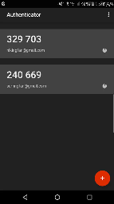

Authentication
==============

*Written by Ashtyne, Edited by Michael R and Brooke.*

Introduction
------------

Authentication is the technique of identifying a person and verifying that they are who they say they are.
The most common form of authentication is for a user to sign in using some sort of username and password. 
There are many other ways to authenticate a user, some include retina scanning and voice recognition [abu]_.
There are also ways for the user to authenticate that a website or system is what it says it is. This is by
using https in the url. Authentication is important because otherwise it would be much easier to steal
information of users and potentially even their identity.

Authenticating the User
-----------------------

Authenticating the user is important because it allows only people with certain knowledge to access potentially
important and private information. With different possibilities to authenticate users, there is less risk that
a user claiming to be someone else can access that information.

Passwords
^^^^^^^^^

As mentioned earlier, the most common way for a system to authenticate a user is through username and password.
Many systems require the users’ password to fulfill certain requirements, such as number of characters, having
special characters, and having numbers. The reason for this is to make sure that the password is as unique as
possible and difficult for people to guess [pea]_. This type of authentication is one of the first types of
computer authentication and still continues to be the front runner in authentication to this day.

Retina Scanning
^^^^^^^^^^^^^^^

Retina scanning is a technique of identifying someone by scanning the blood vessels of their eye. When scanning an
eye, a beam of infra-red light is casted into the eye. Retinal scanners are pretty accurate and hard to trick. Many
times the infra-red has trouble acquiring the image of the eye and can take a small amount of time, which makes it
uncomfortable for users to stand at a scanner with their eye open for long periods of time.

Voice Recognition
^^^^^^^^^^^^^^^^^

Voice recognition is when someone speaks and a computer program takes that input and compares it to samples it
already has. Many systems take time to learn the different mannerisms that people use when speaking, so the user
must train the system by reading certain phrases to the system. The audio that these programs receive are converted
to digital signals and  compared to the digital signals already stored in the program. If the signals match, then
access is granted. Voice recognition is not the most secure method of authorization because voices can be easily
recorded or mimicked.

Fingerprints
^^^^^^^^^^^^

Fingerprints are another way to identify people. Fingerprints are unique for every person and no two people have the
same fingerprint. When a fingerprint is being scanned a computer system looks at different patterns in the lines on
the finger. There are three different basic patterns to a fingerprint, the arch, loop, and whorl. Scanning fingerprints
has become increasingly popular considering Apple, Samsung, and other electronic companies have started including them
in their phones.  

Face Recognition
^^^^^^^^^^^^^^^^

Face recognition is a way for identifying someone by taking a picture of their face and comparing their features to
those of a pre-loaded image. This type of recognition is similar to the other biometric systems that look at fingerprints
or retinal scanning. Some of the things that the system compares are the size, position, and shape of a user’s eyes,
nose, cheekbones and it can also look at the texture of their skin. There are some computers and a few phones that
include this as an option for users to log in with.

Picture Password
^^^^^^^^^^^^^^^^

Picture passwords are pictures that are used to log into computers and tablets. A person can choose three moves; a dot,
a circle, or a line, anywhere on a chosen picture.  This is another form of protection similar to passwords because it
is something that you know. Picture passwords are a little more difficult than regular passwords for attackers to figure
out because you cannot try to get in remotely, the attacker must have the physical device.

Authenticator App
^^^^^^^^^^^^^^^^^

Authenticator apps are commonly used for a two-factor authentication. These are apps that are synced to certain websites
and have numbers that a person can enter when logging in. The numbers typically change every few minutes or so and
therefore would incorporate something you know (a password) and something you have (your phone).

This is an example of an app. There are many different services that can sync with this specific type of two factor
authentication. They all have their own number that can be typed in to a specific spot when logging in to the respective
site. Most apps have the numbers change every 30 seconds, but some are longer than that.

Authenticating the Website
--------------------------

Whenever someone visits a website there is always the chance that the link is taking them to a website that isn’t actually
where they intended to go. You could be thinking that you are going to Amazon, but someone actually made it so that when
amazon.com is typed in the user is taken to another website. The way to combat this is with https.

HTTPS
^^^^^

Using https is something that most people never think about or notice, but it is almost always there. In the url there
will typically be green text at the beginning. This means that the system has checked and made sure that the website the
user typed in or clicked on is truly that website and that it isn’t a fake amazon website. Https also makes sure that
the website is secure and that any information entered, such as a password or even a social security number is safe and
private [bwa]. 

References
----------

.. [abu] "`Understanding Authentication, Authorization, and Encryption <https://www.bu.edu/tech/about/security-resources/bestpractice/auth/>`_." BostonUniversity.com. N.d. Web. 23 Feb. 2017.
.. [bwa] Cairns, Cade, and Somerfield "`The Basics of Web Application Security <https://martinfowler.com/articles/web-security-basics.html>`_." Martinfowler.com. 05 Jan. 2017. Web. 20 Feb. 2017.
.. [pea] Bonneua, Herley, Van Oorschot, and Stajano "Passwords and the Evolution of Imperfect Authentication." Communications Of The ACM 58 July 2015. Business Source Premier, EBSCOhost 20 Feb. 2017.
