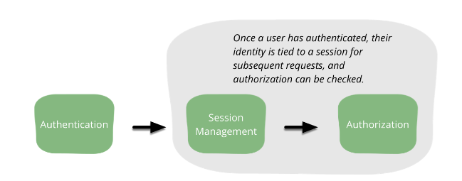

Authorization
=============

*Written by Sara, Edited by Tyler and Cody.*

Introduction
-------------
Authorization is very closely coupled with authentication, but they are two very
different things. While authentication proves the user's identity, authorization
determines what permissions and rights the user has. Authorization and 
authentication can be tied together with session management. Session management
makes it possible to relate requests made by a user so that a user does not 
have to authenticate during each request they make. [bwa]_

[bwa]_

Every time a user makes a request they must undergo a valid and effective 
authorization procedure. A good authorization procedure consists of identifying 
the user making the request, verifying that the request has not changed since 
its initiation, applying the appropriate authorization procedures of the user, 
and re-examining previously authorized request of the user. [wcs]_ 

Vulnerabilities
----------------
The most common vulnerability for authorization is not authorizing everything.
When it comes to authorization we must authorize every action that a user takes
no matter how insignificant it may seem. For example, if a website has a form
for the user to fill out that is specific to just that user we must check 
not only that they have authorization to edit and add new objects to the form, 
but also that the values they put into the form are valid. Let's say that the
form is connected to a database where each object has a specific ID. What 
happens if a user is editing an object and changes the ID to one that is not 
theirs? Without authorization the user would easily have access to all objects
in the database regardless of the owner.

Best Practices
---------------
* One of the most critical mistakes that can be made is hiding capabilities 
  rather than explicitly enforcing authorization on the server. [bwa]_ 
* The authorization process should always deny actions by default unless they 
  are explicitly allowed. [bwa]_
* Always authorize actions on specific resources.

Implementations
----------------
Role-Based Access Control
~~~~~~~~~~~~~~~~~~~~~~~~~~~
The most common type of authorization is role-based access control(RBAC). 
RBAC assigns roles to users and the roles are given permissions. [bwa]_

Attribute-Based Access Control
~~~~~~~~~~~~~~~~~~~~~~~~~~~~~~~
A more advanced application should look at using attribute-based access 
control(ABAC). ABAC is like an extension of RBAC. It still can base decisions 
just on a role assigned to a user, but it can also use any property of the 
user's profile such as their IP address. [bwa]_

Other Implementations
~~~~~~~~~~~~~~~~~~~~~~~
There are many other ways to implement authorization, but in most cases 
either RBAC or ABAC will be the best fit.

Sources
---------

.. [wsb] Bhasin, Shweta, and (Corporation) NIIT. Web Security Basics. Cincinnati, Ohio: Course PTR, 2003. Print. 20 Feb. 2017.
.. [bwa] Cairns, Cade, and Daniel Somerfield"`The Basics of Web Application Security <https://martinfowler.com/articles/web-security-basics.html>`_." Martinfowler.com. Martin Fowler, 05 Jan. 2017. Web. 20 Feb. 2017.
.. [cac] "'Category: Acccess Control <https://www.owasp.org/index.php/Category:Access_Control>'_." OSWAP. OWASP Foundation, 01 June 2016. Web. 21 Feb. 2017.
.. [wcs] Nahari, Hadi, and Ronald L. Krutz. Web Commerce Security: Design And Development. Indianapolis: Wiley, 2011. Print. 20 Feb. 2017.