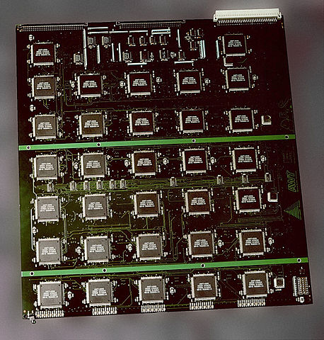

Brute-Force Attacks
===================

A brute force attack (aka brute force cracking) is when someone runs a program that tries to login to an account by running a loop that tries a 
long series of passwords.  Someone could make a program that simply goes through a list of the most popular passwords used online 
until it reaches the end of the list, or it could run through every possible password someone could use, starting with something like "000000" and
ending with "zzzzzzzzzzzzzzzz" for something that requires passwords to be at least six characters long and at most sixteen characters long,
using only letters and numbers.  This second way is the more traditional meaning of "brute force attack", as it simply tries everything rather than
employing any amount of sophistication.

=======================================
The Threat: Your Accounts Are In Danger
=======================================

With the help of brute force attacks and a lack of protections against them, 
anyone can access your accounts online.  Even for an old computer with minimal 
power, it takes only about twenty minutes to crack most passwords. [TechTarget]_
It would take much less with today's computers.  For the more difficult 
passwords to crack, the hacker will implement a more heavy duty solution than 
your standard home PC.  In 1998, the Electronic Frontier Foundation built a
machine with over 1,800 chips in order to crack Data Encryption Standard (DES) keys.  
The image below is of a circuit board from that machine. [Wikipedia]_
Modern encryption standards are much more secure than the DES keys that the
machine had dealt with, but it is still important for people to use some sort
of safeguard against brute force attacks.

The threat of brute forcing means that both the user and the creator
of the website need to take action to protect against these attacks.  
According to Sucuri, these attacks mean that someone can gain illegitimate 
administrative privileges to websites and use that power to upload harmful code 
where it will be spread to the users. [sucuri]_ This would result in a vast
amount of computers being compromised by whatever the hacker had used.
	

=================================================================
The Protection: How You, the Account Holder, Can Protect Yourself
=================================================================

Don't just use normal words as your password; many brute-force-like algorithms 
just input words from the dictionary as the password. You should also use a 
longer password; a true brute force attack will run through every single 
possible combination. It will take a lot longer to match the combination 
you used if your password is sixteen
characters long instead of six due to there being exponentially more 
combinations. A common trick is to make up a sentence and use the first letter of
each word as one character in the password, letting any numbers take their numerical
form, rather than using the initial of the word.  This trick is used because
it both makes a fairly long password and eliminates the possibility of it
being broken by a dictionary attack.  If the sentence you use is too short,
add additional letters from each word so that the password is longer.
For example, "Six dogs ran across the yard" will turn into "6draty" under the
standard trick. 

This will take an alphanumeric brute forcing program very
little time to break, as it will only have to run through some of the
56 billion possible combinations in a six character alphanumeric password.
This sounds like a lot, but computers are incredibly fast and can run
through hundreds of thousands of combinations per second.  At a rate of
500,000 combinations per second, a normal computer might go through that many
combinations in under 2 days. The computers that hackers will use to crack
passwords will likely be much more powerful than that, so one character
per word wouldn't be enough for our example sentence.  Two would be much
better, resulting in "6doraacthya", an eleven character alphanumeric
string that happens to only have one word from the dictionary in it (do).

Passwords of this size have 62^11 possible combinations, or about 
52 quintillion possible combinations. This sounds like it should be safe,
but hackers often have access to not just one or two computers, but hundreds
of thousands of computers due to them being part of their botnets. If we want
to be safe against a brute force from the biggest of these 
(potentially several million computers), we're going to have to go bigger.
How big? An easy way to make sure that it's a sufficient number of characters
to keep them stumped is to use a randomly generated 64 character alphanumeric
code. You'll have to keep this somewhere safe and accessible to you because
you're not going to be able to remember it, but on the upside, those have 
more total combinations than there are atoms in the universe, so you should
theoretically be safe from this type of attack.

=======================================================
The Hope: What You Hope Is In Place to Help Protect You
=======================================================

If the creator of the website is thinking about brute force attacks when they
made the login system, there are a few measures they would have in place to
protect their users' accounts. For example, they might have a limit in place
for the number of times someone can try to login to a particular account 
before it locks them out for a period of time, 
as Techopedia suggests. [techopedia]_ 

A five-try limit on an account before it locks out whoever is trying to login
for five minutes is going to slow down a brute force attack immensely while 
holding off even the most forgetful user for a minimal amount of time.
It is also common to require users to have complex passwords as Techopedia 
points out. Involving a variety of character types (capital letters, 
lowercase letters, numbers, and a special character like a $) 
is a fairly common requirement.  Some may implement systems that automatically
ban some attribute of the system they are getting requests from after so many
attempts in a particular period of time, such as banning that IP address.
However, that risks banning a lot of innocent users as well that might just
be sharing an internet connection with that person; there's going to be a lot
of upset people if their local coffee shop's WiFi got banned from Facebook.

======================================================
The Method: A Rudimentary Way to Brute Force Passwords
======================================================

The simplest (but longest) way to brute force a password is by testing every 
possible combination allowed by the service you're trying to gain access to.
To do this, you would want to start with a simple string of the minimum 
required length, test that string, then change one character in
that string until you've tested every possible combination of that length.  
After that, add another character to the string and then try
every combination of that length.  

This is the more traditional definition
of the term "brute forcing", though people often use it to refer to different
processes that are very similar, such as running through a list of words in
the dictionary rather than going through every single possible combination.
The upside to the more traditional method is that it can crack any password, 
given enough attempts.  The downside is that it will take far more attempts 
than the more sophisticated methods, such as the aforementioned dictionary 
method or those that try combinations of words and numbers that someone would 
expect of that specific person.  However, good security measures 
will block traditional brute force techniques, whether they be the most
brutish "every combination" type, or the most calculated of personal
information powered password guessing.  See the section above for details
about how administrators can defend against brute force attacks.

Below is a rough example of how a brute forcing program would work for 4 digit PIN codes.::

	function pinBreaker() {
	    var pin = 0;

	    for (i = 0; i < 10000; i++) {
	        pin = String(pin);
	        while (pin.length < 4) {
	            pin = "0" + pin;
	        }
	        $('#password').val(pin);
	        $('#submitButton').trigger("click");  // simulates clicking the submit button [click]_
	        pin = parseInt(pin, 10);
	        pin++;
	    }
	    console.log("All combinations failed.");
	}

	function comboCheck() {
		jqueryGetButtonAction();
	}

	function jqueryGetButtonAction() {
	    var passwordValue = $('#password').val();
	    console.log(passwordValue);
	    var url = "api/password_check?password="+passwordValue+"&submitButton=Submit"; // sets url to one that indicates the password being submitted

	    $.get(url, null, function (dataFromServer) {
	        console.log("Finished calling servlet.");
	        console.log(dataFromServer);
	        }
	    ); // submits a request for the url set above

	}
	var start = $('#startButton');
	start.on("click", pinBreaker);

	var submit = $('#submitButton');
	submit.on("click", comboCheck);

[sucuri]		Tony Perez. `"Brute Force Attacks and Their Consequences" <https://blog.sucuri.net/2013/04/brute-force-attacks-and-their-consequences.html>`_ Sucuri Inc., 12 Apr. 2013. Web. 18 Feb. 2017. 

[TechTarget]	Margaret Rouse. `"brute force cracking" <http://searchsecurity.techtarget.com/definition/brute-force-cracking>`_ TechTarget, Jul. 2006. Web. 18 Feb. 2017.

[techopedia]	`"Brute Force Attack" <https://www.techopedia.com/definition/18091/brute-force-attack>`_ Techopedia, Web. 18 Feb. 2017.

[click]			Adam Salma. `"How to simulate a click with JavaScript?" <http://stackoverflow.com/questions/2705583/how-to-simulate-a-click-with-javascript>`_ StackOverflow, 24 Jan. 2016. Web. 18 Feb. 2017.

[Wikipedia]		Matt Crypto. `"Brute-force attack" <https://en.wikipedia.org/w/index.php?curid=36781082>`_ Wikipedia, 9 Feb. 2017. Web. 18 Feb. 2017.

*Written by Tyler G, Edited by Lana and Nathan.*

