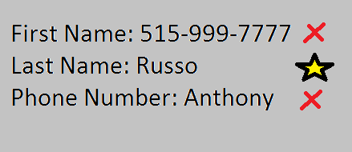

Data Validation
===============

*Written by Anthony, Edited by Ashtyne and Esteban.*

*Outline*
^^^^^^^^^

* Intro:
	a. Thesis Statment
	b. Brief overview of each topic.
* What is data validation?
	a. Explain what data validation does.
	b. How did data validation come about? (History)
* "How to" on data validation [WEB]
	a. Instructions on how to add data validation to a website.
	b. Picture examples.
* Why is data validation important?
	a. Risks Involving data validation.
		1. Risk of not having.
		2. Risk of Front end only.
		3. Risk of Back end only.
	b. Picture Examples.
* Conclusion:
	a. Thesis Statement
	b. Brief review of each topic. 

Introduction
^^^^^^^^^^^^
	Data Validation is the most important aspet of coding any website that takes inputs from an outside user. Data validation is the process in which a website verify's the data being input by the user is in the correct form. For example if the website asks for a first name and the user inputs a phone number, validation will prevent the website from taking that input. Creating validation can be a lengthy process, however the risk of not having any validation are high. Users could input code that could change features of a website, without validation to stop this your website could be at risk. There are short cuts to data validation such as front end or back end only validation, but these leave the door open for potential risks. 

What is Data Validation?
^^^^^^^^^^^^^^^^^^^^^^^^

How to code Data Validation
^^^^^^^^^^^^^^^^^^^^^^^^^^^

Why is Data Validation important?
^^^^^^^^^^^^^^^^^^^^^^^^^^^^^^^^^

Conclusion
^^^^^^^^^^

Sources
^^^^^^^

.. [WEB] `"Web Development" <http://web-development-class.readthedocs.io/en/latest/index.html>`_ Simpson College Web Development Class, 018 Feb. 2017. Web. 2016.
.. [Weinstock-Herman] Weinstock-Herman, Eli. `"Client-side vs Server-side Validation in Web Applications" <http://blogs.lessthandot.com/index.php/webdev/client-side-vs-server-side-validation-in-web-applications/>`_ LessThanDot A Technical Community for IT Professionals, 18 Feb. 2017. Web. 01 Aug. 2014.