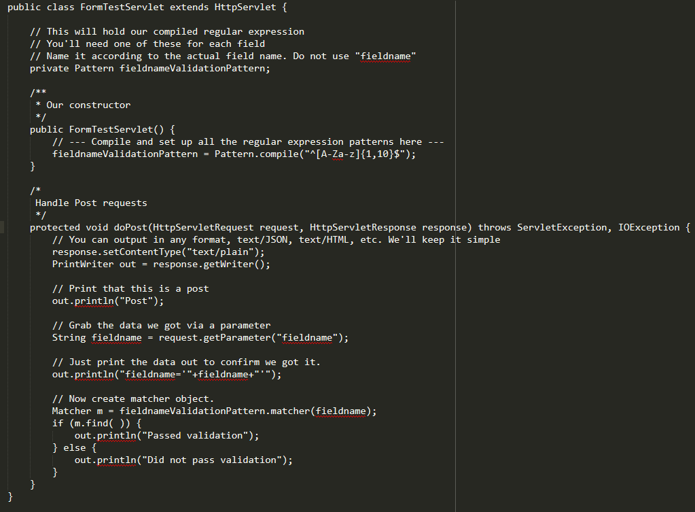

Data Validation
===============

*Written by Anthony, Edited by Ashtyne and Esteban.*

.. image:: datav.png
	:width: 400px
	:align: center

Introduction
^^^^^^^^^^^^
Data Validation is one of the most important aspect of coding any website 
that takes inputs from an outside user. Data validation is the process in 
which a website verity's the data being input by the user is in the correct 
form. For example if the website asks for a first name and the user inputs a
phone number, validation will prevent the website from taking that input. 
Creating validation can be a lengthy process, however the risk of not 
having any validation are high. Users could input code that could change 
features of a website, without validation to stop this your website could 
be at risk. There are short cuts to data validation such as front end 
(client side) or back end (server side) only validation, but these leave the
door open for potential risks. [WEB]_

What is Data Validation?
^^^^^^^^^^^^^^^^^^^^^^^^
"Data validation guarantees to your application that every data value is 
correct and accurate." [DATA]_ Data Validation answers simple questions such
such as "is the string alphabetic" or "is the string numerical". If you are
asking for a first name it will be helpful if you do not accept a telephone
number as the users first name. Another form of validation is ensuring the
users uses the correct amount of characters. Most phone numbers are ten
digits, so we would not want a user's inputting "1119-67-2" as their phone
number.

Data validation on the client side is mainly for the user. It does serve a
a small purpose to the website itself. Client side validation makes it
possible for the user to easily enter information with no errors. As stated 
we want to make sure we receive accurate data, so what happens when a user
inputs their phone number as their first name? client side validation will
prevent the website from taking this input and in a nice and pretty way show
the user that the data entered is not acceptable. "Client-side or front end 
JavaScript form validation provides absolutely no value from a security 
perspective." [Cade]_

Data validation on the server side is mainly for the website server. The 
same checks for client side validation are used for server side validation 
and more security. So a website asks for a first name, however the user 
enters a code to change or alter the website. The code may pass client side 
validation, however server side validation is created to stop this.

How to Code Data Validation
^^^^^^^^^^^^^^^^^^^^^^^^^^^
The image below is an example of client side validation. Notice the first 
parameter is what type of characters can be used in. For example in "name" 
we would only want to use capital or lower case letter A-Z and a-z. For 
"phone" and "birthday_check" we would only want numbers 0-9. The next set of
parameters is the format and number of characters allowed. If we look back 
at "name" we will only accept names that are between 1 and 20 characters
long. "phone" and "birthday_check" both have formatting parameters. Phone 
for example can use any number between 0-9 three times. After the third 
number you need a "-". This repeats, then we end with four numbers instead 
of three, "515-285-2929". [WEB]_

.. image:: frontendCodeExample.png
	:width: 600px
	:align: center

The image below is an example of server side validation. In order to do this 
you must pause client side first and resume once the server side is set 
up. This code uses regular expressions to validate there is no malicious inputs 
going into your website. Once the input passes as valid on the back end, it goes 
through the client side. Like we stated above if the data submitted is not 
malicious, but is incorrect, the user will get a nice message explaining what 
they entered is incorrect. The difference here is we do not care about making a 
nice message for someone trying to submit something malicious. [WEB]_

Why is Data Validation Important?
^^^^^^^^^^^^^^^^^^^^^^^^^^^^^^^^^

Client side validation is important because it involves the end user. 
Without client side validation the end user would have no way of knowing if 
their input was accepted or denied. Client side also prevents bad data from 
being taken in from good intent users. Server side validation is important 
because it involves the last line of defense to prevent bad data from being 
taken in. Server side validation prevents incorrect values from being taken 
in from malicious users. If we take the example from above ("What is data 
validation") the malicious code could pass client side validation. This is 
why it is important to not only have client side validation for the user, 
but server side validation for the security of the website. 
[Weinstock-Herman]_

Conclusion
^^^^^^^^^^

Understanding how to validate data before taking information from the user is 
extremely important when it comes to websites that take in data from the end
users. Using some of the examples above will help you create a solid 
validation process. The importance of client and server end validation are 
easy to see once you understand the risks at large without data validation. 
Once again, there are no shortcuts when it comes to data validation. "If 
you can't control it, you can't trust it." [Cade]_

Sources
^^^^^^^

.. [WEB] `"Web Development" <http://web-development-class.readthedocs.io/en/latest/index.html>`_ Simpson College Web Development Class, 18 Feb. 2017. Web. 2016.
.. [Weinstock-Herman] Weinstock-Herman, Eli. `"Client-side vs Server-side Validation in Web Applications" <http://blogs.lessthandot.com/index.php/webdev/client-side-vs-server-side-validation-in-web-applications/>`_ LessThanDot A Technical Community for IT Professionals, 18 Feb. 2017. Web. 01 Aug. 2014.
.. [DATA] `"Data Validation" <https://msdn.microsoft.com/en-us/library/aa291820(v=vs.71).aspx>`_ Data Validation, 18 Feb. 2017. Web. 2013.
.. [Cade] Cairns, Cade, and Daniel Somerfield. `"The Basics of Web Application Security." <https://martinfowler.com/articles/web-security-basics.html>`_ MartinFlower, 18 Feb. 2017. Web. 5 Jan. 2017.