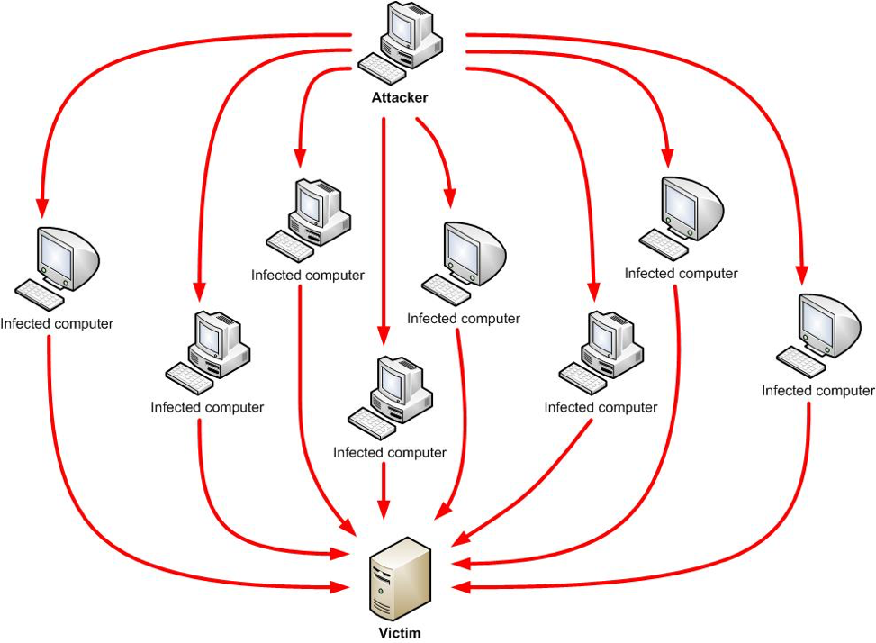
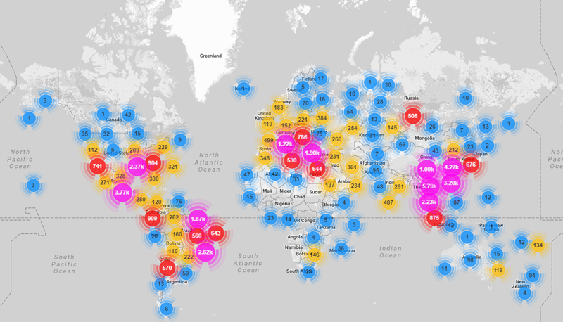
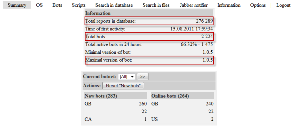

Distributed Denial-of-Service
=============================
*Written by Taylor, Edited by Esteban and Morgan.*

Introduction
------------

Distributed Denial-of-Service (DDoS) is a type of Denial-of-Service when an 
attacker overloads a server with requests and it stops being able to process 
them. However, DDoS is harder to prevent and stop, because instead of one 
computer attacking a target, an attacker will take over many computers to 
attack a target by sending multiple messages or connection requests to it. 
Furthermore, it is more difficult to distinguish these attacks from real 
requests due to certain circumstances such as a spike in a website's popularity
[Rou]_. The victim computer, website, or network source may be significantly 
slower, crash, or shut down denying real users of the service. This is a more
advanced security breach than an attack from a single host or IP address
where they can be blocked easily with a firewall [Kar]_.

    
This image depicts a typical DDoS attack [Dsa]_.

In a DDoS attack, an attacker exploits a weakness of a computer system and 
becomes the DDoS master. The DDoS master then finds other weak systems and
gains control using malware or bypassing their security. The 
computers that are under the control of the attacker are called zombies or
bots. There can be any number of zombie computers from ten to thousands, or
even millions that make up a botnet [Rou]_. 

Past DDoS Attack Examples
-------------------------
Past Large Botnets
~~~~~~~~~~~~~~~~~~
The ability for hackers to gain control of large botnets gives them the 
possibility to do cybercriminal activity, send billions of spam emails, 
and complete large DDoS attacks. The security industry estimates that over time,
botnets have resulted in more than $110 billion in losses to victims globally
[Zet]_.

Although there have been many botnets, here are a few noteworthy ones:

* Grum - From 2008 to 2012, it became responsible for up to 26% of the world's
  spam traffic. In 2010, it was capable of emitting 39.9 billion messages a 
  day, making it the largest botnet at the time.
* ZeroAccess - Estimated to have controlled 1.9 million computers around the 
  world, focusing on click fraud and bitcoin mining. It was reported to be 
  consuming enough energy to power 111,000 homes per day from all of its 
  infected computers.
* Windigo - Discovered in 2014 after running undetected for three years.
  It infected 10,000 Linux servers and sent 35 million spam emails a day, 
  infecting 500,000 computers. It had different forms of malware depending 
  on the operating system of the device receiving it.
* Conficker - At its peak in 2009, it was estimated to have infected 15 
  million computers, but the total number of machines under the botnet control
  totaled between 3 and 4 million.
* Srizbi - Only active for about a year, but was responsible for 60% of spam
  worldwide and sent 60 billion emails every day from 2007 to 2008. When it 
  was taken offline, spam volume worldwide dropped by 75%.
* Bredolab - Hijacked more than 30 million machines. Georgy Avanesov developed 
  it in 2009 to collect bank account passwords but also earned about $125,000 
  a month from renting out access of his botnet to other criminals to spread
  malware and conduct DDoS attacks [Tho]_.

Large DDoS Attack on Dyn 
~~~~~~~~~~~~~~~~~~~~~~~~
On October 21, 2016, the DNS provider, Dyn, was a victim of a DDoS attack.
This impacted users from using popular websites that are Dyn customers 
including Twitter, Reddit, Twitter, Spotify, and Netflix. The attacker 
used a Mirai botnet, a network of infected Internet of Things devices such
as security cameras and DVR players, which have poor security. 
It is estimated that there were 100,000 infected devices that caused the
attack with a magnitude of 1.2 Tbps.

  "Attacking a DNS or a content delivery provider such as Dyn or Akamai in 
  this manner gives hackers the ability to interrupt many more companies 
  than they could by directly attacking corporate servers, because several 
  companies shared Dyn's network." -Spectrum magazine

This attack came in three phases throughout the course of the day. Since it was
difficult to distinguish legitimate traffic from attack traffic, it was very
difficult to mitigate. Furthermore, legitimate retry activity caused 10 to 20
times more traffic volume from many IP addresses around the world.

Dyn's Engineering and Operations teams worked hard to mitigate the attack and
some of their techniques included traffic-shaping incoming traffic,
applications of internal filtering, and deployment of scrubbing services [Hil]_

Involving the FBI
~~~~~~~~~~~~~~~~~
In April 2011, the FBI obtained a court order to seize control of a server used to 
command the Coreflood botnet and sent code to the infected machines to disable
the malware on them. The private security firm that did this first hijacked
communication between the infected devices and the attacker's command servers.
After collecting the IP addresses of the infected devices, they sent code to
disable the botnet malware on them. Although the effect of this code on the
devices was unknown, the action was ultimately successful and helped disable
malware on over 700,000 devices in one week.

In November 2011, an FBI investigation brought down the Butterfly Botnet, 
which stole credit card and bank account information. It was comprised of over
11 million infected devices and resulted in over $850 million losses. Overall, 
10 individuals were arrested from several countries.

In May 2014, the FBI arrested one of the co-developers of the malware Backshades, 
which was used to infect over 500,000 devices around the world. The FBI held
over 100 interviews, 100 email and physical search warrants, and seized more
than 1,900 domains used to control infected devices [Dem]_.

DDoS Botnets and Botnet Tools
-----------------------------
Botnets are available from many different sources and are auctioned and traded
by hackers. There are even online marketplaces for trading huge numbers of 
malware-infected computers. They can be rented and used for DDoS or various 
other attacks for a low cost, although the impact of these attacks can vary.

Analysis of a Mirai Botnet
~~~~~~~~~~~~~~~~~~~~~~~~~~
On September 20, 2016, the website of journalist Brian Krebs was subject to a
very large DDoS attack. Like the attack on Dyn, the attacker used a Mirai
botnet, mostly made up of hacked CCTV security cameras. An analysis by Ben
Herzber, Dima Bekerman, and Igal Zeifman with their Mirai scanner found that
the attack was made up of 49,657 unique IP addresses and devices in 164
different countries. 

    
This image shows the locations of Mirai infected devices that made up the 
botnet [Bek]_.

Mirai attackers gained control of IoT devices mainly by guessing login 
credentials and gained access due to default usernames and passwords still being 
used. The attacker gained control by using brute force based on the following
list of credentials.

.. code-block:: plain

  root     xc3511
  root     vizxv
  root     admin
  admin    admin
  root     888888
  root     xmhdipc
  root     default
  root     juantech
  root     123456
  root     54321
  support  support
  root     (none)
  admin    password
  root     root
  root     12345
  user     user
  admin    (none)
  root     pass
  admin    admin1234
  root     1111
  admin    smcadmin
  admin    1111
  root     666666
  root     password
  root     1234
  root     klv123
  Administrator admin
  service  service
  supervisor supervisor
  guest    guest
  guest    12345
  guest    12345
  admin1   password
  administrator 1234
  666666   666666
  888888   888888 ...

One of the most interesting things they found while analyzing this attack
was a list of hardcoded IP addresses the Mirai bots are programmed to avoid
when performing IP scans. It include the U.S. Postal service, the Department
of Defense, and the Internet Assigned Numbers Authority.

.. code-block:: plain

  127.0.0.0/8               - Loopback
  0.0.0.0/8                 - Invalid address space
  3.0.0.0/8                 - General Electric (GE)
  15.0.0.0/7                - Hewlett-Packard (HP)
  56.0.0.0/8                - US Postal Service
  10.0.0.0/8                - Internal network
  192.168.0.0/16            - Internal network
  172.16.0.0/14             - Internal network
  100.64.0.0/10             - IANA NAT reserved
  169.254.0.0/16            - IANA NAT reserved
  198.18.0.0/15             - IANA Special use
  224.*.*.*+                - Multicast
  6.0.0.0/7                 - Department of Defense 
  11.0.0.0/8                - Department of Defense
  21.0.0.0/8                - Department of Defense
  22.0.0.0/8                - Department of Defense
  26.0.0.0/8                - Department of Defense
  28.0.0.0/7                - Department of Defense
  30.0.0.0/8                - Department of Defense
  33.0.0.0/8                - Department of Defense
  55.0.0.0/8                - Department of Defense
  214.0.0.0/7               - Department of Defense

The botnet also holds several killer scripts to locate and eradicate other
botnet processes from a device's memory. This is known as memory scraping. This
behavior helped the attacker to maximize the potential of the botnet devices
and prevent other malware from doing the same behavior to the devices [Bek]_.

.. code-block ::

  #DEFINE TABLE_MEM_QBOT            // REPORT %S:%S
  #DEFINE TABLE_MEM_QBOT2           // HTTPFLOOD
  #DEFINE TABLE_MEM_QBOT3           // LOLNOGTFO
  #DEFINE TABLE_MEM_UPX             // \X58\X4D\X4E\X4E\X43\X50\X46\X22
  #DEFINE TABLE_MEM_ZOLLARD         // ZOLLARD

How to Build a Botnet
~~~~~~~~~~~~~~~~~~~~~
Another reason a DDoS attack is very threatening is due to the fact that 
setting up a botnet is fairly easy. Simon Mullis from FireEye simulated this 
process with a clean Windows virtual machine and a LAMP server on Amazon
Web Service's EC2 platform.

These are the steps Mullis took:

1. Downloading and installing the botnet builder tool for malware known as 
   Ice IX
2. Specifying parameters. For example, how often the malware would 
   communicate with the command server, what actions it would take, and how it
   would hide from anti-virus scans. It can take screenshots of pages visited 
   by the victim's machine, block sites such as anti-virus sites, and redirect 
   legitimate URLS to malevolent sites to collect information.
3. Encrypting and packing the infected file to install malware on the victim's 
   machine
4. At this point, the bot master can spread more malware to other computers 
   [Pro]_

    
This image depicts an early version of Ice IX Botnet [Mie]_.

Responding to an Attack
-----------------------
According to Akamai, an American content delivery network and cloud services 
provider, at the end of 2015, there was an 180% increase in the total number
of DDoS attacks compared to 2014. Online gaming is the most susceptible to 
attacks, but software and technology companies still make up 25% of all DDoS
attacks. [Rub]_

Below are some indications of a DDoS attack taking place:

* Unusual network traffic could be the result of an attack. Performing network
  data analysis is important in understanding usual traffic flows. 
* Unusually slow network performance
* Unavailability of website or inability to access site
* Increase in spam

If an attack is taking place, there are some steps a victim can take to mitigate
the effect of the attack which include: 

* Rate limit router to prevent web server from being overwhelmed
* Add filters to tell your router to drop packets from obvious sources of attack
* Timeout half-open connections
* Drop spoofed or malformed packages
* Set lower SYN, ICMP (Internet Control Message Protocol), and UDP drop 
  thresholds
* Call ISP or hosting provider to stop traffic getting on the network
* Divert traffic to a scrubber to remove malicious packets [Rub]_

How to Avoid DDoS Attacks
-------------------------
While there is no way to absolutely rid a company from the threat of a DDoS 
attack, there are measures the company can take to decrease the chance of a 
large, expensive and damaging attack from taking place. 

* Architecture:

  - Having a strong technical architecture can be important to decrease the risk
    of an attack
  - Having servers in different data centers, locating data centers on different
    networks, ensuring data centers have diverse paths, and eliminating 
    bottlenecks in data centers and networks they are connected to

* Hardware & Bandwidth:

  - Network firewalls, web application firewalls, and load balancers can defend
    against protocol attacks and application attacks
  - If it is affordable, it can be beneficial to scale up network bandwidth
    to absorb large traffic volume. This is more realistic for large 
    organizations

* Outsourcing:

  - There are also several services that specialize in responding to different 
    kinds of attacks
  - They can provide cloud scrubbing services for attack traffic
  - Internet Service Providers can also offer DDoS mitigation that can help 
    respond to attacks [Kar]_

* Other:

  - Having clear email distribution practices
  - Applying email filters
  - Creating proper authentication credentials for system administration
  - Maintaining proper communication with customers
  - Having a plan in preparation of an attack [Rub]_

Sources
-------

.. [Bek] Dima Bekerman, Ben Herzberg, and Igal Zeifman. "`Breaking Down Mirai: An IoT DDoS Botnet Analysis <https://www.incapsula.com/blog/malware-analysis-mirai-ddos-botnet.html>`_." Imperva Incapsula, 26 Oct. 2016 Web. 23 Feb. 2017.

.. [Dem] Joseph Demarest. "`Taking Down Botnets, A Statement Before the Senate Judiciary Committee, Subcommittee on Crime and Terrorism <https://www.fbi.gov/news/testimony/taking-down-botnets>`_." FBI News, 15 Jul. 2014 Web. 23 Feb. 2017.

.. [Dsa] "`Denial of a Service Attack <https://www.ebankingabersicher.ch/en/your-security-contribution/extended-protection/denial-of-service-attack>`_." Lucerne University of Applied Sciences and Arts, Web. 16 Feb. 2017.

.. [Hil] Scott Hilton. "`Dyn Analysis Summary of Friday October 21 Attack <http://dyn.com/blog/dyn-analysis-summary-of-friday-october-21-attack/>`_." Dyn, 26 Oct. 2016 Web. 20 Feb. 2017.

.. [Kar] Rachel Kartch. "`Distributed Denial of Service Attacks: Four Best Practices for Prevention and Response <https://insights.sei.cmu.edu/sei_blog/2016/11/distributed-denial-of-service-attacks-four-best-practices-for-prevention-and-response.html>`_." Software Engineering Institute. Carnegie Mellon University, 21 Nov. 2016. Web. 16 Feb. 2017.

.. [Mie] Jorge Mieres. "`Ice IX, the First Crimeware Based on the Leaked ZeuS Sources <https://securelist.com/blog/research/29577/ice-ix-the-first-crimeware-based-on-the-leaked-zeus-sources-8/>`_." SecureList. AO Kasperksy Lab, 24 Aug. 2011. Web. 21 Feb. 2017.

.. [Pro] Brian Proffitt. "`How to Build a Botnet in 15 Minutes <http://readwrite.com/2013/07/31/how-to-build-a-botnet-in-15-minutes/>`_." ReadWrite, 31 Jul. 2013. Web. 21 Feb. 2017.

.. [Rou] Margaret Rouse. "`Distributed Denial of Service (DDoS) Attack <http://searchsecurity.techtarget.com/definition/distributed-denial-of-service-attack>`_." TechTarget, Jan. 2017. Web. 16 Feb. 2017.

.. [Rub] Paul Rubens. "`Distributed Denial of Service (DDoS) Attack <http://www.esecurityplanet.com/network-security/5-tips-for-fighting-ddos-attacks.html>`_." eSecurity Planet. IT Business Edge, 25 Jan. 2016. Web. 16 Feb. 2017.

.. [Tho] Karl Thomas. "`Nine Bad Botnets and the Damage They Did <http://www.welivesecurity.com/2015/02/25/nine-bad-botnets-damage/>`_." WeLiveSecurity. ESET, 25 Feb. 2015. Web. 21 Feb. 2017.