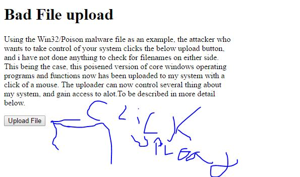

Directory Traversal / Poisoned File Upload
==========================================

Introduction 
------------

*Directory Traversal* 

The two attacks that will be covered here are Directory Transversal and Poisoned
File Upload, these attacks are achieved in both exploiting not validated input
from user, they achieve the same goal in a different way. That goal being 
breaking into a computer to steal information, causing irreparable damage to the
file system, or the computer as a whole.  Directory Traversal happens when a 
malicious user decides to test if they can get out of the web root directory, 
which is where they should stay. Now, if they manage to do this, the directory
traversal attack has begun [ACUNETIX]_. According to [ACUNETIX]_  , this is a
 pretty simple malicious attack to attempt, basically if you know the system the
 website you are trying to break is being stored on you too can do this 
 malicious attack (I don’t recommend anyone try this at home).

 How are these attacks actually executed? In the paper by Wei Xu,Sandeep 
 Bhatkar,and R.
 Sekar , they explain in much greater detail of how to do directory traversal 
 than other sources currently cited.  To sum it up short and sweet, the process
 of traversing directories depending on security, you try using forward slashes 
 with two dot operators on most file systems to go up directories. Finishing 
 with the folder you want to traverse to in mind. If the security is higher, 
 you get more creative and attempt and encode directory traversal. If that fails
 they go into a little detail, but I don’t think it is necessary here [USENIX]_.

*Poisoned File Upload*

Poisoned File Upload is done when a web application, or website don’t validate 
file inputs to the upload field. Basically, making sure that only allowed types
of files are being uploaded not system ruining viruses, or system controlling 
viruses. Now, this is a really bad attack that can cause several bad things to
happen.  Just covering a couple gives a good picture for how bad this attack 
is for anyone on the receiving end.  Rob Shapland from [COMWEEKLY]_ explains 
two really good reasons, and one, I already glossed over. 

One, a nefarious user decides they want to just make your website or web
application useless,
so they upload a file with the same name as a core process that makes your 
web server run and add it to the same directory.  The core process is then 
overwritten, making your web application useless. Two, he explains that the 
nefarious user could upload a virus to your web server that hands the keys over
 to him or her. There are many bad thing that could happen with poisoned 
 upload, but I think those are two of the worst, and in the example section it
  will be  explained how to prevent these attacks. 

**Real World Directory Traversal Vulnerability Example**
--------------------------------------------------------
The focus of the top of this section will be describing directory traversal 
vulnerability in detail to give a prospective on how dangerous it it’s to leave
 yourself vulnerable to this attack. this section will give a real life 
 application of this technique, and where it has been found. I found a 
 directory transversal vulnerability from a router company I’ve never heard of 
 named Huawei, on their model HG532. [CISCO]_

**Real World Poisoned File Vulnerability Example**
-------------------------------------------------
The first objective here is to explain any terminology, and refer back to 
introduction for the description of the vulnerability. Next, goal here is to 
find a detailed account of poisoned file upload in a company setting that 
caused some issues for them infrastructure wise. The other main goal of this 
section, will be to drive home the devastation that this vulnerability can 
cause to a company's file system at the minimum, or their core operations at 
the most serve.  After I go into detail about the event, next I will layout 
prevention techniques for poisoned file upload to end this section. [COMWEEKLY]_ 

* If I can find a large tech firm example it is the one i will use
* If I can't find a big tech example, find a couple small examples 
* Use the Win32/Poison a virus program as an example of a file that a hacker could upload [MICROSOFT]_.

Directory Traversal / Poisoned File Upload Examples
---------------------------------------------------
This section will have both text and image examples of both vulnerabilities, to
 show how evasive they both are to privacy of an individual’s information if
 these attacks have been executed. The image below with the text description 
 is a possible Poisoned File Upload. A few of the side effects of the 
 potential poisoned upload are bulleted below courtesy of [MICROSOFT]_.
 Directory Traversal examples will be hashed out from these three sources 
 [VERACODE]_, [ACUNETIX]_, and [USENIX]_.

*The below list are things Win32/Poison does when it is uploaded to your
computer*

* Downloading or uploading of files
* Keylogging
* Stealing WiFi keys
* Injecting into processes

**Works Cited**
---------------  
.. [VERACODE] DuPaul, Neil."`Directory Traversal <https://www.veracode.com/security/directory-traversal>`_." *Veracode*.Web.Date Accessed 20 Feb 2017.

.. [VERACODE] No Author List "`CWE/SANS TOP 25 <https://www.veracode.com/directory/cwe-sans-top-25>`_." *Veracode*.Web.Date Accessed 20 Feb 2017.

.. [ACUNETIX] No Author Listed "`Directory Traversal Attacks <http://www.acunetix.com/websitesecurity/directory-traversal/>`_." *Acuntetix*.Web.Date Accessed 20 Feb 2017.
.. [MICROSOFT] No Author Listed  "`Win32/Poison <https://www.microsoft.com/security/portal/threat/encyclopedia/entry.aspx?Name=Win32%2fPoison>`_." *Microsoft*.Web.Date Accessed 20 Feb 2017.

.. [CISCO] No Author Listed "`Huawei HG532 Routers Restricted Directory Improper Limitation Pathname Vulnerability <https://tools.cisco.com/security/center/viewAlert.x?alertId=41997>`_." *Cisco*.Web.Date Accessed 20 Feb 2017. Article first published 9 Nov 2015.

.. [COMWEEKLY] Shapland, Robert."`"File Upload Security Best Practices: Block a Malicious File Upload." <http://www.computerweekly.com/answer/File-upload-security-best-practices-Block-a-malicious-file-upload>`_."ComputerWeekly. Computerweekly.com, May 2012. Web. 20 Feb. 2017.  

.. [USENIX] Xu, Wei, Sandeep Bhatkar, and R. Sekar."`Taint Enhanced Policy Enforcement A Practical Approach to Defeat a Wide Range of Attacks <https://www.usenix.org/legacy/event/sec06/tech/full_papers/xu/xu_html/>`_." *Usenix Security*.Web.Date Accessed 20 Feb 2017.

*Written by Michael B. Edited by Kyle and Michael R*

