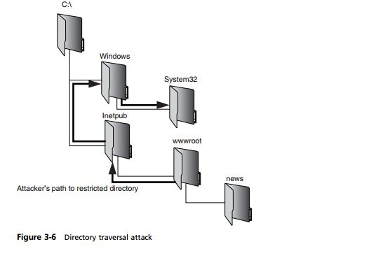

Directory Traversal / Poisoned File Upload
==========================================
--------------------------------------------------------
Introduction Directory Traversal or Poisoned File Upload
--------------------------------------------------------

 -----------------------------
 Directory Traversal Examples
 -----------------------------

:height: 300px
:width:  300px
:align: center
:alt: figure 3.6

			

-----------
Works Cited  
-----------
.. [CENGAGE]  Ciampa, Mark."Security Guide to Network Security Fundamentals." 5th Ed. "`Figure 3_6 Directory Traversal Attack  <http://www.wadsworthmedia.com/marketing/sample_chapters/2014/9781305093911_ch03.pdf>`_." pg 101.Independence: Cengage Learning, 2014. Web.Date Accessed 20 Feb 2017.

.. [VERACODE] DuPaul, Neil."`Directory Traversal <https://www.veracode.com/security/directory-traversal>`_." *Veracode*.Web.Date Accessed 20 Feb 2017.

.. [ACUNETIX] No Author Listed "`Directory Traversal Attacks <http://www.acunetix.com/websitesecurity/directory-traversal/>`_." *Acuntetix*.Web.Date Accessed 20 Feb 2017.

.. [CISCO] No Author Listed "`Huawei HG532 Routers Restricted Directory Improper Limitation Pathname Vulnerability <https://tools.cisco.com/security/center/viewAlert.x?alertId=41997>`_." *Cisco*.Web.Date Accessed 20 Feb 2017. Article first published 9 Nov 2015.

.. [USENIX] Xu, Wei, Sandeep Bhatkar, and R. Sekar."`Taint Enhanced Policy Enforcement A Practical Approach to Defeat a Wide Range of Attacks <https://www.usenix.org/legacy/event/sec06/tech/full_papers/xu/xu_html/>`_." *Usenix Security*.Web.Date Accessed 20 Feb 2017.

*Written by Michael B. Edited by Kyle and Michael R*

  Independence: Cengage Learning, 2014. Print.