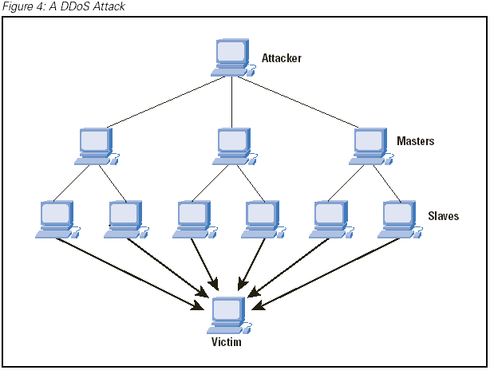

Denial-of-Service
=================

Denial-of-Service attack is a security event that occurs when an attacker takes action that prevents legitimate users from accessing the target computer, device, website, or other network resource. 

How it Happens
--------------

Denial of service is typically accomplished by flooding the targeted machine or resource, such as Facebook's servers. With requests in attempt to overload the system and prevent users from accessing the website. An easy way to think about how this works is when you are driving on the interstate to work and it seems that traffic is normal everyone is going 65MPH and it is slightly relaxing. You are about to get to your destination which is exit B2 Facebook ST, BOOM there is a huge line of care at that exit so big that you can see the cars all the way to the Facebook building connecting to the interstate. Here you stay frustrated and annoyed because you need to get to work but there is nothing you as the user can really do about it.  

* This is a real word example of how Denial of service happens because This has happened to me way too many times when trying to get downtown during rush hour.

[img]_

Why is it dangerous?
--------------------

1. Users hate having to wait for websites to open up.
2. The website can lose customers as a result, which will hurt the company in return. 
3. The Workers at the company being attacked will not be able to work since their services are down. 
4. When your workers are not able to work you either have to send them home or keep them on the clock not making the company any money. 
5. The cost; companies will easily spend more than $50k in recovery bill from a DOS attack. [Cost]_

Why does it happen?
-------------------

I actually have a theory on this. When it comes to attacks on a major network such as anything to do with credit cards like Shazam or social media like Facebook.

* Shazam will be attacked because it will make it harder for people to use their ATMs which in return will make Shazam lose money. This opens a window of opportunity for the attackers to request money from Shazam to stop the attack. 

* Facebook will be attacked because of similar reason but I personally think mostly from another company. Not necessarily the company attacking but one employee that thinks he is doing the right thing. A few years ago when I was playing a game called Guild Wars 2 they released new content and right after the release they were hit with a DOS attack making it impossible for players to log in and play the game. There is no reason to attack a company for a video game unless you are trying to get players to play a different game. [Why]_

Different Types of Attacks
--------------------------

Distributed DOS

* In this attack Perpetrators using more than one IP address to hit the computer with.
[Dos]_

Advanced Persistent DOS

* These attacks are caused by more skilled hackers. The attacks involve multiple layers of attacks, starting with application layer floods, followed by repeated SQLI and XSS attacks. [Dos]_

How to protect my self
----------------------

Typical users do not need to worry about being the target of a denial of service attack. There are a few exceptions to this though listed below.

1. Online streamers
2. Professional gamers
3. Social Media Influencers
4. YouTube Stars

It is uncommon for one specific user to be the target of an attack. [geek]_
The tricky thing here is that there is no real way to prevent a DOS attack. It is almost impossible to tell the difference between a normal request and a malicious request, because they come to the end point the same way. There are a few things you can do to help prevent and make it not as effective. 

1. Have PLENTY of bandwidth. Although this can rack up a big bill it is easier to keep your services up and running if you have free bandwidth.

2. DOS attack identification. This helps with trying to decide if the request is real or malicious. This is not the perfect system but it can help. 

3. Prepare for DOS response. Using technology to slow down people connections or limiting each request to half a megabyte for example can prevent the attack from taking over and shutting down the service. 

All in all, there is not perfect way to prevent the attack. To me it works like cold and flu medicine its great stuff and help but you can still catch a cold even with medicine. 
[safe]_

Sources
-------
.. [Cost] https://betanews.com/2015/09/18/ddos-attacks-are-more-dangerous-than-you-think/

.. [Why] https://zeltser.com/reasons-for-denial-of-service-attacks/

.. [Dos] https://en.wikipedia.org/wiki/Denial-of-service_attack

.. [geek] https://www.howtogeek.com/281707/what-are-denial-of-service-and-ddos-attacks/

.. [safe] http://searchsecurity.techtarget.com/answer/How-to-prevent-a-denial-of-service-DoS-attack

.. [img] http://www.cisco.com/c/dam/en_us/about/ac123/ac147/images/ipj/ipj_7-4/dos_figure_4.gif
*Written by Rasim, Edited by Kyann and Kyle.*
