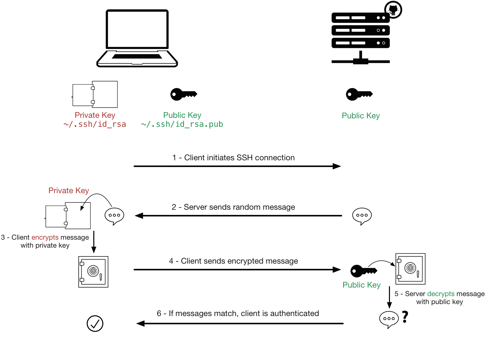

Encryption
==========
Written by Esteban, Edited by Morgan and Sara.

Introduction
------------
Encryption is when you convert plain text into cyphertext so that the plain text can only be understood by the authorized person. The translation of data into a secret code. We give away important information/data to the web and it is important to who ever we are giving the information to to protect us by encrypting the data. To read an encrypted file, you must have access to a secret key or password that enables you to decrypt it.

History of Encryption
---------------------
The word encryption comes from the Greek word kryptos, meaning hidden or secret. People have been ecrypting text as early since the beginning of communication. Egyptians scribe used non-standard hieroglyphs to hide the meaning of an inscription. In 700 BC, the Spartans wrote sensitive messages on strips of leather wrapped around sticks.Until this point, all encryption schemes used `Symmetric key`. In 1976, B. Whitfield Diffie and Martin Hellman helped to solve one of the fundamental problems of cryptography, how to send the key to decypher the text without exposing the data/information. Then the RSA implemented  the public-key cryptography using `Asymmetric algorithms`, or public-key.

Different kinds of encryption
-----------------------------
    * Base64 Encoding
    * Block Cipher
    * Symmetric Key/ Secret key
        DES
        AES
    * Asymmetric Key
        Diffie-Hellman
        RSA

How we use encryption today
---------------------------
Before there was assymetrical key, the officials were the only ones in need and using encryption. There was no need for someone else toe encrypt something because they were not sending information accross a network. But today all kinds of electronic devices use one kind of encryption. There are several protocols for encryption like SSH, S/MIME, and SSL/TLS to encrypt sensitive data. Now, everywhere you have sensitive information needs to be encrypted, not only on your phone and laptop computer but in the ATM, websites, and servers.

What can happen if someone can overpass encryption
--------------------------------------------------
It is important to understand that all kinds of sensitive and not so sensitive information need to be encrypted. People can do much with little information. All your passwords need to be encrypted you Social Security numbers has been stored somewhere, it has to be encrypted. You have given your address before, do you want people to do a simple google search and now all this things about you? What about you credit card number, expiration date and Code? 
Let say that someone has access to your computer now if he goes to the browser history and saw that you were checking your bank account, she/he clicks and he is in. He can send money check your bank account, know your account and router number, etc. If someone had access to your phone, she/he could unlock all your passwords from all your social media, email, websites. This is why even when you have your phone with a password, it is important to encrypt the passwords within your phone. 

Vulnerability example
---------------------
There is a reason almost everything on your phone is encrypted now-a-days, because you have important information in your phone. Now, what could happen if someone could overpass that encryption and have access to the data and information on your phone. Last year in 2016, chipmaker Qualcomm's mobile processor that was used in 60% of Android had a flaw. In combination with a vulnerability with Android's media sever, together these vulnerabilities could allow someone with physical access to the phone to bypass the full disk encryptionIt was not long for people to discover the vulnerability, but when it was made public by Duo Labs. 

Cited
-----

https://pixabay.com/en/encrypted-binary-file-computer-key-156514/

.. [encryption] "`What is encryption?" <http://searchsecurity.techtarget.com/definition/encryption> _." SearchSecurity. Web. 21 Feb. 2017.

.. [networking-class] Paul Craven. "`Session Layer." <http://networking-class.readthedocs.io/en/latest/chapters/session_layer/session_layer.html>_. "Session Layer — Networking Class 2016 Fall documentation. Web. 21 Feb. 2017.

.. [webo] Beal, Vangie. "Encryption." <http://www.webopedia.com/TERM/E/encryption.html>_.` What is Encryption? Webopedia Definition. Web. 21 Feb. 2017.

.. _Symetric key: https://en.wikipedia.org/wiki/Symmetric-key_algorithm
.. _Asymmetric key: https://en.wikipedia.org/wiki/Public-key_cryptography

