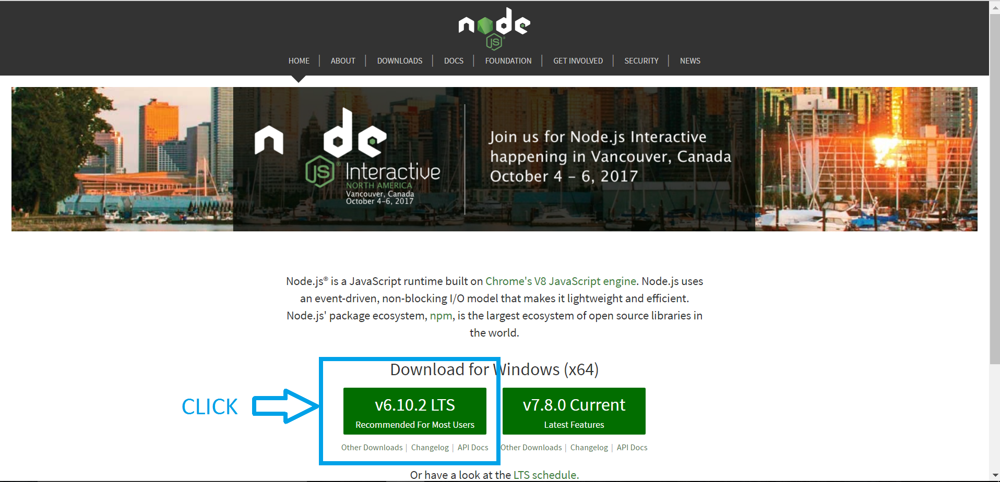
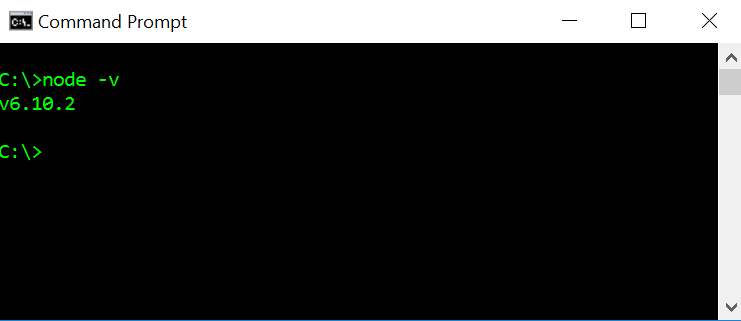
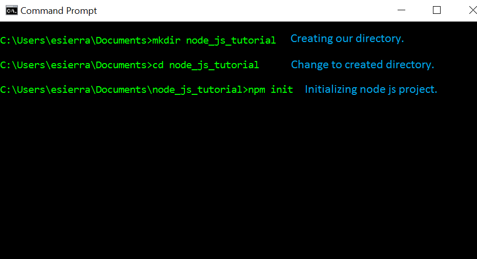
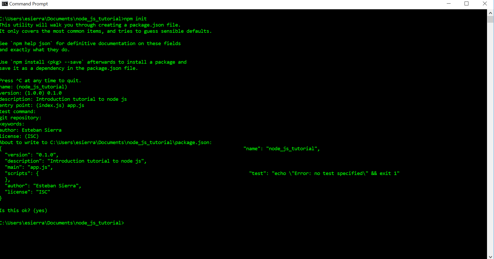
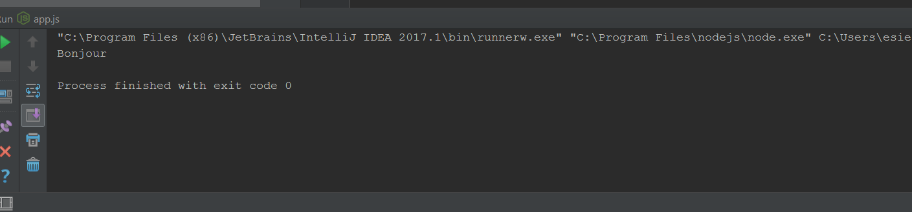
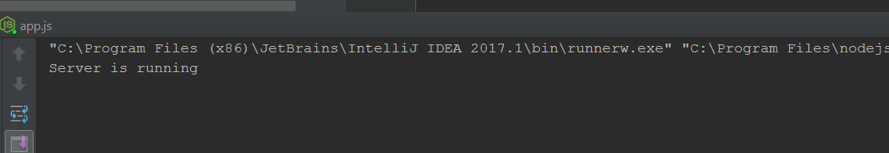
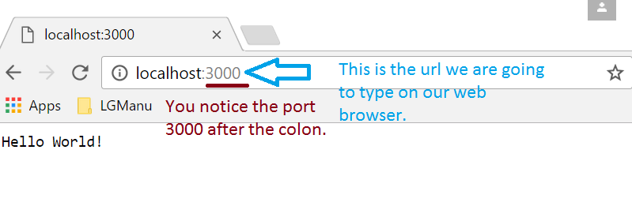
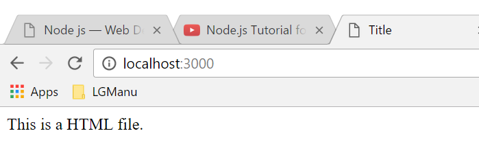
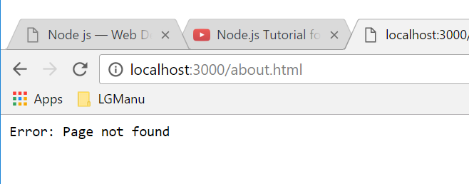

Node js - Esteban Sierra
========================
Node js let's you run JavaScript on your computer, as simple as that. It is an 
open source platform that takes out the engine that in runs JavaScript in Google
Chrome, JavaScript V8 Engine.

* V8 is written in C++.
* All APIs of Node.js library are asynchronous, it essentially means a server
  made with Node JS never waits for an API to return data.
* The server moves to the next API after calling it and Node JS takes care for
  returning the data from the server.
* NPM is the largest ecosystem of open source libraries
  in the world.

.. note::
	API
		Application program interface (API) is a set of routines, protocols, 
		and tools for building software applications.
	NPM
		Node Package Manager, is two things: first and foremost, it is an on-line
		repository for the publishing of open-source Node.js projects; second, 
		it is a command-line utility for interacting with said repository.

History
-------
Node js was developed by Ryan Dahl in 2009. At first node js was developed only for MacOs and Linux. Dahl demonstrated the project at the inaugural European JSConf, 
the project received a standing ovation.
In January 2010, a package manager was introduced for the Node.js called npm. The
package manager makes it easier for programmers to publish and share source code of Node.js libraries and is to simplify installation, updating and uninstallation of
libraries.
In June 2011, a native Windows version of Node.js. The first Node.js build
supporting Windows was released in July 2011.

Prerequisites
-------------

* Basic knowledge of HTML, CSS, and JavaScript, especially JavaScript.
* Text Editor
* Internet connection

Node JS will help you create really cool web application, especially if they
require to connect people, and will also aid you in making everything smother. 
For example if we want to create a real-time application, thanks to the agility
and smoothness of Node JS communication with server it will benefit your
application.

Installation
------------
Let's get started! Go to the website Node JS and download Node.js

Ok, once we have Node JS install in our computer, let's double check it is install
in your computer. Open your Terminal or Command Prompt, depending on your OS and
type ``node -v``. You should get a sentences containing the version of the node 
js installed in your machine. Should look something like this:

Next, we need a text editor. I will use Intelli j IDEA because it is a really good 
text editor. But I am assuming you have your own text editor. Sublime, Brackets, 
Notepad, Text Edit, Atom, etc any of those will work. Ok, let's dive in.

Creating a node js project
--------------------------
Open you cmd or terminal and create a directory were you want your node js project
to be. Run the next command *npm init* and that will initialize your project and
install all your dependencies. The cmd will ask several questions like the name, 
version, description, author, etc. Once they are over, you will have your project
up and going. Let's take a look at how it will look.

Once you run *npm init* this is what you will be getting.

.. note:: 
	If you do not want to answer the questions the value will be the one in
	parenthesis. For example name: (node_js_tutorial) was left blank,
	node_js_tutorial will be the name of my project.

Now, let's open up our project in our favorite text editor and jump right in into
the next subject of this tutorial.

Modules
-------
Modules are like libraries in any other OOP and node js has a very simple loading
system.Go ahead and open your project and create a file, I am going to name mine
*countries.js* they end with *js* so they are JavaScript files. On *countries.js* type the
following:

.. code-block:: js
	:linenos:

	function France() {
		console.log("Bonjour");
	}

	function Argentina() {
		console.log("Hola Che!");
	}

	module.exports.france = France();

We created two functions France and Argentina and they are login out "hi" in 
their language. The line ``module.exports.avatar = France;`` It's exporting the
function France and it's content. Cool thing about this is that you decide
what to export while keeping your other stuff private and not global.

Now on app.js:

.. code-block:: js
	:linenos:

	//Export the module countries.
	var country = require('./countries');

	//Run it
	country.france();

We create a variable called *country* to store the import from the module countries.
And now we will have access to countries.js. It should give us something like this:

.. important:: 
	When we declare the var countries we do not need to type the extension of the
	file *.js*. The program will read it as a node js file and also do you
	see the point and forward slash? Even though the files are in the same directory,
	we need to put the period and slash to specify it is an own created module. 
	Other wise it will look for node js modules that are already built into node
	js.

There are several ways to export from the modules. Another way of exporting could
be something like this, in your *countries.js* write the following code:

.. code-block:: js
	:linenos:

	module.exports = {
		bonjour: function() = {
			console.log('Bonjour');
		}
	}

And in the *app.js* file:

.. code-block:: js
	:linenos:

	let France = require('.countries');

	France.bonjour();

It will give you the expected result: *bonjour*.

.. important::
	Everything you type inside the *module.exports* will be available to other
	modules.

Now that we know how to use modules let's do something more fun with node js.
Let's create a Server in our computer with JavaScript.

* **Step 1:** Create a file with name: *server.js*
* **Step 2:** Import the *http module* from node js.
* **Step 3:** Create a variable to store the port you want to listen through.
* **Step 4:** Start the server with your function and port.
* **Step 5:** Create function to take user request if they hit the server.
* **Step 6:** Write header inside the function to send the user.

.. code-block:: js
	:linenos:

	//File: server.js
	//--Step 2--
	var http = require('http');

	//--Step 5--
	function onRequest(req, res) {
		console.log('User made a request.');

	//--Step6--
		res.writeHead(200, {"Context-Type": "text/plain"});
		res.write('Hello World!');
		res.end();
	}

	//--Step 3--
	var port = 3000;

	//--Step 4--
	http.createServer(onRequest).listen(port);
	console.log('Server is running')

It is really straight forward, right? Well, let's go in detail. We created the
file, we imported the *http module*, we created the port variable which I set to
be 3000 because that is what node js and express js ( another node js module)
usually use. Nothing new or strange until here.

We start our server with the function ``http.createServer(onRequest).listen(port);``
this line of code is creating a server and *onRequest* is a function
that the server is going to run when the user hits the server. *listen(port)* 
is only telling the server to start listening through the port assigned.

The *onRequest* function has to parameters *req* and *res*, which stand for request and response. The req variable holds the request the user is making like the link and what files are they looking for and the response is what we are going to be sending back to the client.

We need to write a head because that is appropriate http response to the user. The 200 is a http code that means everything is OK, and the rest is just saying the type of content we are going to send back. 

And when we run this, our terminal should look like these before we hit the server:

And now we can access our server:

Now, let's end a HTML file instead of plain text, this is simple and will be the last thing so that you can have your server up and running.

* **Step 1:** Create the HTML file you want to send.
* **Step 2:** Import the file server module to your server.js.
* **Step 3:** Change your *onRequest* function to send the file instead of text.
* **Step 4:** Write and if else statement in case they request a file it does not exist.

This is going to be my simple HTML file.

.. code-block:: html
	:linenos:

	//--Step 1--
	//File: index.html
	<!DOCTYPE html>
	<html lang="en">
		<head>
    		<meta charset="UTF-8">
    		<title>Title</title>
		</head>
		<body>
    		<h1>This is a HTML file.</h1>
		</body>
	</html>

And this is how our *server.js* looks like now.

.. code-block:: html
	:linenos:

	//File: index.html
	var http = require('http');
	//--Step 2--
	var fs = require('fs');

	function onRequest(req, res) {
	    console.log('User made a request.');

	    if(req.url == '/'){
	    //--Step 3--
	        res.writeHead(200, {'Context-Type': 'text/html'});
	        fs.createReadStream('./index.html').pipe(res);
	    } 
	    //--Step 4--
	    else {
	        res.writeHead(404, {'Context-Type': 'text/plain'});
	        res.write('Error: Page not found');
	        res.end();
	    }
	}

	var port = 3000;

	http.createServer(onRequest).listen(3000);

	console.log('Server is running');

The only thing that is new to us in this file is that we change the context-type of our response head to be text/**html** instead of plain. For obvious reasons. And then, we use the file server to send our file on step 3.
The last step is to make an if else statement to send a plain text of *Error: Page not found* when the user request a file that it is not routed in our server.

So our server should work like this.

When we request a file that does not exist or that the server can't serve, our browser should look something like this.

.. important::
	Congratulations you have created a useful file server in node js. I hope this tutorial was useful and hope you can continue your journey on this great ___ node js.

As a conclusion, we have learned so far:

* What is node js.
* What are modules and how to use them.
* How to send data between modules.
* How to create a plain text server.
* How to create a html file server.

These tools are more than enough for you to create a useful web server, for more advance topics you should try to google tutorials for node js. Javascript has many more tools that you can use besides node js. Some that I would suggest to look for would be Express js and Angular js.

Citation
--------

.. [top] "Node.js Tutorial." www.tutorialspoint.com. Tutorials Point, Web. 11 Apr. 2017. <https://www.tutorialspoint.com/nodejs/index.htm>.

.. [wkp] "Node.js." Wikipedia. Wikimedia Foundation, 24 Apr. 2017. Web. 24 Apr. 2017. <https://en.wikipedia.org/wiki/Node.js>.

.. [tut] "Node.js for Beginners." Code Envato Tuts+. Web. 24 Apr. 2017. <https://code.tutsplus.com/tutorials/nodejs-for-beginners--net-26314>.
