ECMAScript 6
===============
*Written by Lana*

What is it?
~~~~~~~~~~~~~~~
ECMAScript is the standardize language for JavaScript and is defined by ECMA-262 
standard [Zakas]_. JavaScript is used in most web browsers allowing 
programmers to create more functionality, but with a user friendly interaction 
for the client. So with the new ECMAScript 6, also known as ES6, this will allow 
programmers to write more readable and cleaner code. With the latest update, 
implementation for the new features of ES6 has begun. Most web browser are up to 
date and support the new features. Hopefully, programmers have read up on the 
new update and are least underway to improve their code. [gitHub]_ 

When is it used? 
~~~~~~~~~~~~~~~~~~
JavaScript may have multiple uses, such as client-side validation of form 
elements, allowing the user to drag and drop elements, updating a table, 
asynchronously retrieving data from a server and loading it into the page 
(AJAX), and more. Basically, it is primarily used in the form of client-side 
JavaScript. It allows programmers to enhance the web browser’s interface(s) 
making the website more dynamic.

The most common web browsers include Firefox, Chrome, Safari, Internet Explorer, 
Microsoft Edge, and Opera. According to Kangax, all of the listed most common 
web browsers excluding Internet Explorer have implemented 97% of the new 
features. Wheras, Internet Explorer only support 11% of the new features. That 
may be due to Microsoft Edge potentially replacing Internet Explorer. [Kangax]_

History
~~~~~~~~~
In the early stages, ECMAScript first appeared at Netscape and in that company's 
Navigator 2.0 browser. Soon it also appeared in other browsers from Netscape and 
Internet Explorer. [ECMAScript]_

The ECMAScript Language Specification was created by Brendan Eich in November 
1996. The first edition of this ECMA standard was adopted by the ECMA General 
Assembly of June 1997. The changes between the first and second edition were 
editorial in nature. The second edition was submitted shortly after to be be 
approved as international standard ISO/IEC 16262 in April 1998. 

Then the third edition had a larger adoption allowing it to be incorporated with 
the World Wide Web resulting it to be the main programming language to be 
supported by all web browsers. The development team started working on the new 
updates for the fourth edition. However, it was not complete so it was never 
implemented. The fifth edition had minor correction and was submitted to ISO/IEC 
JTC 1. [ECMAScript]_

Following, the sixth edition development started in 2009. The development 
team’s goal was to enhance the language. Their biggest goal was to:
 
	included providing better support for large applications, library creation, 
	and for use of ECMAScript as a compilation target for other languages. Some 
	of its major enhancements included modules, class declarations, lexical 
	block scoping, iterators and generators, promises for asynchronous 
	programming,destructuring patterns, and proper tail calls. 
	
	The ECMAScript library of built ins was expanded to support additional data 
	abstractions including maps, sets, and arrays of binary numeric values as 
	well as additional support for Unicode supplemental characters in strings 
	and regular expressions. The builtins were also made extensible via 
	subclassing. The sixth edition provides the foundation for regular, 
	incremental language and library enhancements. [ECMAScript]_

ES6 New Features
~~~~~~~~~~~~~~~~~~~

**Var vs. Let**

Typically to declare a variable was by using "var". Wherever variables occured 
the code executes the variables first, this is known as "hoisting". If a 
variable is declared outside of a function, it is considered a global variable. 
With the new ES6 update, a new way to declare a variable is by using "let". So 
declaring a let variable has the same syntax compared to var. Essentially, let 
could replace the var declaration. [Zakas]_

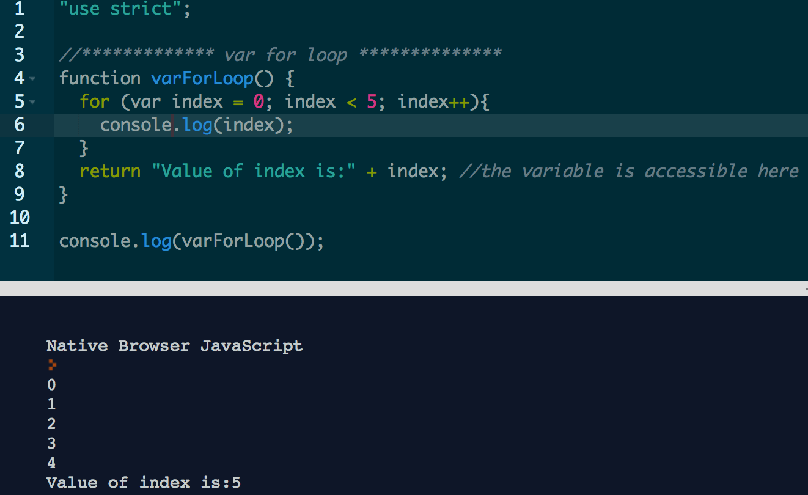
		
		The variable is declared within the for loop INSIDE the 
		function. Notice, that the variable can be called outside the for loop, 
		meaning the variable is function scoped. It can only be called inside 
		the function.
		
		
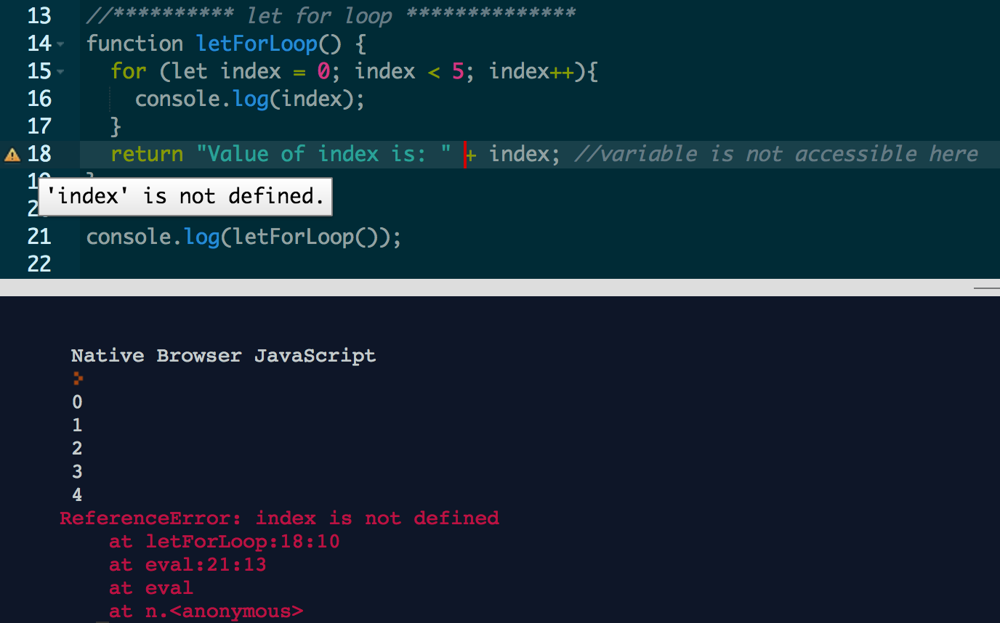
		
		This is similar to the picture above, but the variable was 
		declared by using “let”. Notice that the variable is called outside the 
		function. However, there is an error message saying "variable is not 
		define". Let variables are blocked scope and that is why it can not be 
		called outside of the block.

Variables can be either declared as “var” or “let”, depending on the contexts 
and whether if the variable should be accessible or not. Basically, variables 
that are declared as “var” are considered as function scope, whereas “let” 
variables are considered block scope. The two images above displays how a "var" 
declaration is function scoped and can be called anywhere INSIDE the function. 
Whereas, "let" variables can only be access within the block making it block 
function scoped. [Zakas]_

Another difference is that ‘let’ variables can not be re-declared using the same 
name.

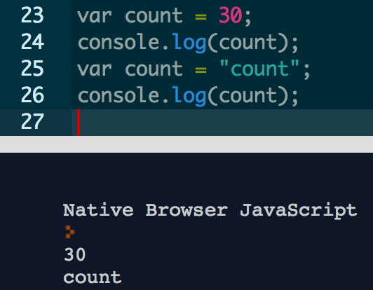
		
		The variable "count" is declared by using var which is 
		valid. It just replaces the value of count with the new value. 

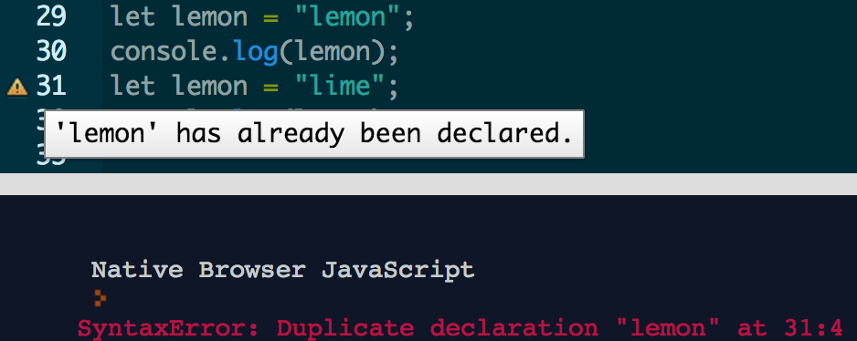
		
		Notice the variable lemon is declared by using “let” which is 
		valid for the first variable, but not for the second. The second 
		variable states gives an error message because “let” can not redefined 
		an identifier that already exists in the same scope. 

However, it will not throw an error if a new variable is created within a 
containing scope by using let. 

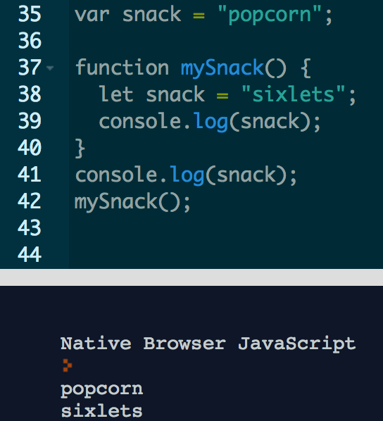

This is acceptable because let snack is declared within a function making the 
variable block scope. If called outside the function, it would return popcorn, 
the global variable. 

**Arrow Function**

Arrow functions is a shorter function syntax... Kind of. It is best used when 
the function is small, and inline. Functions can be written the typical way of 
writing a function, however, the arrow function provides a "cleaner" and more 
readable code.

The following is the way to write a function that is not using the new arrow 
syntax. 

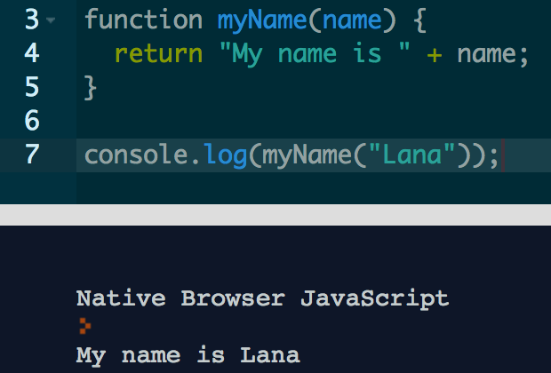
		
		A simple example of how to write a function

 
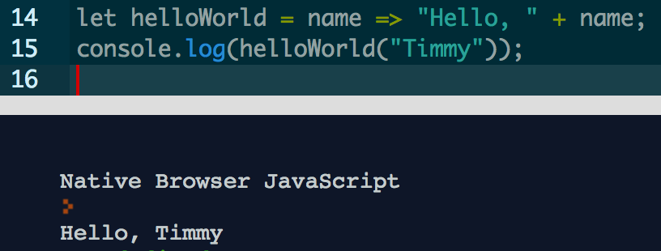
		
		
The image above is an example of an arrow function. The entire function is on a 
single line. The keyword “function” has been removed; In this example 
“helloWorld” is the function name followed by “name” which is the parameter; 
then the arrow syntax is followed by the “body” of the function. In this case it 
will display “Hello, Timmy”. 

An arrow function can still be written with more content in the body. To do so,
following the arrow syntax (=>) should be curly braces and the content within. 
Obviously, it will no longer be inline but, still somewhat shorter syntax. 

A common error in Javascript is how binding “this” inside a function. The value 
of “this” could be changed inside a function which may not be the intention of 
the programmer. The purpose of the arrow function is to eliminate the number of 
errors. Arrow functions do not bind “this”, meaning the value of “this” is 
determined by looking up the scope chain. [Zakas]_

**Template Literals**

ECMAScript 5 lacked features for certain situations dealing with multiple 
strings. Programmers found work around ideas to make results on a single line, 
and multiple lines. Some of these practices were considered syntax bugs so it 
was not the best practice. An example of a work around idea was to add backward 
slash when the intentions of the results are to be a single line instead of 
multiple lines.

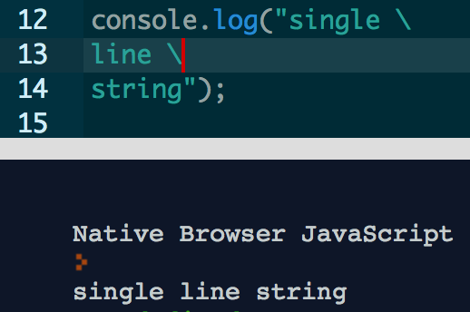
		
		Even though this is a simple example, it displays how 
		programmers would make the string results output on a single line 
		instead of multiple. 

Another work around to make string results on multiple lines was by adding 
backslash + n + backslash wherever a new line was needed.

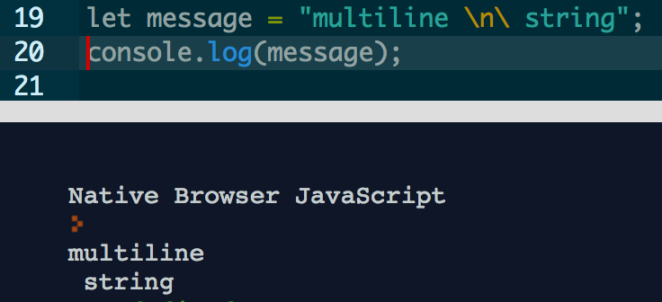
		
ECMAScript 5 lacked some features which is in now included in ES6 – template 
literals "fixes" multiline strings, basic string formatting and HTML escaping 
(the ability to transform a string so it is safe to insert into HTML). 
JavaScript could have added more functionality to already existing strings, but 
template literals are a new approach to solve some problems.

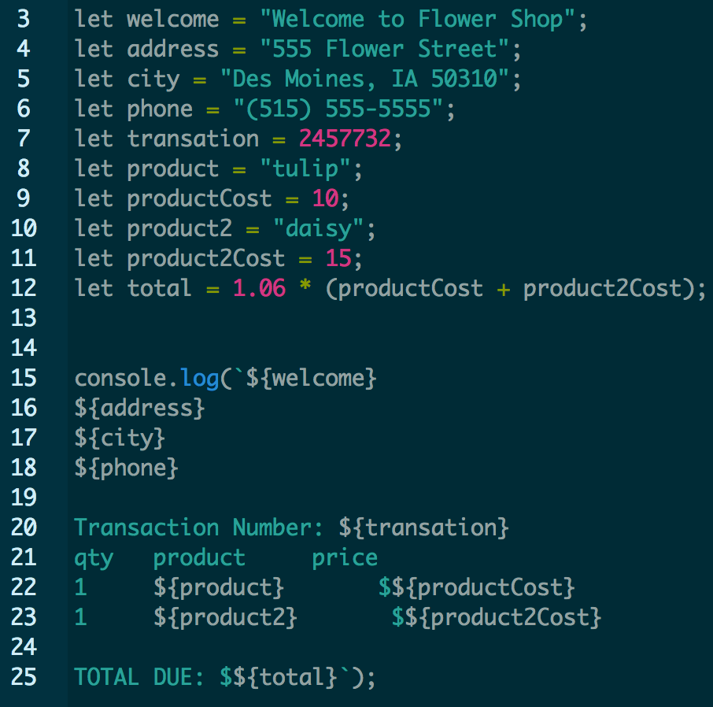

 
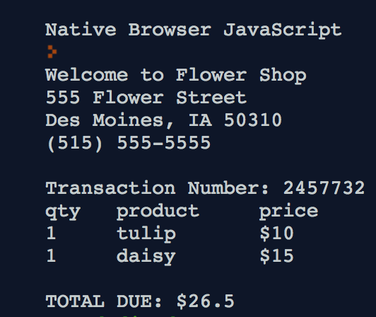

Typically, this would be done in SQL database, but for this assignment the 
example is to display how template literals allows multiple lines, includes 
spacing and a cleaner way to include variables. 

Template literals are used with ticks or backticks (this is above the tab key) 
instead of quotation marks. Also, to have them on a new line, just move the 
content to a new line and it will show this in the results. Looking at line 
20 – 25 from the image above, notice there is additional spacing between “qty”, 
“product”, and “price”. This is one of the new features apart of the template 
literal. Prior to this update, concatenation was the way to include a variable. 
However, notice in the example it is included by “${variable}”. This update 
avoids previous work around and is a cleaner way to output text and variables.

**Classes**

JavaScript did not have classes prior to ES6 update. Instead, there were 
libraries that functioned like a class, but became very unclear and confusing 
for many programmers.

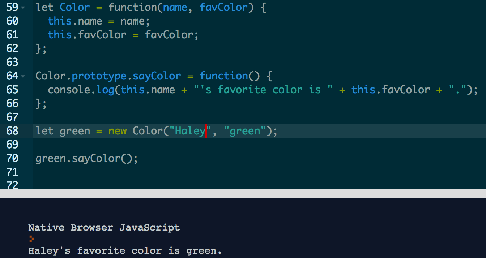
		
		old way to write a class

		
		
In this example “Color” is the constructor taking name and color as the 
parameters. The sayColor() is a method that is assigned to prototype so the same 
function is shared by all instances of the “Color” object. Than the object is 
created by using the “new” operator.

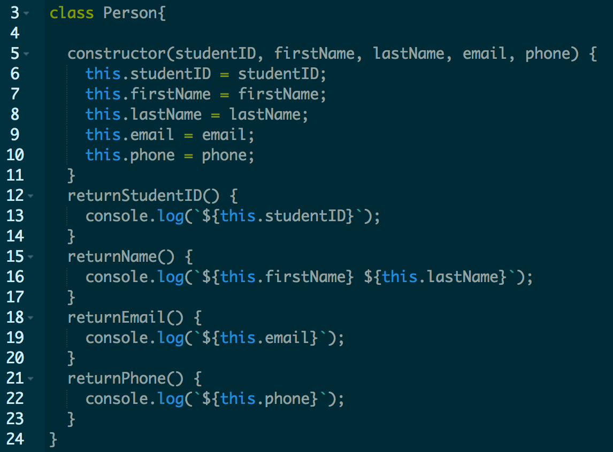
		
		New way to write a class

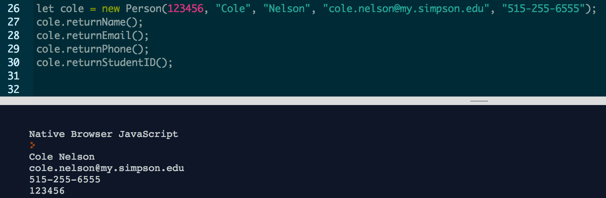

ES6 update on how to make a class is a lot clearer to read. This example is 
fairly simple, but displays an easier way to read and write the class. For 
starters, begin with the ‘class’ keyword followed by the name of the class. 
Next, create a constructor which is where the parameters would be taken in. It 
is cleaner to create a constructor by using the keyword “constructor” instead of 
creating a function that defines the constructor. Then, create the methods 
associated with the class. Since the class has a concise syntax there is no need 
to use the “function” keyword to make a function. Instead, name the method 
followed by open and close parentheses. 

•	With the new feature, there are some differences between the two and how 
they behave. Class declarations are not hoisted unlike function declaration. 
Class declarations behave similarly to let declarations, so they exist in the 
block until execution reaches the declaration.

•	All code within the class declarations runs in strict mode and there is no 
way to opt out of it. Strict mode is a way to have better error-checking into 
your code.

•	In the new ES6 features, methods are non-enumerable meaning an object 
property can not be modified within the class. 

•	Calling a constructor without “new” will throw an error message. 
There are actually a lot of changes on how a class behaves so what was listed 
above is just a small handful of those alterations.

 
**Promises**

Web developers needed to incorporate a way to manage how asynchronous user 
interactions should be executed. Node.js allowed asynchronous programming more 
common with callbacks. However, it was not powerful enough for programmers. 
Therefore, promises were the solution to this issue. Promises are an alternate 
option for asynchronous programming. Resembling events and callbacks, a promise 
specifies some code to be executed later, but promises also explicitly indicate 
whether the code resolved or failed. [Zakas]_

In the example below may be a silly concept. Nevertheless, this shows how a 
promise is set up. Notice that a promise is created; usually it takes two 
parameters (most common parameters is resolve and reject). A function is created 
to randomly “roll” a six sided die and to return a random number. If the 
results are an odd number, it will be resolved else it will be rejected.

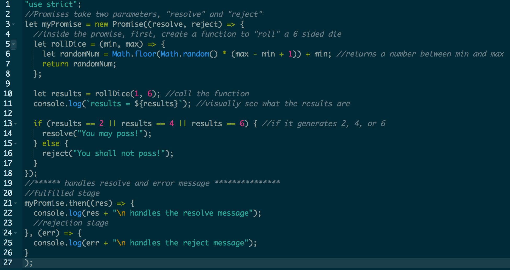

A promise life cycle has three stages. Pending, fulfilled, and rejected.

1. Pending stage indicates the operation is not complete.
2. Fulfilled stage indicates the operation fulfilled successfully.
3. Rejected stage indicates the operation failed due to an error or another cause.

Notice in the example above, line 20 – 25 is how the promise handles the 
fulfilled and rejected stage. 

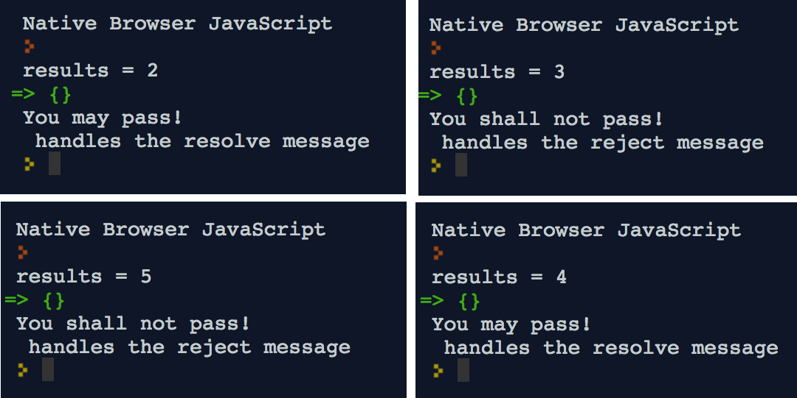

Again, this is a simple example and there are more 
components to promises. Promises are a powerful way to asynchronous program and 
provides a cleaner way to do so.

Conclusion
~~~~~~~~~~~~~~~
The ES6 update has been one of the largest updates for JavaScript programmers 
with the intention of cleaner and more concise coding. The examples above are 
only a handful of concepts that were updated which barely covers half. However, 
the update has been a positive update allowing programmers to write cleaner 
code, make it more readable, and fixes a lot work around that were considered as 
bugs.

Sources
+++++++++

.. [gitHub] Hoban, Luke. "Lukehoban/es6features." GitHub. N.p., n.d. Web. 11 Apr. 2017. <https://github.com/lukehoban/es6features/blob/master/README.md>.

.. [Zakas] Zakas, Nicholas C. Understanding ECMAScript 6: the definitive guide for Javascript developers. San Francisco: No starch Press, 2016. Print.

.. [Kangax] ECMAScript 6 compatibility table. N.p., n.d. Web. 17 Apr. 2017. <https://Kangax.github.io/compat-table/es6/>.

.. [ECMAScript] ECMAScript® 2016 Language Specification. N.p.: ECMA International, June 2016. PDF. < https://www.ecma-international.org/publications/files/ECMA-ST/Ecma-262.pdf>.
