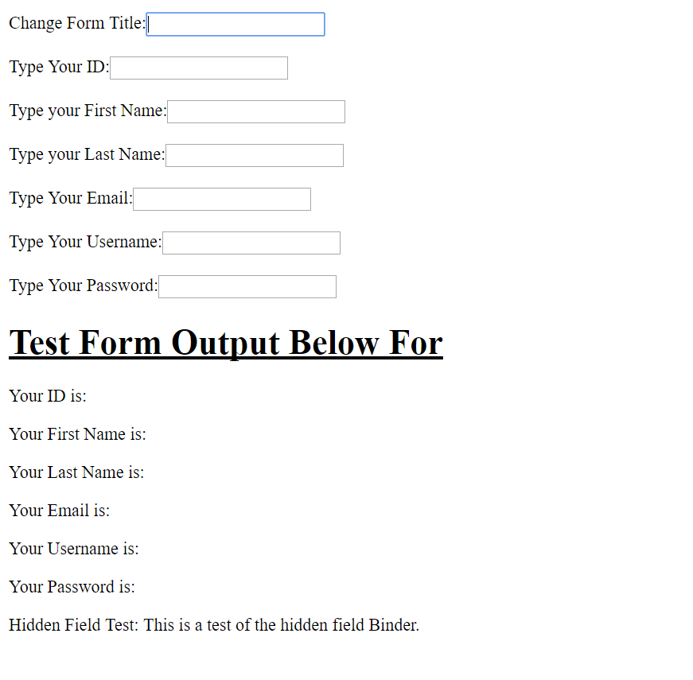
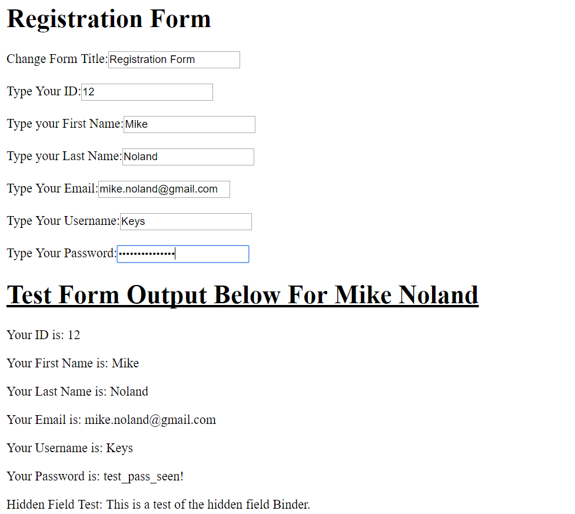

AngularJS Tutorial By:Michael Borland
=====================================
The Brief History of Google's AngularJS
---------------------------------------
Disclaimer it's probably the worst together paper I've ever wrote, I didn't get finished and tell 7:40AM.
I felt like I owed you something for giving me the extension and being so generous with it. I just couldn't manage to get a good paper out of the time I had with everything else going on.

Angular.js was developed by Google as an open source way to make HTML at the time,
HTML5 now more efficient and gives a simpler way to do what would take would take
a bunch of JavaScript to achieve before angular. AngularJS's first release was 
put on GitHub in 2010 on November 11 [GITHUB]_.
The Tech Crunch article went into depth about the second full version release of 
AngularJS. It offered some insightful details on what are the big pluses to the 
two versus one, and it made a point of pointing out that  one and two are not at 
all compatible. Article offered up some possible solutions to help you make your 
decision on which version to pick. The modern progression of things is probably 
go with two if you’re new to angular JS. If you’re a developer coming under 
projects that are written and angular JS 1.0-1.6 what this tutorial written. 
The decision whether to upgrade it is tied to availability of the money or not, 
to essentially rewrite the same program in the upgraded version.The
tech crunch article also, announced the release date for angular 2.0 out of beta
in 2014,so took them four years to innovate the framework to make it even more 
efficient, and make mobile development easier. In doing so as mentioned above 
they made versions incompatible[TECHCRUNCH]_. The Following tutorial is in 
AngularJS 1.6.

Introduction to AngularJS
-------------------------
There are couple reasons that AngularJS is attractive to all kinds of developers, during this tutorial the simpler aspects of AngularJS will be examined, just the core basics to get a simple form to auto fill with information into nine in total form fields. To achieve this, you just must have a basic background in the five below topic areas. One, thing that is apparent from doing more research on the topic, that the bare basics are easy to grasp for most, and that’s all that will be presented here. Per Anton Tymchuk  blog post from 2015, he explains as tech crunch did there are some drawbacks to AngularJS. He specifically covers that certain things are easier, if you the learner have had some experience with a JavaScript library in the past. If you haven’t he explains that the entirety of the framework can be difficult for you to learn as a brand-new JavaScript developer. The community is the pretty large one, another article that talks about the popularity from Eduonx explores some bigger companies that use it as the core of an application they have developed, there are few that are notable on the list that I’ll list below. [STFALCON]_ 
	* Netflix
	* angularJS.org
	* weather.com 
	* YouTube for PS3

[EDUONIX]_

Directives 
~~~~~~~~~~
Directives are the NG–controller,app,or model  that are part of the the HTML in the form properties below. Out of habit in the form example below, I named the form  attributes the same thing to make it easier when making changes in the future,  and it makes it easier to remember if you're trying to manipulate in another program.It also makes it easy when you're having to remember which directive you're trying to use is the right over in the label name so you don't have to go far.The directives here are bound to each field name,  first name last name etc., now they are prepared  to be able to  automatically update  if  something is entered into an input box. The data binding just has to take place and in order for your form to work.  First though you need to be stepped through the scope object, how it's used in data binding, and then  discuss the properties of the data binding represented in the example. [ANGULAR_2]_

Data binding and Scope
~~~~~~~~~~~~~~~~~~~~~~
The data binding in scope principle is in general the double brackets in the double brackets with the variable name inside of it, that how you bind data to the specific element in HTML. In order to even be able to do this you need to have a scope object created with all of the elements mentioned above already typed out. Then you have to have a scope object followed by a . and then variable name to then be able to see something print to the screen. You can see in the example below that all of the scope variable names have been bound to each individual field and if you were to have access to this program you could make your own registration form with your own data. It would print the screen automatically, and as you can see it's little to no code to do so thanks to angularJS.

 [ANGULAR_4]_ [ANGULAR_3]_

Module and Controller
~~~~~~~~~~~~~~~~~~~~~

In programming, you must have a container of some type to send all the data to the compiler, in the case of object oriented programming it’s a main method, everything must be called inside main. This is a similar concept to angular JS, but it must be inside of module method. This can be found in this the simple form example below on line 31 where variable is set to testFormApp, and that is used again on line 32. Line 32 is where the controller aspect of things come in, and this is where another parallel can be drawn if you have relatively little experience programming, the controller acts as the constructor for an object called scope which will be discussed below. The object for scope has been created so this is where the concept of the view model controller comes in, basically angular has separated the application into three parts, the angular logic, what you the user sees, and the actual information.[STFALCON]_ [ANGULAR_5]_ [ANGULAR_6]_

An important topic to discuss when trying to implement libraries nowadays is
the use of linking in with content delivery networks. 
Below CDN's are described in a little bit of detail, as they pertain to the
implementation of AngularJS the framework, and the many libraries that increase
the functionality of the framework.

Content Delivery Network Description
~~~~~~~~~~~~~~~~~~~~~~~~~~~~~~~~~~~~

AngularJS has two ways of implementing the libraries that compose the entirety of the framework in your HTML pages. One, is going to the website: `AngularJS <https://angularjs.org/>`_ and downloading the library, or you can use a content delivery network. Now, to explain further the content delivery network, it is a static or not group of Web Servers that that will always send you to a server location nearest to your IP, that is a very brief a limited description of a CDN explained in much more detail by [AMZ]_. Sites that are available as content delivery networks are the two listed below in the example, and several others. Programmers can investigate CDN’s to see if they offer the libraries that they’re looking for. By searching AngularJS CDN on Google and it should come up with the most popular CDN for Angular. The CDN's that are listed below, may not necessarily come up with angular content, but they could serve up other libraries. The list came in part, in no particular order from: `cdnreviews <http://www.cdnreviews.com/popular-cdns/>`_. 

* Amazon cloud front
* MaxCDN
* CDN77

Examples Of Libraries Available In AngularJS
~~~~~~~~~~~~~~~~~~~~~~~~~~~~~~~~~~~~~~~~~~~~
.. code-block:: html
	:linenos:

	<!DOCTYPE html>
	<html lang="en">
	<head>
	<meta charset="UTF-8">	
	<title>Example of Angular Libraries</title>

	<!-- This is the main library that you need to have linked, or downloaded to use AngularJS. -->
	

	<!-- These are a bunch of libraries that expand the functionality of the above  the above framework. -->
	
	
	
	
	
	
	
	
	
	
	
	
	
	
	
	
	

	</head>
	<body>
	<!-- Links to a bunch more libraries are found at the link below. -->
	<a href="https://cdnjs.com/libraries/angular.js/1.6.4">AngularJS libraries Available here</a>

	</body>
	</html>

Form Example
~~~~~~~~~~~~
Explanation of what the form does goes here. i patterned it off of this and expanded it by 7 fields. [W3SCHOOLS]_

.. code-block:: html
	:linenos:

	<!DOCTYPE html>
	<html lang="en">
	<head>
	<meta charset="utf-8">
	<title>Angular Form Example</title>
	
	
	</head>

	<body>
	

	<form>
	<h1>{{changeHeading}}</h1>
	<label for="changeHeading">Change Form Title:<input type="text" name="changeHeading" ng-model="changeHeading"></label>   
	<label for="ID_number">Type Your ID:<input type="text" name="ID_number" ng-model="ID_number"></label>  
	<label for="firstName">Type your First Name:<input type="text" name="firstName" ng-model="firstName"></label>  
	<label for="lastName">Type your Last Name:<input type="text" name="lastName" ng-model="lastName"></label>   
	<label for="email"> Type Your Email:<input type="text" name="email" ng-model="email"></label>    
	<label for="username">Type Your Username:<input type="text" name="username" ng-model="username"></label>     
	<label for="pass">Type Your Password:<input type="password" name="pass" ng-model="pass"></label>
	<label for="hf"><input type="hidden" name="hf" ng-model="hf"></label>
	</form>
	<h1 style="text-decoration: underline;">Test Form Output Below For {{firstName}} {{lastName}}</h1>

	
Your ID is: {{ID_number}}

	
 Your First Name is: {{firstName}}

	
 Your Last Name is: {{lastName}}

	
Your Email is: {{email}}

	
Your Username is: {{username}}

	
Your Password is: {{pass}}

	
Hidden Field Test: {{hf}}

	

	<!-- The below script tag contains the code that constructs the
	 AngularJS form Application, and allows for the data binding above. -->
	

	</body>
	</html>

Image of empty example form

Image of filled out form

References 
----------
.. [TECHCRUNCH] Frederic Lardinois."`Google launches final release version of Angular 2.0 <https://techcrunch.com/2016/09/14/google-launches-final-release-version-of-angular-2-0/>`_.Crunch Network.Web.Date Accessed 18 April 2017" 

.. [ANGULAR_2] No author listed. "`Directives <https://docs.angularjs.org/guide/directive>`_. Google. Web. Date Accessed 24 April 2017."
.. [ANGULAR_3] No author listed. "`Scope <https://docs.angularjs.org/guide/scope>`_. Google. Web. Date Accessed 24 April 2017."
.. [ANGULAR_4] No author listed. "`Data binding <https://docs.angularjs.org/guide/databinding>`_. Google. Web. Date Accessed 24 April 2017."
.. [ANGULAR_5] No author listed. "`Controller <https://docs.angularjs.org/guide/controller>`_. Google. Web. Date Accessed 24 April 2017."
.. [ANGULAR_6] No author listed. "`Module <https://docs.angularjs.org/guide/module>`_. Google. Web. Date Accessed 24 April 2017.

.. [EDUONIX] Sabeer Shaikh. "`Top 15 websites bilt With AngularJS <https://www.eduonix.com/blog/web-programming-tutorials/top-15-websites-and-apps-built-with-angularjs/>`_.Eduonix Learning Solutions . Web. Date Accessed 26 April 2017.""

.. [AMZ] No Author List."`Amazon CloudFront – Content Delivery Network (CDN) <https://aws.amazon.com/cloudfront/?sc_channel=PS&sc_campaign=acquisition_US&sc_publisher=google&sc_medium=juice_test_nb&sc_content=cdn_p&sc_detail=cdn&sc_category=cloudfront&sc_segment=164981649830&sc_matchtype=p&sc_country=US&s_kwcid=AL!4422!3!164981649830!p!!g!!cdn&ef_id=WO8RiAAABBvbPdZA:20170413055000:s>`_.Amazon.Web.Date Accessed 13 April 2017"

.. [STFALCON] Anton Tymchuk. "`AngularJS: A Powerful JavaScript Framework <https://stfalcon.com/en/blog/post/why-use-angularjs-for-webapps#more>`_. UpWork. Web. Date Accessed 26 April 2017."

.. [GITHUB] No Author Listed."`First Known Release Of AngularJS <https://github.com/angular/angular.js/releases?after=v0.9.4>`_.GitHub.Web.Date Accessed 18 April 2017."
.. [W3SCHOOLS] No Author Listed."`Data Binding W3 <https://www.w3schools.com/angular/angular_databinding.asp>`_.W3Schools.Web.Date Accessed 18 April 2017."

