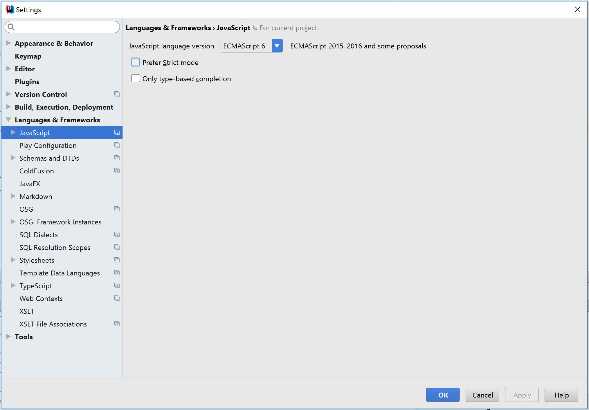

New ES6 Features - Michael Reuter
=================================

Introduction
------------
ES6 is a new set of features for JavaScript that make the language more robust 
and easier to use. The abbreviation ES stands for ECMAScript. ECMA is an
international organization that makes programming standards. ECMAScript can be 
implemented in several scripting languages, but it was created for JavaScript 
and that remains its most popular implementation. [ES]_

History
-------
The history of ES is rather unique and the naming convention can be confusing.
The first version of the scripting language was approved in 1996 after being
created by Netscape who submitted what they called JavaScript to ECMA for
standardization. [ES]_

ES was improved upon soon after its initial release with versions 2 and 3, the
later being released in 1999. This is where things get a little weird. Unlike 
most other programming languages and technologies, new additions to ES standards
were not released for ten years with version 5 following in 2009. Version 4 was
abandoned. [ES]_

Version 5, named ES5, is currently very popular and supported by all major
browsers. [ES5]_ Version 6 which is also called ES6 and ES2015 is gaining
popularity and the topic of this report. With version 6 which was standardized
in 2015, the naming system changed to ES followed by the year it was published.
This is in an effort to launch new versions every year and not wait for an
entire feature set to be completed. ES2016 is actually the newest standard but
it takes a few years for changes to be widely adopted. [ES]_

Uses
----
JavaScript and the new features available in ES6 have a wide variety of uses.
JavaScript is popular as a client-side scripting tool, enabling websites to
hold interactive content that can provide a captivating and useful web design
while allowing features to run faster. JavaScript is also becoming popular as
a back-end tool with its inclusion in languages such as Node.js. This server
technology isn't useful for all applications, but it works very well for network 
applications because it can support thousands of concurrent connections. [Node]_
There are many more possible applications for the technology which will likely
be realized in the future.

New features
------------
Constants
^^^^^^^^^
Also known as immutable variables, the concept of constant variables is simply
variables that cannot be reassigned. [ES6NF]_

Example:
    
.. code-block:: javascript

  const userNum = 55;

  userNum = 100;

  console.log(userNum);

This example will not log the number 55 and will instead throw an "Assignment
to constant" error.

This is beneficial for several reasons. First, programs are easier to understand
if variables (or some of the variables) can't be changed. Second, performance is
generally faster because references to constants can be cached. [IO]_

Default Parameters
^^^^^^^^^^^^^^^^^^
A second new feature of ES6 is default parameters. In previous versions of the
language it took multiple lines of code, but the defaults can now be included
in the function declaration. [ES6NF]_

For example, if an Indianola business had a customer form on their website, they
might want to use code like this:

.. code-block:: javascript

  function defaults(fName, lName, state = "IA", county = "Warren", city = "Indianola", areaCode = 515) {
    console.log(fName);
    console.log(lName);
    console.log(state);
    console.log(county);
    console.log(city);
    console.log(areaCode);
  }

The console outputs:

.. code-block:: python

  undefined
  undefined
  IA
  Warren
  Indianola
  515

String Interpolation
^^^^^^^^^^^^^^^^^^^^
String Interpolation is a fancy way of saying that it is easier to access data
stored in strings. This can be very useful for displaying data and in a host of
other implementations.

Here is an example including a student and the courses they are enrolled in:

.. code-block:: javascript
  
  var student = {firstName: "Michael", lastName: "Reuter"};
  var course1 = {name: "Programming", instructor: "Craven", days: "MWF"};
  var course2 = {name: "Spanish", instructor: "Gates", days: "TTH"};

  var loginMsg = `You are signed in as ${student.firstName} ${student.lastName}. 
  You are enrolled in ${course1.name} and ${course2.name}.`;

  console.log(welcomeMsg);

The log output is:

.. code-block:: python

  You are signed in as Michael Reuter. You are enrolled in Programming and 
  Spanish.

This may seem a bit more complicated than the ES5 code which allowed references
like ``student.firstName`` and ``course1.name`` but it is more useful in most
implementations. For example, when writing a message or logging information,
concatenation with plus (+) signs is not needed and extra spaces inside
quotations aren't necessary. Note, however, that the string uses back ticks (`)
instead of regular quotation marks. [ES6NF]_

Back ticks can also be used to create a multi-line string. Where concatenation 
with plus (+) signs and new quotes was required in ES5, a string can encompass 
an unlimited number of lines using back ticks in ES6. [TOP10ES6]_

Here's an example using some text from the Quick Facts page on Simpson College's
website:

.. code-block:: javascript

  var message = `Eighty-five acres comprise Simpson’s main campus in Indianola 
  with 34 major buildings, including: College Hall, Wallace Hall, Mary Berry 
  Hall, George Washington Carver Science Center, Dunn Library, Kent Campus 
  Center, Smith Memorial Chapel, Blank Performing Arts Center, Athletic Complex, 
  Amy Robertson Music Center and Henry H. and Thomas H. McNeill Hall.`

Short object definitions
^^^^^^^^^^^^^^^^^^^^^^^^
This is an extremely simple improvement but it makes the language easier to
understand. During this course, many students were confused when creating a line
in the JavaScript login file that looked something like ``var dataToServer = 
{loginId : loginId};`` The ``loginId : loginId`` section can be somewhat 
confusing to people who are new to the language. This has been simplified in ES6
allowing for that line to look like this:

.. code-block:: javascript

  var dataToServer = {loginId};

Let statements
^^^^^^^^^^^^^^
ES6 introduces ``let`` which is very similar to ``var`` but contains itself to 
the curly braces that house the statement. This allows variables to be 
temporarily changed within sections of code. [TOP10ES6]_

Read the following code and predict what the output will be before scrolling
to the solution.

.. code-block:: javascript

  function letTest() {
      var projectedEnrollment = 1000;

      console.log("Check 1: ", projectedEnrollment);
      {
          // How about a digital advertising campaign?
          let projectedEnrollment = 1050;
          console.log("Check 2: ", projectedEnrollment);
      }
      console.log("Check 3: ", projectedEnrollment);
      
      {
          // What about hiring another admissions counselor?
          let projectedEnrollment = 1025;
          console.log("Check 4: ", projectedEnrollment);
          {
              // What about adding an online application?
              let projectedEnrollment = 1100;
              console.log("Check 5: ", projectedEnrollment);
          }
          console.log("Check 6: ", projectedEnrollment);
      }
      console.log("Check 7: ", projectedEnrollment);
  }

Here is the output:

.. code-block:: python

  Check 1:  1000
  Check 2:  1050
  Check 3:  1000
  Check 4:  1025
  Check 5:  1100
  Check 6:  1025
  Check 7:  1000

String searches
^^^^^^^^^^^^^^^
As a final feature highlight, ES6 added a few very useful and easy ways to
search strings. [ES6STR]_ This includes:

.. code-block:: javascript

  .startsWith()
  .endsWith()
  .includes()

Here is an example implementation:

.. code-block:: javascript

  function stringSearches() {
      var sentence = "Simpson College is an excellent school.";

      console.log(sentence.startsWith("Sim"));
      console.log(sentence.startsWith("col"));

      console.log(sentence.endsWith("."));
      console.log(sentence.endsWith("an"));

      console.log(sentence.includes("is"));
      console.log(sentence.includes("excel"));
  }

The console prints true or false for each line:

.. code-block:: python

  true
  false
  true
  false
  true
  true

Compatibility
-------------
What happens to the web page when the browser isn't compatible? The short answer
is that it doesn't work. End users don't generally see error messages unless
they're looking at the console, so it may appear that the website is programmed
poorly.

How do today's JavaScript developers write modern, efficient code while
ensuring it will work for all their users? The answer to this question depends
on the end user environment. Generally, it is much easier to determine what
version of JavaScript to use when writing an internal application for a 
corporate environment because the company likely has standardized browser 
versions. This may mean that programmers aren't writing in the newest version, 
but they know the application will work for all of their users.

This question becomes a little more challenging when writing a website for the
public Internet. Thankfully there are compatibility websites that list all major
browsers and what JavaScript features they support. According to the ECMAScript
compatibility table by kangax, these are the percentage of ES6 each browser 
supports as of April 16, 2017:

* Internet Explorer 11: 11%
* Edge: 96%
* Firefox: 94%
* Chrome: 97%
* Safari: 100%
* Android browser: 25%
* Safari on iOS: 100%

[ES6]_

As you can see, programming in ES6 may cause errors for some users, although the
vast majority should have updated browsers. Firefox, Chrome, and Edge update
automatically so most general users likely have a recent version. Apple users
who keep their devices up to date can access all of the new features. At this
point, it is a business decision which must also include factors such as how
vital the systems are and what support options are available for end users. ES5 
has near 100% support on every major browser so it's a safe bet, but most
developers will want to update their applications to the newest standard 
sometime in the near future.

Changing JavaScript version in IntelliJ
^^^^^^^^^^^^^^^^^^^^^^^^^^^^^^^^^^^^^^^
Trying to use many of the new features in development environments such as
IntelliJ will throw errors in the editor while working in the browser, if the
browser is compatible. Follow these steps to change the JavaScript version in
IntelliJ:

1. Navigate to **File** > **Settings**.
2. Expand **Languages & Frameworks** and select **JavaScript**.
3. Change the language version from **ECMAScript 5.1** to **ECMAScript 6**.
4. In IntelliJ, this selection also includes ECMA2016 and some newer features.

[IntelliJ]_

Conclusion
----------
ES6 has a number of  very useful new features. New web applications should be 
written using the language and existing applications should be updated to use 
the new features if resources are available. While the audience of the website 
must be considered, all major browsers have adopted the main features of this 
language and they will continue adopting additional pieces.

Sources
-------
.. [ES] "ES5, ES6, ES2016, ES.Next: What's going on with JavaScript versioning?" Ben McCormick, Web. 12 Sep. 2015.
.. [ES5] "ECMAScript compatibility table." kangax, Web. n.d.
.. [Node] "Why Would I Use Node.js? A Case-by-Case Tutorial" Tomislav Capan, Web. 13 Aug. 2013
.. [ES6NF] "ECMAScript 6-New Features: Overview & Comparison." Ralf Engelschall, Web. 2016
.. [IO] "6 Benefits of Programming with Immutable Objects in Java." Asankhaya Sharma, Web. 28 May 2014
.. [IntelliJ] "JavaScript version settings." Michael Reuter, Web. 16 Apr. 2017
.. [TOP10ES6] "Top 10 ES6 Features Every Busy JavaScript Developer Must Know." Azat Mardan, Web. 10 Nov. 2015
.. [ES6] "ECMAScript compatibility table." kangax, Web. n.d.
.. [ES6STR] "An overview of what's new in ES6." ExploringJS, Web. n.d.