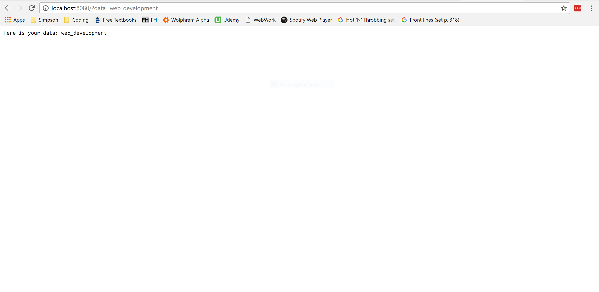
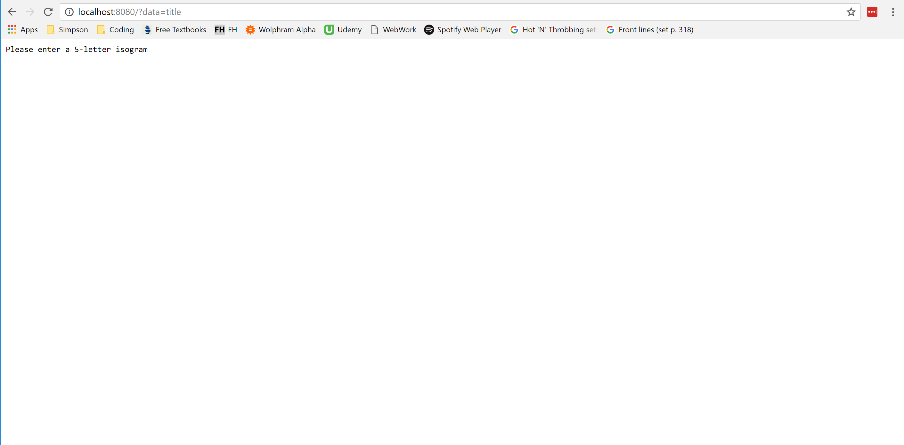
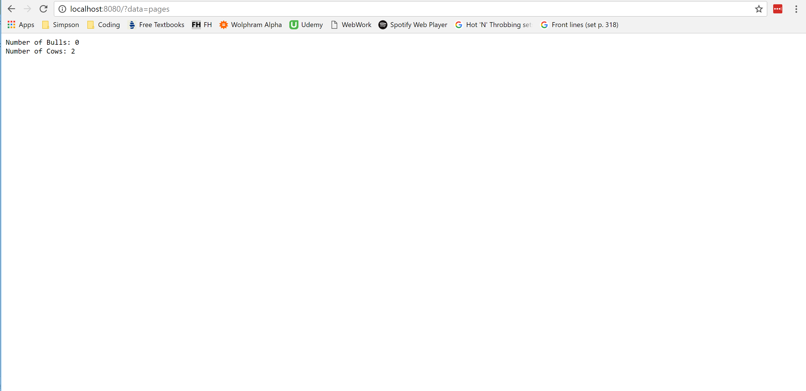

Node.js - Nathan Hawkins
========================

.. image:: img/nodejs_title.png
	:align: center

Introduction
------------
History
~~~~~~~
JavaScript is an incredibly helpful language. Nearly every modern web page uses 
JavaScript as a way to provide client-side interactivity between the user and 
their page, but this aspect of the web hasn't always been so convenient. If 
JavaScript had never been developed, users wouldn't be able to like cat pictures 
on their grandmother's FaceBook page. There certainly wouldn't be a way to change 
viewing preferences on a YouTube video. Without JavaScript, the fancy menu bar to 
the left of this text wouldn't change colors based on where the user placed their 
cursor. Before JavaScript, web pages were simply words, links, pictures, and 
whatever could be crafted through the burdening restrictions of HTML [WHA]_.

When Brendan Eich created JavaScript, the web no longer had to be boring. Web 
developers could create interactive objects for more convenient browsing. Finally, 
there was a way to access the user's computer without forcing them to load a 
separate page! There was a problem, though: JavaScript was strictly client-side. 
There wasn't an easy way for the server to initiate contact with the user, and 
this issue limited developers in what they could do [WHY]_. For example, if an eBay 
user wanted to know real-time when a bid was made on their product, tough luck. 
They better get used to mashing that refresh button.

That's why when Ryan Dahl developed Node.js in 2009 it gained huge momentum from 
the get-go [ABT]_. Used by huge corporations such as Neflix, GitHub, Google, and 
PayPal, Node.js is a widely popular server-side platform that uses JavaScript to 
let developers create lightweight web applications [SIT]_. Node.js applications are coded in Javascript, and they're lightning fast. Instead of using common 
languages like Java to run their servers, full-stack developers can now use the 
same language in both their front-end and back-end applications. But enough of how
Node.js came to be. What is Node.js, and why is it so popular?

What is Node.js?
~~~~~~~~~~~~~~~~
The official Node.js website defines Node.js as, "a JavaScript runtime built on 
Chrome's V8 JavaScript engine. Node.js uses an event-driven, non-blocking I/O 
model that makes it lightweight and efficient." [NDE]_. These features allow for 
Node.js applications to serve more requests than traditional back-end servers, 
which is crucial if the owner wishes to serve multiple thousands of clients at a 
time. Below is a more in-depth list of Node.js features and why people care about 
them so much.

Features of Node.js
-------------------
Event-Driven I/O
~~~~~~~~~~~~~~~~
Node.js applications don't actively seek out activity. Instead, the only time they 
distribute information is when an event has occurred, either on the server-side or 
the client side. This is implemented in the event loop. 

The main event loop in Node.js is in charge of connecting to and distributing 
between clients on a single thread. This feature of Node.js ensures that the 
server is optimized to make as many connections as possible, but there is a cost. 
Because the server runs everything in a single thread, the server sacrifices CPU 
power for more connections to clients. This is important because it highlights the 
situations for which a developer should pick Node.js: lightweight applications 
that require few CPU operations [WHY]_. By running everything in Node.js via events, requests from the user are idle when there is no I/O. Resources aren't 
wasted on connections that aren't currently exchanging information [EVN]_.

But if a thousand clients request information at the same time on a single thread, 
wouldn't the hypothetical last client have to wait for every other client before 
getting his or her data? That issue might be a problem if not for asynchronous 
programming, another key feature of Node.js.

Asynchronous Programming
~~~~~~~~~~~~~~~~~~~~~~~~
Asynchronous programming is a key aspect to Node.js' success. In an asynchronous 
function, the client may request a piece of information, and the server will 
gather that information *without blocking the entire event loop*. This is called a 
callback Instead of waiting for information, the event loop moves to the next 
event and trusts the callback to perform the operation. The process is then 
responsible for, once the information has been gathered, sending that information 
to the client [HOW]_.

Fast Performance
~~~~~~~~~~~~~~~~
When used correctly to fill its niche, Node.js can greatly outperform other tools.
A test created by Maciej Sopylo perfectly captures the beneficial aspects of 
Node.js in comparison to PHP, another popular language in back-end web 
development. To do this, Sopylo ran a simple for loop that did three separate 
calculations and printed to the console the amount of time it took to finish the 
loop. Sopylo then timed two different applications: one using PHP, the other using
Node.js. It was found that as the number of iterations increased, the PHP 
application's time increased in a linear fashion. However, the tester found that 
the Node.js application finished at a more logarithmic (faster) rate when doing 
the same calculations. When the number of iterations was increased to one billion, 
the PHP application was 93% slower than the Node.js one [BEG]_.

Examples of Node.js Applications
--------------------------------
Simple Get
~~~~~~~~~~
With Node.js, it is pretty easy to create a new web server and perform a get 
method using JavaScript. Helpful built-in modules to the Node.js framework are the 
"http" and "url" modules. By using these modules and some core functions in them, 
the below example is a way to gather data from the url and pass it to the site 
itself. 

.. code-block :: JavaScript

	// Include modules
	var http = require("http"),
		url  = require("url");

	// Create server
	http.createServer(function (request, response) { 
		request.on('readable', function () {
	       request.read();
	  	});

	  	// End event
		request.on('end', function () { 
			var data = url.parse(request.url, true).query; 
			response.writeHead(200, { 
				'Content-Type': 'text/plain' 
			}); 

			// Display data
			response.end('This is your data: ' + data['data']); 
		}); 
	}).listen(8080);

The first two lines are simply including the http and url modules. On the next 
line, by using the createServer() function built into the http module, the code is 
able to read the data with the .read() function or consume it in the 'end' event 
[BEG]_.

Bulls and Cows Game
~~~~~~~~~~~~~~~~~~~
As previously mentioned, Node.js is an extremely versitile tool that can do a 
surprising amount of things. By taking the previous example a step further, it is 
possible to create a game based on whatever data the user puts into the url. In 
the code below, the game is to guess a five-letter isogram, or word with no 
repeating letters. For example, "games" is an isogram, but "title" isn't due to it 
having two T's. 

This example takes a word from the url and decides whether or not it matches the 
secret word on the server. If the word is a match, the word is displayed on the 
screen alongside a congratulations message. However, if the word is incorrect, the 
game will respond with the number of bulls (letters in the correct location) and 
cows (letters that are in the word, but incorrectly placed).

.. code-block :: JavaScript

	// 5 letter isogram in Node.js
	var secretWord = "slant";

	// Include modules
	var http = require("http"),
		url  = require("url");

	// Create server 
	http.createServer(function (request, response) {
	    request.on('readable', function () {
	        request.read();
	    });

	    // End event
	    request.on('end', function () {
	    	// Store arguments in userData variable
	        var userData = url.parse(request.url, true);
	        var data = userData.query.data;

	        response.writeHead(200, {
	            'Content-Type': 'text/plain'
	        });

	        // Game logic
	        // If the user is correct, show the solution. Otherwise, show number of
	        // bulls and cows
	        var isUserCorrect = checkSolution(data);

	        if (isUserCorrect) {
	            // CORRECT, show answer
	            response.end('Congratulations! ' + secretWord + ' is the secret word!');
	        }
	        else {
	            // INCORRECT, show number of bulls and cows
	            var numBulls = checkBulls(data);
	            var numCows = checkCows(data);

	            // numCows will be negative only if the user entered an incorrect
	            // word
	            if (numCows >= 0)
	            	response.end('Number of Bulls: ' + numBulls + 
	            		'\nNumber of Cows: ' + numCows);
	            else if (numCows == -1)
	            	response.end('Make sure your isogram is ' + secretWord.length + 
	            		' characters in length');
	            else if (numCows == -2)
	            	response.end('Please enter a ' + secretWord.length + '-letter isogram');
	        }
	    });
	}).listen(8080);

	// -------------------------------Functions------------------------------------
	// Returns whether or not the user has entered the correct solution
	function checkSolution(data) {
	    // userData must be 5 characters long
	    if (data) {
	    	if (data.length != secretWord.length) return false;
	    	else if (!(data === secretWord)) return false;
	    }

	    return true;
	}

	// Returns the number of letters in the correct location
	function checkBulls(data) {
		// Incorrect word length
	    if (data.length != secretWord.length) return -1;

	    // Correct word length. Count the number of correctly-placed letters
	    var numBulls = 0;

	    for (var i = 0; i < secretWord.length; i++) {
	        if (data[i] == secretWord[i]) numBulls++;
	    }

	    return numBulls;
	}

	// Returns the number of incorrectly placed letters in the word
	function checkCows(data) {
		// Incorrect word length
	    if (data.length != secretWord.length) return -1;

	    // Correct word length. Count the number of incorrectly-placed letters
	    var numCows = 0;
	    var lettersUsed = ['0', '0', '0', '0', '0'];

	    for (var i = 0; i < secretWord.length; i++) {
	        var char = data[i];
	        // Check to see if the letter has been used before
	        if (secretWord.includes(char) && !(char === secretWord[i]) &&
	        	!(lettersUsed.includes(char))) numCows++;

	        // Letter has been used already - not an isogram
	        if (lettersUsed.includes(char)) return -2;
	        lettersUsed[i] = char;
	    }

	    return numCows;
	}

For example, if the data is a non-isogram like "title", the application will respond with an error message.

If the data is a 5-letter isogram, the application appropriately responds.

And finally, if the data is correct, the congratulations message is displayed.

Conclusion
----------
Node.js is an extremely useful tool that allows for programmers to have responsive 
web applications that can handle multitudes of requests at the same time. Its 
fast, event driven, asynchronous nature has been the future of web development 
ever since its conception in 2009. Because of the flexibility of its JavaScript 
framework, there isn't a limit on the things Node.js can create. If a developer is 
condsidering different languages to create their web application, Node.js makes 
its own case with its unparalleled speed and ease of use. 

References
----------
.. [ABT] http://blog.training.com/2016/09/about-nodejs-and-why-you-should-add.html

.. [BEG] https://code.tutsplus.com/tutorials/nodejs-for-beginners--net-26314

.. [NDE] https://nodejs.org/en/

.. [WHY] https://www.toptal.com/nodejs/why-the-hell-would-i-use-node-js

.. [WHA] http://www.makeuseof.com/tag/what-is-javascript-and-can-the-internet-exist-without-it/

.. [SIT] https://www.coderfactoryacademy.edu.au/posts/top-8-sites-built-with-node-js

.. [EVN] https://developers.redhat.com/blog/2016/08/16/why-should-i-use-node-js-the-non-blocking-event-io-framework/

.. [HOW] https://softwareengineeringdaily.com/2015/08/02/how-does-node-js-work-asynchronously-without-multithreading/