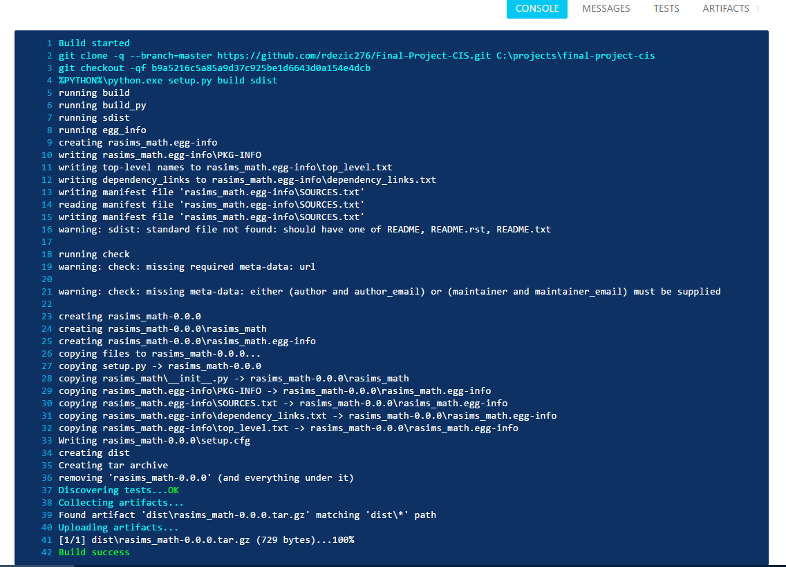

Continuous integration - Rasim Dezic
====================================

What is it?
-----------
Continuous integration is a unique and effective programming practice in which
developers regularly merge their code changes into a central repository
after automated builds and tests are run. These tests are run automatically
after the code has been pushed with the support of a ".yml" file. Continuous 
integration most often refers to the build or integration stage of the software
release process and entails both an automation component and a cultural component.
The automation component makes all the testing work happen in the background
and the programmers do not have to activate it or start this process. The cultural
component is to streamline this practice so that it becomes part of a company's 
culture. 

The key goals of continuous integration are to find and address bugs quicker, 
improve software quality, and reduce the time it takes to validate and
release new software updates. Testing a program can be difficult and in most
cases when using new programs, you will find minor bugs because those aren't 
what the programmers are looking for. Those bugs are easily overlooked because
the concern is within the main purpose of the program. Continuous integration
allows you to create tests that will constantly check for these bugs so you do 
not have to. 

History?
--------
In 1994, Grady Booch used the phrase continuous integration in object oriented 
analysis and design. Grady used this phrase when explaining development using 
micro processes, meaning the internal releases represents a sort of continuous 
integration system. Although this is not directly the continuous integration 
that we know of today, it was the start of it. Following this discovery came
Kent Beck and Ron Jeffris in 1997. They invented extreme programming while on 
the Chrysler Comprehensive Compensation System. This project included Continuous 
integration. This became an important factor in Beck's life, and he published about
continuous integration in 1998. His reasoning was the importance of face-
to-face communication over technological support. These people did not have the 
tools we have today such as Travis CI and AppVeyor, but they were still able to 
practice continuous integration. This was an important milestone for the world of
programming.  [HIST]_

How to start
------------
When looking at using continuous integration, developers need to decide which 
tools to use. Some examples include Jenkins, Travis CI, TeamCity, Bamboo, and 
AppVeyor. There are pros and cons in using each tool. Some of the tools may not
have the features your company needs, and you will find another tool. For smaller 
companies that may not have a big budgets, the cost of the program could be a 
deciding factor. For this report we will be talking about AppVeyor.

.. figure:: applogo.PNG
	:height: 200px
	:width: 200px
	:align: center

AppVeyor is a hosted and distributed continuous integration service used to build 
and test different projects that are being hosted at GitHub. They are tested using a 
Microsoft Windows virtual machine. This is where the cool part comes into play.
AppVeyor is configured using a Web UI, meaning you do not need to download 
special programs to make this work. [APP]_ All you will need is to include a
".yml" file at the root directory of the code repository. In my situation, I used 
the Python programming language to create my project. This is what my ".yml" 
looks like. 

.. figure:: yml.PNG
	:height: 300px
	:width: 300px
	:align: center

The main purpose of this ".yml" file is the ability to create instructions
for AppVeyor to follow. These instructions can be many different things. Some 
examples include adding test code to see if the program works when programmers 
code to the repository. ".yml" files can also be used to test multiple versions
of python at one time. In the picture, we are testing Python version "3.5.0". You 
would be able to add multiple different versions of the program to make sure that 
your program can run versatilely Python. This is important 
to test because not every user will be running the latest version. They will be 
running a few versions behind the latest one. The second section of 
this code shows the actual executable which runs on the Windows Virtual Machine. 
Because this is a Python program, you will also be required to make a "setup.py" file.
This setup file establishes which tests will be running. This is what it looks like.
[YML]_ 

.. figure:: setup.PNG
	:height: 300px
	:width: 300px
	:align: center

The two final programs you will need are the actual program you are working on 
and the test code for it. The test code is what AppVeyor will be using against
your program when it is pushed to the repository. In my example, the test code is 
checking a math problem. All of this together should work. If the code passes and 
does not cause any issues, things will be OK. If not, the programmers will 
receive a notification that there is an issue. They will then be notified where 
the issue happened in the code. Below, you will see both programs starting with 
the code I was working on. It is a simple addition equation and the test code is 
checking to see if the numbers all add up. 

.. figure:: program.PNG
	:height: 400px
	:width: 300px
	:align: left

.. figure:: test.PNG
	:height: 300px
	:width: 300px
	:align: right

Results
-------
After that, you have the required set up and know the code is working the way you 
are intending it to. The next step is to push your project up to Github. AppVeyor
will automatically detect you have pushed code up to the repository and will
start looking for the ".yml" file. The file will contain instructions on what 
AppVeyor is supposed to do. AppVeyor will run the program in its own environment,
hitting the code with the tests the developer has created for it. The process 
is shown below.


AppVeyor displays a few different tabs for the developer to look at, such as 
console, messages, tests, and artifacts. The console is where the project is 
being built and all the tests are being performed. The messages tab show any
alerts that AppVeyor feel are important to the developers, such 
as a failed test or corrupted code. The artifacts tab is a very unique feature
in AppVeyor. This feature allows the owner of the code to create and download
a program artifact. The owner can then give his program to another person 
as one file. This is even though it may contain a lot more then one file within it. 

Real life example
-----------------
I will paint the picture on how this would look in real life. The best way to explain
it is envisioning an office building with multiple programmers working on a 
project together. Each programmer has a certain portion of the project they are supposed
to be working on. Because of this setup, each member of the team would be pushing 
code with tools such as SourceTree to a centralized repository. The repository
is where you would find the ".yml" file. AppVeyor would detect that the programmer
has pushed up code and would start running its tests. AppVeyor would also keep
track of the version number based on how many times the tests were run. If 
everything builds without issues and the the code passes the tests, everything
is okay. If there is an issue with the code, it does not pass the tests. All 
of the programmers will receive an alert that the code did not pass, and 
everyone will know which programmer broke the code. This puts the pressure on 
the programmer who pushed the code to fix it. This creates a 
much more efficient team and ensures that integrity is always part of the project.
[LIFE]_   

Conclusion
----------
Overall, this programming practice has been around for some time but appears
to have entered the mainstream of programming since 2005. This is based on the 
start dates for continuous integration programs. Now continuous integration is a 
common part of team-based programming. I strongly believe this tool will help 
businesses first and save money for most. A product group at HP reduced development 
costs by 78% by using continuous integration. [LIFE]_  This is very important 
because it shows that with that increase, the programmers were working harder and 
smarter then before, allowing them to finish the code faster and better serving 
the customers who were using HP products. 

Citations
---------

.. [HIST] "Continuous Integration." Wikipedia. Wikimedia Foundation, 11 Apr. 2017. Web. 17 Apr. 2017. <https://en.wikipedia.org/wiki/Continuous_integration>.

.. [APP] Hanselman, Scott. "Scott Hanselman." AppVeyor - A Good Continuous Integration System Is a Joy to Behold. N.p., 30 May 2014. Web. 23 Apr. 2017. <https://www.hanselman.com/blog/AppVeyorAGoodContinuousIntegrationSystemIsAJoyToBehold.aspx>.

.. [YML] YAML Ain't Markup Language. N.p., n.d. Web. 23 Apr. 2017. <http://www.yaml.org/start.html>.

.. [LIFE] Hilton, Michael, Timothy Tunnell, Kai Huang, Darko Marinov, and Danny Dig. "Usage, Costs, and Benefits of Continuous Integration in Open-source Projects." Proceedings of the 31st IEEE/ACM International Conference on Automated Software Engineering - ASE 2016 (2016): n. pag. Web.
