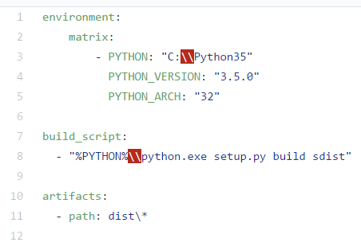
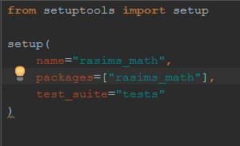
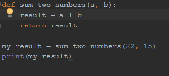
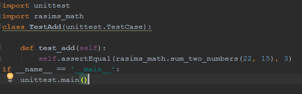

Continuous integration - Rasim Dezic
====================================

What is it?
-----------
Continuous integration is a unique and effective programming practice where
developers regularly merge their code changes into a central repository,
after which automated builds and tests are run. These tests are run automatically
after the code has been pushed with the support of a ".yml" file. Continuous 
integration most often refers to the build or integration stage of the software
release process and entails both an automation component and a cultural component.
The key goals of continuous integration are to find and address bugs quicker, 
improve software quality, and reduce the time it takes to validate and
release new software updates. Testing a program can be difficult and in most
cases when using new programs you will find minor bugs because that stuff isn't
what the programmers are looking for those bugs are easily overlooked because
the concern is within the main purpose of the program. Continuous integration
allows you to create tests that will constantly check for these bugs so you do 
not have to. 

What purpose does it serve?
---------------------------
(talk about how it makes programmers jobs easier+version control)

History?
--------
In 1994, Grady booch used the phrase continuous integration in object oriented 
analysis and design. Grady used this phrase when explaining development using 
micro processes, meaning the internal releases represents a sort of continuous integration system. Although this is not directly the continuous integration 
that we know of today it was the start of it. Following this discovery came
Kent Beck and Ron Jeffris in 1997. They invented extreme programming while on 
the Chrysler Comprehensive Compensation System. This project included Continuous 
integration. This became an important factor in Becks life, that he published about
continuous integration in 1998. His reasoning for it was the importance of face
to face communication over technological support. These people did not have the 
tools we have today such as Travis CI and AppVeyor, but they were still able to 
practice continuous integration. This was an important milestone for the world of
programming.  [HIST]_

How to start
------------
When looking into this awesome idea you need to decide which tools you would 
like to use. Some examples include Jenkins, Travis CI, TeamCity, Bamboo, and 
AppVeyor. For this report we will be talking about AppVeyor.

AppVeyor is a hosted, distributed continous integration service used to build 
and tests different projects that are being hosted at GitHub using a 
Microsoft Windows virtual machine. This is where the cool part comes into play.
AppVeyor is configured using a Web UI, meaning you do not need to download 
special programs to make this work. All you will need is to include a ".yml" file
at the root directory of the code repository. In my situation  I used the Python
programming language to create my project so this is what my ".yml" looks like. 

The main purpose of this ".yml" file is that you are able to test multiple versions
of python at one time. In the picture we are testing Python version "3.5.0". You 
would be able to add multiple different version of the program to make sure that 
your program can run on multiple different version of Python. This is important 
to test because not every user will be running the latest version, chances are 
they will be running a few versions behind the latest one. The second section of 
this code shows the actual executable which runs on the Windows Virtual Machine. 
Because this is a Python program you will also be required to make a setup.py file.
This setup file establishes which tests will be running. This is what it looks like. 

The two final programs you will need is the actual program you are working on 
and the test code for it. All of this tougher should work. Below you will see 
both programs starting with the code I was working on. It is a simple addition 
equation and the test code for it is checking to see if the numbers all add up. 

Real life example
-----------------
(talk about examples where programmers would really benefit from this product)

Conclusion
----------

Citations
---------

.. [HIST] "Continuous Integration." Wikipedia. Wikimedia Foundation, 11 Apr. 2017. Web. 17 Apr. 2017. <https://en.wikipedia.org/wiki/Continuous_integration>.