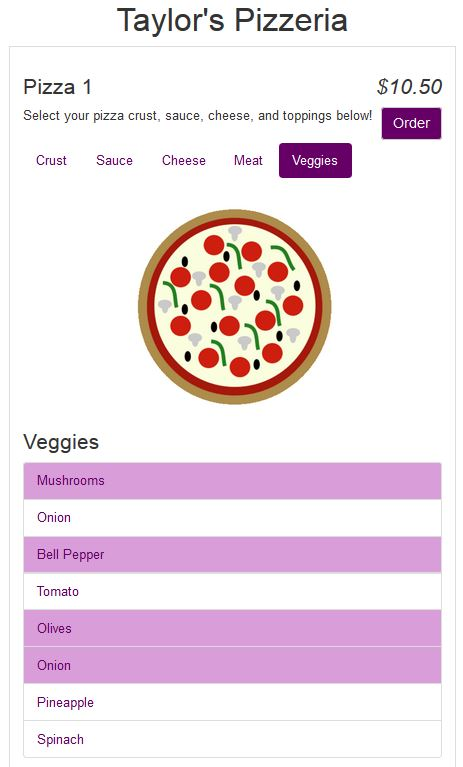
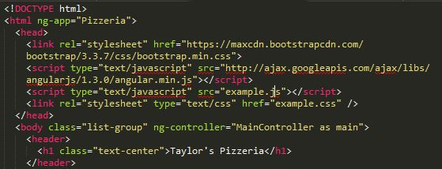
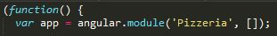
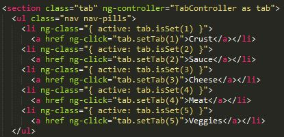
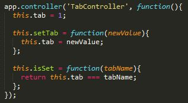
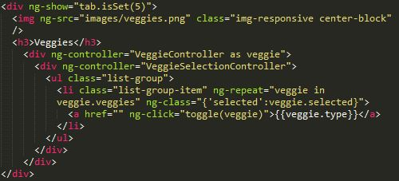
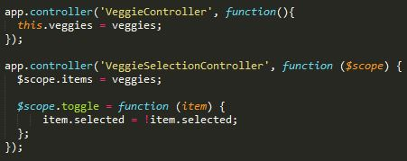
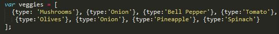

AngularJS - Taylor Gehrls
=========================

What is AngularJS?
------------------

.. figure:: angular_js.jpg
	:height: 300px
	:width: 300px
	:align: center

AngularJS is a JavaScript open-source front-end web application framework. 
It works by first reading the HTML page of a web application, and then 
interprets custom tag attributes as directives to bind input or output
parts of the page to JavaScript variables. These variables can be set
within the code or retrieved from JSON files [Pol]_.

Some weaknesses of AngularJS include inefficient error reporting and little 
direction for best practices. However, the flexibility of Angular can be seen
as a weakness or a strong suit. AngularJS focuses on testability and code 
quality, setting it apart from other frameworks [Aus]_.

What to use AngularJS for?
--------------------------

It is used to better organize code, create responsive websites, 
work with jQuery more easily, and create dynamic websites.

Not Responsive: Web Browser sends URL request to the server, 
the web server responds with the web page and assets, the
browser loads the entire web page using HTML & JavaScript. When user 
clicks on a link, a new request is sent and the server responds with the 
new web page and assets. Browser loads up entire web page again.

Responsive: Page refresh is almost unnoticeable. Instead of loading up the 
entire page when a user clicks a link, the server responds with JSON data. 
This data is loaded into the existing page [Pol]_.

.. code-block :: HTML

	<body ng-controller="HelloController"> 

.. code-block :: JavaScript

	functionHelloController(){alert('Hello!');}

Reasons to Use AngularJS:

1. Most frameworks work by splitting the MVC (model-view-controller) into 
   components and then requiring the developer to string them up together with
   code. AngularJS splits the application into MVC components and it does the 
   rest. 
2. AngularJS uses HTML which is used to determine the execution of the 
   application. Attributes of HTML determine which controllers to use for an 
   element and determine what gets loaded, not how it is loaded. A developer 
   just needs to define what the application should achieve and Angular 
   takes care of the dependencies.
3. Data models in Angular are more like cork boards, because it is a temporary
   storage area to place and retrieve data. They are called scopes in AngularJS
   and are automatically bound to the view by Angular. This means that AngularJS
   watches for changes in the properties and updates the front-end 
   automatically. Scope has no data initially and relies on the controllers 
   to feed data.
4. Filters can filter the data before they are displayed on the view. 
   This can involve things like formatting decimal places or reversing the
   order of an array [Lau]_.

AngularJS is perfect for database CRUD (create, read, update, delete) 
applications. AngularJS applications consist of the View (HTML), the Model 
(data available for current view), and the Controller (which is the JavaScript
function that controls the data) [Ang]_.

History
-------

In 2009, AngularJS was created as a side-project by two developers at Google, 
Misko Hevery and Adam Abrons. Originally, it was meant to be a tool to
allow developers to interact with both the front-end and back-end. While at
Google, Hevery bet his manager that he could re-write his 17,000 lines of 
project code in 2 weeks with his side project (AngularJS). It actually ended
up taking him 3 weeks, but he condensed it down to just 1,500 lines of code.
After this, the development of AngularJS took off. The top 10 contributors to
the framework are all from Google, and Google has been the main drive behind 
its development [Aus]_.

In late 2016, Angular 2 was released. Some differences between the two are that
Angular 2 does not use controllers and $scope and instead uses components. 
Components are controllers and directives with a specific template. The 
specification for directives has also been simplified. Dependency Injection 
is also available, which creates more opportunities for object-based work 
and faster performance. Angular 2 can also be used with TypeScript [Mul]_.

AngularJS Components
--------------------

Directives
~~~~~~~~~~

Directive - a directive is a marker on a HTML tag that tells Angular to 
run or reference JavaScript code.

* ``ng-app`` defines an AngularJS application ``
``
* ``ng-model`` binds the value of HTML controls (input, select, text-area) to
  the application data
* ``ng-init`` initializes AngularJS application variables
* ``ng-bind`` binds application data to the HTML view.

Angular has built-in directives that trigger certain behavior when a certain
value is true. For example, the following code would show a certain variable
if the canShow expression is true.

.. code-block :: HTML

	

For not showing certain data, ``ng-hide`` can be used.

Modules
~~~~~~~

Module - where pieces of an application are written. Modules make it more 
maintainable, testable, and readable. Modules define applications and act as 
containers for different parts of an application. Modules are containers for 
application controllers and  controllers must belong to a module. It is common 
to put the module and controllers in JavaScript files. Global functions are 
avoided in JavaScript as they can be easily overwritten or destroyed by 
other scripts. AngularJS reduces this problem by keeping functions local 
to the module [Ang]_.

.. code-block :: JavaScript

	var app = angular.module("angularjsApp", []);

Expressions
~~~~~~~~~~~

Expression - expressions allow the insertion of dynamic values into HTML [Pol]_.
Expressions are written inside double braces and AngularJS will output data
exactly where the expression is written. AngularJS expressions bind data to 
HTML the same way as the ``ng-bind`` directive. Expressions can contain 
literals, operators, and variables, but do not support conditionals, loops, and 
exceptions whereas JavaScript expressions do [Ang]_.

.. code-block :: JavaScript

	
An example of an expression: {{ price * amount }}

Controllers
~~~~~~~~~~~

Controller - controllers help to show data on the web page. 
Controllers are where the application's behavior is defined by defining 
functions and values. AngularJS controllers are regular JavaScript 
objects created by a standard JavaScript object constructor and control the 
application. The ``ng-controller`` directive defines the application 
controller. Controllers can be invoked with a $scope object. The $scope is 
the application object, or owner of application variables and functions. 
Scope is the binding part between the HTML (view) and the JavaScript 
controllers. When adding properties to the $scope object in the controller, 
the view gets access to these properties [Ang]_.

.. code-block :: JavaScript

	(function(){
	var app = angular.module('school',[]);
	app.controller('SchoolController', function(){
		this.classes = classes;
	});

	var classes = [
    {
      name: 'Math',
      number: 236,
      room: 'Carver 340',
    }, 
    {
      name: 'Chemistry',
      number: 110,
      room: 'Carver 226',
    }, 
    {
      name: 'Philosophy',
      number: 319,
      room: 'Mary Berry 11',
    }, 
  ];

.. code-block :: HTML

	

		<h1 ng-repeat="name in school.classes">name</h1>
	

Two-Way Data Binding
~~~~~~~~~~~~~~~~~~~~

Two-Way Data Binding - expressions are re-evaluated when a property changes 
on the page. With the AngularJS, you can bind the value of an input field 
to a variable that is created. The binding is called two-way binding, 
because it goes both ways. If the user changes the value inside the input 
field, the AngularJS property value also changes. 

The ``ng-model`` directive can provide data validation for things like number, 
e-mail, and required fields. The ``ng-model`` directive can also provide 
different statuses for application data. For example, a control may return 
true for untouched if it has not lost focus, it could returned true for 
touched it has lost focus, it could return true for pristine if the user has 
not interacted with the control yet, and it could return true for dirty if 
the user already interacted with the control. Pristine and dirty signify 
whether the user actually changed anything while touched and untouched 
signify if the user has been to that control [Roz]_.

Filters
~~~~~~~

Filters are a neat aspect of AngularJS that can be added to format data. Some 
filters include, currency, data, filter, JSON, limitTo, lowercase, number, 
orderBy, and uppercase. They are added to expressions using the pipe 
character, followed by the desired filter. They can also be added to 
directives in the same way. The filter called filter selects a subset of an 
array containing only matching items [Ang]_.

.. code-block :: HTML

	<h1>Price: {{ price | currency }}</h1>

Example
-------

The image above uses AngularJS to create a pizza ordering application.
The customer is able to select crust type, sauce, cheese, meat, and veggies, 
and order their pizza.

The first image above shows how to set up the HTML for the application. 
The ``ng-app`` directive is used to define the application and this is 
connected to the application module in the JavaScript file depicted in the 
second image. The first image also shows how to link AngularJS into an HTML
file.

The first image above shows how to use a tab controller so certain tabs will be
active when they are clicked. It then uses the ``ng-click`` directive to set
the tab to a certain value when it is clicked and creates a reference to that
tab. The second image shows what the tabController looks like in the JavaScript
file. First, it sets the default value to 1, so the first tab is selected when
the page is loaded. Next it has a function to set the tab value to a new value.
Finally, it has a function to check the value of the selected tab and return
its value.

The first image above shows the div that will show if the tab value is equal to
5. Then there are controllers to handle showing the different types of veggies
and the toggling that occurs when they are selected. In the second image, 
the veggieController sets the veggie variable to the list of veggies in the 
third image. The veggieSelectionController toggles between selected and 
not selected veggies.

Conclusion
----------

As with any new technology, working with AngularJS was a little difficult to
get the hang of at first. The documentation is a little confusing great and it 
is difficult to know multiple ways of achieving slightly different outcomes. 
However, the ways in which it interacts with HTML is very useful and gives 
the developer the ability to do some cool dynamic things on their website. 
The two-way data binding would be helpful to have pages automatically 
update when the variables change. While it might be difficult for those 
with already established applications to switch over to the JavaScript 
framework, it would be a good tool for those starting out creating web 
applications. However, there might need to be time reworking applications 
if there are more updates to the popular framework. AngularJS 
is good for knowing what the structure of the application should be, 
but it it is a little difficult to pick up on all of the concepts quickly. 
Although testing was not covered in this summary of AngularJS, it is meant 
to be tested fairly easy, which would be a plus.

*Written by Taylor Gehrls*

Sources
-------

.. [Agu] Jose Jesus Perez Aguinaga. "`AngularJS is Amazing... and Hard as Hell <https://coderwall.com/p/3qclqg/angularjs-is-amazing-and-hard-as-hell>`_." Coderwall, 21 Feb. 2017. Web. 11 Apr. 2017.

.. [Ahm] Mohamad Ahmadi. "`Source Code for Code School's Course "Shaping up with Angular.js" <https://github.com/mhahmadi/codeschool-shaping-up-with-angularjs>`_." GitHub, 19 Oct. 2014. Web. 11 Apr. 2017.

.. [Ang] "`AngularJS Tutorial <https://www.w3schools.com/angular/angular_intro.asp>`_." w3schools.com. Refsnes Data, Web. 11 Apr. 2017.

.. [Aus] Andrew Austin. "`An Overview of AngularJS for Managers <http://andrewaustin.com/an-overview-of-angularjs-for-managers/>`_." Creative Commons, 27 August. 2014. Web. 11 Apr. 2017.

.. [Lau] Dmitri Lau. "`10 Reasons Why You Should Use AngularJS <https://www.sitepoint.com/10-reasons-use-angularjs/>`_." Sitepoint, 5 Sep. 2013. Web. 11 Apr. 2017.

.. [Mul] Elco Muller. "`Angular 2 vs. Angular 1: Key Differences <https://dzone.com/articles/typed-front-end-with-angular-2>`_." DZone, Web Dev Zone, 11 Sep. 2015. Web. 11 Apr. 2017.

.. [Pol] Gregg Pollack. "`Shaping Up With AngularJS <https://www.codeschool.com/courses/shaping-up-with-angularjs>`_." Code School, Web. 11 Apr. 2017.

.. [Roz] Yuriy Rozhovetskiy. "`Angular - Difference Between Pristine/Dirty and Touched/Untouched <http://stackoverflow.com/questions/25025102/angular-difference-between-pristine-dirty-and-touched-untouched>`_." Stack Overflow. Stack Exchange Inc, 29 Jun. 2014. Web. 11 Apr. 2017.

.. [Sho] James Shore. "`An Unconventional Review of AngularJS <http://www.letscodejavascript.com/v3/blog/2015/01/angular_review>`_." Let's Code TDJS. Primate, 14 Jul. 2015. Web. 11 Apr. 2017.

