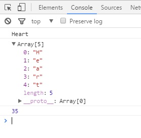
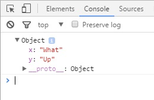
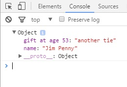
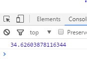
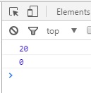

New to JavaScript in ECMAScript 6
=================================

What is ECMAScript 6?
---------------------
ECMAScript is a popular language specification standard, the various editions
of which JavaScript abides by - the edition that it follows depends on which
version of JavaScript is being referred to. According to The Mozilla Corporation, 
the version of JavaScript that most browsers currently run abides by the rules 
of ECMAScript 2015 (as it was released in 2015), better known as ECMAScript 6, 
or simply ES6. [Mozilla]_ ES6 brings a lot of changes that improve JavaScript, from improved syntax for 
common uses, to functionality that just wasn't there with ES5 based JavaScript.

Where does ECMAScript come from?
--------------------------------
According to Ben Ilegbodu on benmvp.com, 
JavaScript was created in 1995 by someone working at Netscape, and took 
various names before they got the rights to the name “JavaScript” at 
the end of the year. In 1996, it was brought to the European Computer 
Manufacturer’s Association (ECMA) to be standardized so that 
browser creators could implement the language. The standard 
became known as “ECMAScript”, with JavaScript being the most famous 
implementation of the language. ECMAScript versions 2 and 3 were both 
released within a few years of the initial ECMAScript release. 
Development for ECMAScript 4 was rough, and it was ultimately abandoned. 
They skipped ECMAScript 4 in the sequence of releases and released 
ECMAScript 5 in 2009. Many of the changes that would have been in 
ECMAScript 4 made their way into ECMAScript 6, which was released in 2015. [Ben]_

Arrow Functions
---------------
A quick note before these features are explained - all of these new features 
can be found from one source, and that is es6-features.org.
It has all the new features listed out, with links to bring up two fields,
one showing an example of the feature in ES6, and the other showing how to
do the same thing in ES5 (if it is possible in ES5). [Features]_
One of the great new things that ES6 brings is "arrow functions", also known
as "fat arrow functions", so called because their identifying feature is
a fat arrow ``=>``, as opposed to a skinny arrow ``->``. This is a new way to 
declare anonymous functions that just cuts down on the amount of code that is
necessary. The two following examples are the ES6 and ES5 methods 
respectively:

``name = v => v * 2;``

``name = function (v) { return v * 2; }``

While this is admittedly a very simple example, the new way took approximately 
half the characters in code to make the same function in an expression.
Another important feature of arrow functions is that they do not replace
the context of whatever they are in. If there is an arrow function within
another function, ``this`` in the arrow function will refer to the outer
function, rather than the arrow function itself. The following example shows 
how this works, as well as how declaring an arrow function works within a 
statement body works in ES6:

	.. code-block:: javascript
		:caption: maintaining "this" and declaring function in statement
		:linenos:

		Function Player() {
			this.strength = 20;
			setInterval( () => { //creates an anonymous function within the setInterval statement
				this.strength++; //increase the value of strength for the player
				console.log(this.strength); //as opposed to the strength of setInterval
			}, 2000); //set Interval runs the code every x milliseconds, defined here
		}

		var playerJonah = new Player(); //creates a new Player, whose strength will
		// constantly increase as the webpage keeps running

Normally, a function will refer to its own parameters and values; however,
an arrow function will simply take these from the parent function and
make changes to that value. This makes things like the above example much easier.

Extended Parameter Handling
---------------------------
ES6 has improved upon parameter handling tremendously. Possibly one of the
most useful changes is how streamlined making default values for a function
parameter is. Before, each value that was supposed to have a default value
had to be checked manually and assigned a value if it were undefined.
Now, it can be given a default value directly in the function header,
as seen below:

	.. code-block:: javascript
		:caption: Default values
		:linenos:

		function divide (a, b = 1) { // declares function with second parameter defaulting to 1
			return (a / b);
		}

ES6 has also made it simpler to allow for extra input values in the parameters
of a function with something called a "rest parameter". To make a rest parameter,
simply put an ellipsis before a parameter in the function header.
This will pick up any extra inputs the function gets beyond the normal
parameter inputs. Down below is an example of a function that finds the 
product of multiple numbers:

	.. code-block:: javascript
		:caption: rest parameter
		:linenos:

		function multiply (a, b, ...c) {
			var product = 1; // declare variable that will hold the product of the #s
			for (var i = 0; i < c.length; i++) { // multiply through the c numbers
				product = product * c[i];
				}
				product = product * a;
				product = product * b;
				return product;
		}

		console.log(multiply(1,2,3,4,5)); // prints 120

With older versions of JavaScript, one would have to have an array in
the function body that gets any extra inputs beyond what the function
already asks for. This eliminates that need in a way that is easy to implement.

Related to parameter handling is the spread operator, which breaks apart
both independent variables and arrays into their component parts. Sometimes
a program will need access to the individual parts of a function or variable, 
and this helps in that regard. The following two examples show how that is done:

	.. code-block:: javascript
		:caption: Breaking hearts
		:linenos:

		var unbroken = "Heart";
		console.log(unbroken);
		var broken = [...unbroken]; // breaks apart Heart
		console.log(broken);

		function adding(a, b, c) {
			var sum = 0;
			for (i = 0; i < c.length; i++) {
				sum = sum + c[i];
			}
			sum = sum + a;
			sum = sum + b;
			return sum;
		}

		var numberGroup = [4, 5, 6, 7, 8];
		console.log(adding(2,3,[...numberGroup])); // prints 35;
		

When applied to a string, it breaks the string into an array that holds one 
character at each index. When applied to an array, it separates the array into
its component parts, which is useful for when the program needs to access 
each value in the array.

Template Literals
-----------------
ES6 brings template literals to JavaScript, which makes adding values into a 
string much simpler than it otherwise would be. Rather than breaking up the 
string with extra quotes, plusses, and variable names, the programmer can
now simply surround the names of predefined variables with ``${}``.
For more clarity, look at the example below:

	.. code-block:: javascript
		:caption: String interpolation (ES6)
		:linenos:

		var year = 36;
		var actor = 'Matthew Broderick';
		var message = \`He\'s been in the business for ${year} years! Welcoming ${actor}!\`;
		console.log(message);

The following example shows how the same thing would be done in previous
versions of JavaScript:

	.. code-block:: javascript
		:caption: String interpolation (ES5)
		:linenos:

		var year = 36;
		var actor = 'Matthew Broderick';
		var message = "He\'s been in the business for " + year + "years! Welcoming " + actor + "!";

This is a simple example, but it would be easy to get lost in all the quotation
marks from a more complicated example, such as listing family members:

	.. code-block:: javascript
		:caption: More string interpolation (ES5)
		:linenos:

		var brother1 = 'Matt';
		var brother2 = 'Rob';
		var brother3 = 'Chris';
		var mother = 'Lori';
		var father = 'Russ';
		var message = "Hi! I have three brothers: " + brother1 + ", " + brother2 + ", and "
		+ brother3 + ". My mother is named " + mother + ", and my father is named " + father + ".";
		console.log(message);
		
Wow, that's a little hairy. This is a lot simpler in ES6:
	
	.. code-block:: javascript
		:caption: More string interpolation (ES6)
		:linenos:

		var brother1 = 'Matt';
		var brother2 = 'Rob';
		var brother3 = 'Chris';
		var mother = 'Lori';
		var father = 'Russ';
		var message = \`Hi! I have three brothers: ${brother1}, ${brother2}, 
		and ${brother3}. My mother is named ${mother}, and my father is named ${father}.\`;
		console.log(message);

ES6 has also introduced access to raw string content of values in arrays. This 
allows the programmer to put in things like backslashes without them being
interpreted as escape characters:
``console.log(String.raw Look \n at \n all \n these \n uninterpreted \n newlines!);``

This is something that simply couldn't be done in previous versions of
JavaScript, instead, the programmer had to put an additional backslash
behind all the other backslashes to "escape the escape". It was a less
efficient way to do it, and the plan failed a lot more easily, as
missing one backslash would mess up the whole thing. In a long string,
avoiding that is going to be a lot harder than simply surrounding it with
"String.raw ` `"

Enhanced Object Properties
--------------------------
The declaration of objects has been simplified a bit in ES6. Where one once
had to give the name of the property and its value even if they would go by
the same name, one can simply give the name of the value (such as if one were
putting variables into the object). To clarify, look at the following two examples - the first in ES6 and the second in ES5:

	.. code-block:: javascript
		:caption: What up object in ES6
		:linenos:

		var x = 'What';
		var y = 'Up';
		obj = { x, y }; // sets the name of the properties as x and y respectively
		// while assigning them the values that are assigned to the variables x and y.
		console.log(obj);

	.. code-block:: javascript
		:caption: What up object in ES5
		:linenos:

		var x = 'What';
		var y = 'Up';
		obj = { x : x, y : y}; // does the same as above, only it wouldn't work
		// without the names being manually declared
		console.log(obj);

ES6 also allows for computed property names. This lets the programmer name
properties after the results of a function, or the combination of multiple strings, etc. The following examples will show how it works:

	.. code-block:: javascript
		:caption: computed property name in ES6
		:linenos:

		var age = 53;
		obj = { name: 'Jim Penny', [ "gift at age " + age]: 'another tie' };
		console.log(obj);

Previously, one would have to add computed names separately from the rest of
the object's property definition, as seen below:

	.. code-block:: javascript
		:caption: computed property name in ES5
		:linenos:

		var age = 53;
		obj = { name: 'Jim Penny' };
		obj[ "gift at age " + age] = 'another tie';
		console.log(obj);

While this doesn't make a huge difference functionally, it makes the
code cleaner by isolating the property definition within the original definition.

Another object feature that was introduced in the ES6 version of JavaScript
is the ability to put method notation directly into the object definition:

	.. code-block:: javascript
		:caption: method in object ES6
		:linenos:

		object = {
			meterHeight : 1.9,
			kilogramMass : 125,
			BMICalc(meterHeight, kilogramMass) {
				return kilogramMass / (meterHeight * meterHeight);
			}
		};
		console.log(object.BMICalc(object.meterHeight, object.kilogramMass));

Previously, one would have to define another property as the method, but
they've cleaned that up, as seen above.

Modules
-------
In ES6 versions of JavaScript, the process of importing and exporting has 
been cleaned up quite a bit.  Previously, one would have to constantly use 
the name of the module they were importing from. One can now import a list
of variables and functions together, rather than defining them one by one,
including the module name each time. Allow the following example to clarify
(the example is similar to the Features webpage's example because mathematical
functions are just a great example for when one would want to export/import
functions) [Features]_:

	.. code-block:: javascript
		:caption: importing and exporting in ES6
		:linenos:

		// in the source JavaScript file (lib/mathstuff)
		export function double(x) { return 2 * x };
		export function half(x) { return x / 2 } ;
		export function square(x) { return x * x };
		export var pi = 3.14159265358979;
		export function circumference (radius) { return pi * square(radius) };

		// in the target JavaScript file
		import { double, half, square, pi, circumference } as math from "lib/math"
		console.log("The circumference of a circle is equal to its radius 
		squared, multiplied by pi.");
		console.log("In other words, a circle with a radius of 2 inches will 
		have a circumference of " + circumference(2) + " inches.");

The equivalent in ES5 would look a bit like this:

	.. code-block:: javascript
		:caption: importing and exporting in ES5
		:linenos:

		// in the source JavaScript file (lib/mathstuff)
		MathStuff = {};
		MathStuff.double(x) { return 2 * x };
		MathStuff.half(x) { return x / 2 };
		MathStuff.square(x) { return x * x };
		MathStuff.pi = 3.14159265358979;
		MathStuff.circumference(radius) { return pi * square(radius)};

		// in the target JavaScript file
		var double = MathStuff.double, half = MathStuff.half, square = MathStuff.square,
		pi = MathStuff.pi, circumference = MathStuff.circumference;
		console.log("The circumference of a circle is equal to its radius 
		squared, multiplied by pi.");
		console.log("In other words, a circle with a radius of 2 inches will 
		have a circumference of " + circumference(2) + " inches.");

One can also do ``export * from "filename"`` to export everything from that
file.  Previously, one would have to run a for loop for each item in the
module.

Classes
-------
Probably the biggest and most important change ES6 makes is the introduction
of classes into JavaScript.  The functionality mirrors that of traditional
object-oriented programming languages like Java.  The constructor must also
be defined when defining a class, as well as the other methods of the class.
The following example shows how:
	

	.. code-block:: javascript
		:caption: class creation in ES6
		:linenos:

		class Lifter {
			constructor (height, weight) {
				this.height = height;
				this.weight = weight;
			}
			minExpectedDeadlift(weight) {
				return 2 * this.weight;
			}
			minExpectedJump(height) {
				return (44 - (this.height / 6));
			}
		}

		bob = new Lifter(72, 280);
		console.log(bob.minExpectedDeadlift()); // prints 560;

An important aspect to classes that they did not fail to bring with ES6
is inheritance, which is much simpler than the approximation that had to be
used in ES5.  ES6 also allows for base class access so that a child class 
can have a different use for the parent class's method while also using 
its result in that new use.  The example below shows how both are done:

	.. code-block:: javascript
		:caption: inheritance and method adaptation
		:linenos:

		class Powerlifter extends Lifter {
			constructor (height, weight, squat, bench, deadlift) {
				super(height, weight);
				this.squat = squat;
				this.bench = bench;
				this.deadlift = deadlift;
			}
			minExpectedDeadlift() {
				return super.minExpectedDeadlift()*1.25; //changes for child class
			}
		}

		rob = new Powerlifter(70, 400);
		console.log(rob.minExpectedDeadlift()); // prints 1000;

In ES6, one can also create static methods so that a default version can be
used instead of having to create an instance of the class to use the function;
getters and setters can be used directly within a class as well:

	.. code-block:: javascript
		:caption: getters and setters
		:linenos:

		class Shoppinglist {
			constructor (galsMilk, dozEggs, loavesBread) {
				this._galsMilk = galsMilk;
				this._dozEggs = dozEggs;
				this._loavesBread = loavesBread;
			}

			set galsMilk (galsMilk) {this._galsMilk = galsMilk; }
			get galsMilk () {return this._galsMilk; }
			set dozEggs (dozEggs) {this._dozEggs = dozEggs; }
			get dozEggs () {return this._dozEggs; }
			set loavesBread (loavesBread) {this._loavesBread = loavesBread; }
			get loavesBread () {return this._loavesBread; }
			get potentialEggSandwiches () 
				{return Math.min(this._loavesBread * 10, this._dozEggs * 6); }
		}

		myShoppingList = new Shoppinglist(0, 6, 2);
		//returns # of possible egg sandwiches from what is still on the shopping list
		console.log(myShoppingList.potentialEggSandwiches); 
		//runs the setter for loavesBread
		myShoppingList.loavesBread = myShoppingList.loavesBread - 2; 
		//0 loavesBread on the list, 0 potentialEggSandwiches
		console.log(myShoppingList.potentialEggSandwiches); 

Final Thoughts
--------------
Though this isn't anywhere near all of the new features implemented in ES6,
they still show why an upgrade to the standard is extremely helpful.
For the most part, someone isn't severely limited by using ES5 over ES6,
but many of the things one would want to do are much more complicated.
On top of that, there are certain things that just cannot be done with
ES5 that ES6 allows for. It might not impact all projects significantly,
but many of those that it does impact will benefit greatly from the greater
functionality.  It is because of these cases that it should be
implemented whenever possible.

Citations
---------
.. [Features] Engelschall, Ralf S. "ECMAScript - New Features: Overview & Comparison." ECMAScript 6: New Features: Overview and Comparison. Ralf S Engelschall, 2016. Web. 17 Apr. 2017. <http://es6-features.org/>

.. [Mozilla] Various Authors. "ECMAScript 2015 Support in Mozilla." Mozilla Developer Network. Mozilla Developer Network, 26 Jan. 2017. Web. 17 Apr. 2017. <https://developer.mozilla.org/en-US/docs/Web/JavaScript/New_in_JavaScript/ECMAScript_2015_support_in_Mozilla>.

.. [Ben] Ilegbodu, Ben. "Learning ES6: History of ECMAScript." Ben Ilegbodu. Ilegbodu, 29 July 2015. Web. 17 Apr. 2017. <http://www.benmvp.com/learning-es6-history-of-ecmascript/>.
