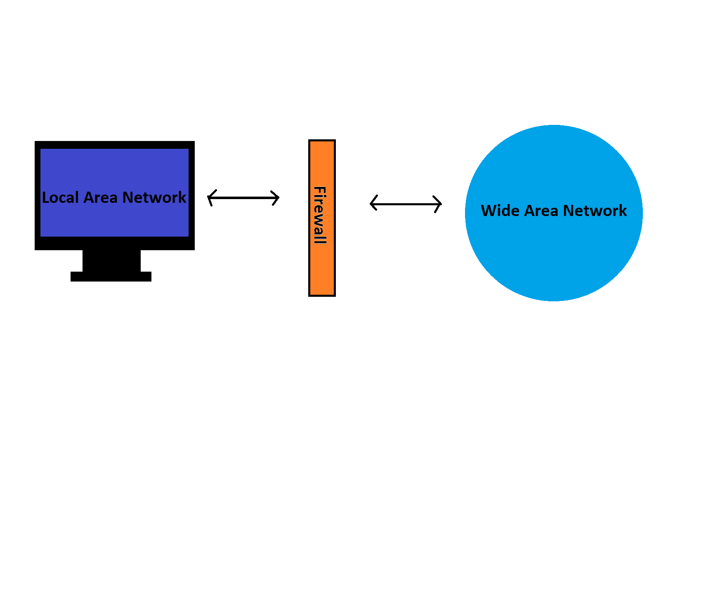

Firewalls
=========

*Written by Kyle, Edited by Brooke and Rasim.*

Introduction
------------
A firewall is one of the most basic forms of network security. Firewalls control incoming and outgoing network traffic and can be hardware or software based. Every firewall has a specific set of rules that define what machines are allowed access to the network. All machines that do not meet the rules are denied access to the firewall. With the rise of the internet in the 1980's, Access Control Lists that simply stated which IP Addresses were allowed on the network did not provide sufficient security. This gave way to firewalls, of which there are three types. [wif]_

Types of Firewalls [tof]_
------------------
Packet Filtering
~~~~~~~~~~~~~~~~
Packet filtering is a network layer form of firewall. As we know information travels through networks in 'packets.' Packet filtering firewalls control access to the network based on source and destination addresses, and the ports on which the packets are travelling. These firewalls do not look at the contents of the packets and have limited logging capabilities. 

Proxy
~~~~~
A proxy firewall passes packets through 'proxy' applications that are separate from the network. A proxy firewall prevents a users network from directly accessing the internet. Instead the proxy application accesses the internet and passes the pages to the user. Proxy firewalls can detect application information along with the surface level information that packet filtering can detect. This requires more resources, but is also more secure.

Stateful Inspection
~~~~~~~~~~~~~~~~~~~
Stateful inspection firewalls are fast and intelligent. They examine packets at the network layer similar to packet filtering, but analyze the sequence of the connection to ensure that the communications follow a set protocol from beginning to end. 

Vulnerablilities
----------------
There are many ways in which a firewall can fail and leave a user vulnerable to attacks. As stated previously only proxy firewalls check packets on an application level. This means that the others leave users vulnerable to applications which can be harmful making their way through a firewall even if they come from trusted sources on trusted ports. Other vulnerabilities include having outdated hardware and software, insecure passwords, unencrypted http connections, insufficient logging, and poor security management and documentation. [cff]_

PrettyPark
----------
A successful bypass of firewall in the past was done by a trojan horse called PrettyPark. This trojan horse bypassed firewalls by being an application attached in an email. When the application was executed it displayed the screensaver and emails itself to contacts in the users address book every 30 minutes. [ppw]_

Sources
-------
.. [cff] Kevin Beaver. "`Top 10 Common Firewall Flaws <https://blog.algosec.com/2015/07/top-10-common-firewall-flaws-that-continue-to-surface.html>`_" Algosec. 16 Jul. 2015. Web. 21 Feb. 2017.
.. [ppw] "`PrettyPark.Worm <https://www.symantec.com/security_response/writeup.jsp?docid=2000-121508-3334-99>`_." Symantec Corporation. 4 Jun. 1999. Web 21 Feb. 2017.
.. [tof] "`Types of Firewall <https://www.black-box.de/en-de/page/28180/Resources/Technical-Resources/Black-Box-Explains/security/types-of-firewall/>`_." Black Box Network Services. Web. 21 Feb. 2017
.. [wif] Margaret Rouse, Michael Cobb. "`What is Firewall? <http://searchsecurity.techtarget.com/definition/firewall>`_" Whatis.com Nov. 2014. Web. 21 Feb. 2017.
