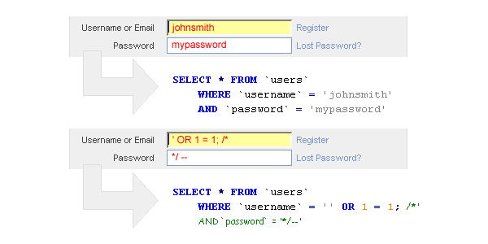

Known Vulnerabilities
=====================

*Written by Nathan, Edited by Taylor and Collin.*

Introduction
------------
There are many examples of known vulnerabilities regarding web security. 
Although some fixes are easy to implement with a quick Google search, others 
take time and effort to correct based on the programmer's individual situation.
With that in mind, here are examples of known security vulnerabilities and how 
to combat each issue.

SQL Injection
-------------
[SQLI]_

* Explain:
	* What is gained
	* Modifying the tables
	* Accessing data that doesn't belong to them
	* Example: real-world effects - target credit card information via accessing the database files

Broken Authentication and Session Management
--------------------------------------------
[BASM]_

* Explain:
	* Gaining access that shouldn't be given
	* Admin privilages
	* Accounts get "hijacked"
	* Example: Malicious attackers hacking a company database to wipe out their records

Sensitive Data Exposure
-----------------------
[SDE]_

* Explain:
	* What is it?
	* How can it affect the website and/or company?
	* Pitfalls of trading insecure information
	* Example: Identity theft based on insecure data monitored over a non-encrypted network (using base encoding)

Unvalidated Redirects and Forwards
----------------------------------
[URF]_

* What is it?
* What are the limitations?
* How does a hacker go about doing this?
* Example: forwarding a user to a malware site instead of their target site

Works Cited
-----------
.. [CSV] Kalman, Gergly. "10 Most Common Web Security Vulnerabilities." Toptal Engineering Blog. N.p., n.d. Web. 20 Feb. 2017.
.. [SQLI] "What Is SQL Injection (SQLi) and How to Fix It." Acunetix. N.p., n.d. Web. 20 Feb. 2017.
.. [BASM] "Broken Authentication and Session Management." Broken Authentication and Session Management - OWASP. N.p., n.d. Web. 20 Feb. 2017.
.. [SDE] McMullin, Maurice. "OWASP Top Ten Series: Sensitive Data Exposure." Load Balancers. N.p., 29 Dec. 2016. Web. 20 Feb. 2017.
.. [URF] Gaskill, Chris. "Top 10 Web Security Risks: Unvalidated Redirects and Forwards (#10)." Www.credera.com. N.p., 31 Dec. 2013. Web. 20 Feb. 2017.