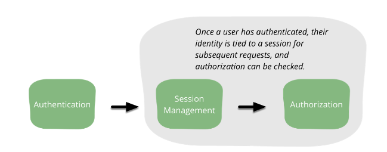
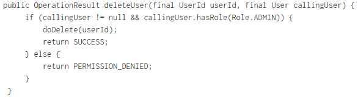
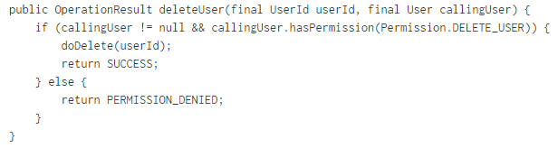
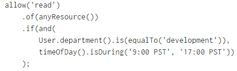

Authorization
=============

*Written by Sara, Edited by Tyler and Cody.*

Introduction
-------------
Authorization is very closely coupled with authentication, but they are two very
different things. While authentication proves the user's identity, authorization
determines what permissions and rights the user has. Authorization and
authentication can be tied together with session management. Session management
makes it possible to relate requests made by a user so that a user does not
have to authenticate during each request they make. [bwa]_

[bwa]_

Every time a user makes a request they must undergo a valid and effective
authorization procedure. A good authorization procedure consists of identifying
the user making the request, verifying that the request has not changed since
its initiation, applying the appropriate authorization procedures of the user,
and re-examining previously authorized request of the user. [wcs]_

Vulnerabilities
----------------
The most common vulnerability for authorization is not authorizing everything.
When it comes to authorization we must authorize every action that a user takes
no matter how insignificant it may seem. For example, if a website has a form
for the user to fill out that is specific to just that user we must check
not only that they have authorization to edit and add new objects to the form,
but also that the values they put into the form are valid. Let's say that the
form is connected to a database where each object has a specific ID. What
happens if a user is editing an object and changes the ID to one that is not
theirs? Without authorization the user would easily have access to all objects
in the database regardless of the owner.

Another example of this is when a web or application server runs at too great a
permission level. This means that they execute using privileged accounts such as
root in UNIX or LOCALSYSTEM in Windows. By running servers as these users the
processes run with all of the rights of these users. It is very easy to use
malicious code to execute with the authority of a privileged account. If someone
were to implement this code, then there could be potential damage from the
exploit. This can come into play with databases as well. Often times the
database accounts used by web applications have privileges beyond those actually
required. This destroys the database server's ability to defend against access
to or modification of unauthorized resources. Web servers should be executed
under accounts with minimal permissions and applications should use one or more
lesser-privileged accounts. [cac]_

Best Practices
---------------
Authorizing on the Server
~~~~~~~~~~~~~~~~~~~~~~~~~~~
One of the most critical mistakes a programmer can make is hiding capabilities
rather than explicitly enforcing authorization on the server. For example, it is
not sufficient enough to just hide the "delete user" button from users that are
not administrators. The server should not trust anything fro the user as far as
identity, permissions, or roles, so the server code must perform the
authorization of the delete. [bwa]_

Deny by Default
~~~~~~~~~~~~~~~~~
The authorization mechanism should always deny action by default unless they are
explicitly allowed. For example, if there are some actions that require
authorization and others that do not, it is safer to just deny by default and
override any actions that do not require permission. [bwa]_

Authorizing on Resources
~~~~~~~~~~~~~~~~~~~~~~~~~~
Resource authorization can be more complex because it validates whether a user
can take a particular action against a particular resource. For example, a user
should be allowed to modify their own profile, but only their profile. The
system must validate that the user is authorized to take action on the specific
resource being affected. [bwa]_

Implementations
----------------
Role-Based Access Control
~~~~~~~~~~~~~~~~~~~~~~~~~~~
The most common type of authorization is role-based access control(RBAC).
RBAC assigns roles to users and the roles are given permissions. Any user who
has been assigned a role inherits the permissions of that role. RBAC can be very
helpful when writing code for authorization. For example, instead of listing
everyone's name who is given the authorization we can just use the role. This
also allows us to easily change code if an employee is hired or fired. Instead
of finding or adding their name to every privilege we just need to add them to
the role. [bwa]_

[bwa]_

This is still not the best solution for authorization with RBAC. As the system
evolves and we end up with more and more roles our statements can become
complicated very fast. Instead the code should be concerned with whether or not
permission should be given to do something. In other words, we will decouple
permissions from roles. This can be shown in the code example below,

[bwa]_

Attribute-Based Access Control
~~~~~~~~~~~~~~~~~~~~~~~~~~~~~~~
A more advanced application should look at using attribute-based access
control(ABAC). ABAC can be thought of as a generalization of RBAC. It can base
decisions on any attribute of the user, the environment in which the user
exists, or the resource being accessed. Instead of making a decision based just
on what roles are assigned to the user, ABAC can use any property of the user's
profile. This can be anything from the amount of time worked at the company, the
country of their IP address, or the time of day. [bwa]_

The most common way to implement ABAC is using XACML. XACML is an XML based
format from Oasis. XACML can be very verbose and arguably cryptic, but it is one
of the few options for the standardized model of ABAC. There is another option,
which is to build policies in the language chosen for the application, bound to
its domain. This is shown as in example in JavaScript below,

[bwa]_

Other Implementations
~~~~~~~~~~~~~~~~~~~~~~~
RBAC and ABAC are just two possible ways of modeling policy and will probably be
used in most situations. Other approaches that can be used are

* Mandatory Access Control(MAC): based on sensitivity of the information
  contained in the objects or resources and a formal authorization. They are
  mandatory because they restrain subjects from setting security attributes on an
  object and from passing on their access. [cac]_
* Relationship-Based Access Control(ReBAC): policy that is largely determined by
  relationship between principals and resources [bwa]_
* Discretionary Access Control(DAC): based on the identity and need-to-know of
  subjects or the groups to which they belong. They are discretionary because a
  subject with certain access permissions is capable of passing on that access
  to other subjects. [cac]_
* Rule-Based Access Control: dynamic role or permission assignment based on a
  set of operator-programmed rules [bwa]_

Sources
---------

.. [bwa] Cairns, Cade, and Daniel Somerfield"`The Basics of Web Application Security <https://martinfowler.com/articles/web-security-basics.html>`_." Martinfowler.com. Martin Fowler, 05 Jan. 2017. Web. 20 Feb. 2017.
.. [cac] "'Category: Acccess Control <https://www.owasp.org/index.php/Category:Access_Control>'_." OSWAP. OWASP Foundation, 01 June 2016. Web. 21 Feb. 2017.
.. [wcs] Nahari, Hadi, and Ronald L. Krutz. Web Commerce Security: Design And Development. Indianapolis: Wiley, 2011. Print. 20 Feb. 2017.
