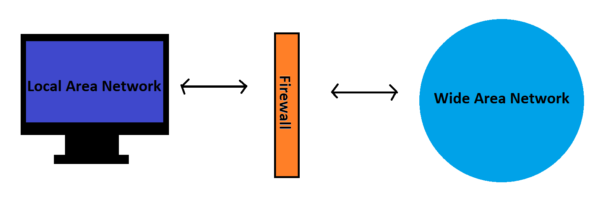
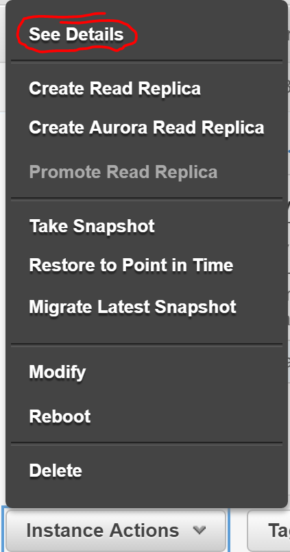
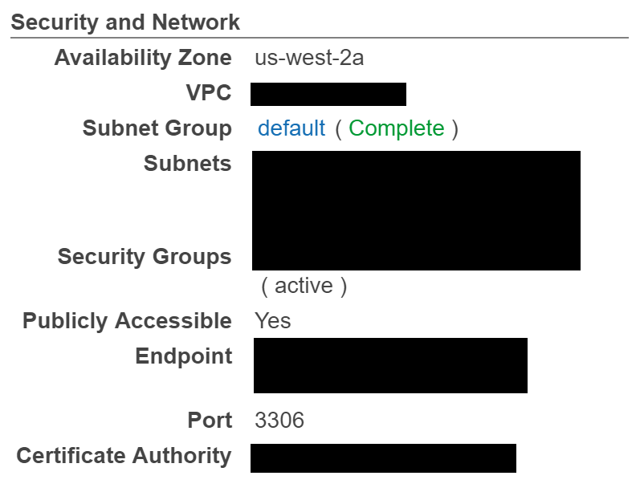
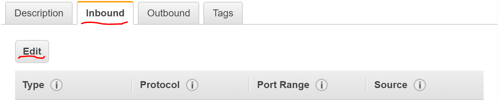
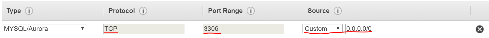

Firewalls
=========

*Written by Kyle, Edited by Brooke and Rasim.*

Introduction
------------
A firewall is one of the most basic forms of network security. Firewalls control
incoming and outgoing network traffic and can be hardware or software based. 
Every firewall has a specific set of rules that define what machines are allowed
access to the network. All machines that do not meet the rules are denied access
to the firewall. With the rise of the internet in the 1980's, Access Control 
Lists that simply stated which IP Addresses were allowed on the network did not 
provide sufficient security. This gave way to firewalls, of which there are 
three types. [wif]_

A Short History of Firewalls
----------------------------
As mentioned previously, the need for firewalls arose when the internet made 
machines more connected, and less secure, than ever before. Prior to firewalls 
most security was controlled by Access Control Lists. These lists existed on 
routers and determined which IP addresses were allowed on the server. This 
became not only not secure enough, but not feasible when hundreds of machines 
are attempting to access my machine. Therefore looking at the sources of packets 
was no longer enough. It was now necessary to look at the packets themselves. 
The first commercial firewall was shipped by Digital Equipment Corp in 1992. 
Since then both firewalls and the attacks that they are preventing have become 
increasingly sophisticated. 

Types of Firewalls [tof]_
------------------
Packet Filtering
~~~~~~~~~~~~~~~~
Packet filtering is a network layer form of firewall. This kind of firewall was 
commonly used in the earliest firewalls. As we know information travels through 
networks in 'packets.' Packet filtering firewalls control access to the network 
based on source and destination addresses, and the ports on which the packets 
are travelling. These firewalls do not look at the contents of the packets and 
have limited logging capabilities. 

Proxy
~~~~~
A proxy firewall passes packets through 'proxy' applications that are separate 
from the network. This process is a bit more complicated than packet filtering. 
A proxy firewall prevents a users network from directly accessing the internet. 
Instead the proxy application accesses the internet and passes the pages to the 
user. Proxy firewalls can detect application information along with the surface 
level information that packet filtering can detect. This requires more resources 
and is slower than the simpler packet filtering. It is, however, more secure. 
Along with increased security, another advantage of proxy firewall is the 
increased logging capabilities. This makes it possible to discover information 
about the data contained within packets.

Stateful Inspection
~~~~~~~~~~~~~~~~~~~
Stateful inspection firewalls are fast and intelligent. They examine packets at 
the network layer similar to packet filtering, but analyze the sequence of the 
connection to ensure that the communications follow a set protocol from 
beginning to end. 

Hybrid Firewalls
~~~~~~~~~~~~~~~~
Most modern day firewalls provide a hybrid of these sorts of systems. This 
mixture of methods increases security greatly. 

Vulnerablilities
----------------
There are many ways in which a firewall can fail and leave a user vulnerable to 
attacks. As stated previously only proxy firewalls check packets on an 
application level. This means that the others leave users vulnerable to 
applications which can be harmful making their way through a firewall even if 
they come from trusted sources on trusted ports. Many exe files contain viruses 
and worms and can make it through packet filtering and stateful inspection 
firewalls. Other vulnerabilities include having outdated hardware and software, 
insecure passwords, unencrypted http connections, insufficient logging, and poor 
security management and documentation. [cff]_

PrettyPark
----------
A successful bypass of firewall in the past was done by a trojan horse called 
PrettyPark. This trojan horse bypassed firewalls by being an application 
attached in an email. When the application was executed it displayed the 
screensaver and emails itself to contacts in the users address book every 30 
minutes. This attack targeted systems that did not have firewalls that protected 
them on the application level. This allowed the systems to be targeted through 
email. [ppw]_

RDS Firewall on AWS
-------------------------------------
An example of a firewall that we have already set up is on our RDS service on 
Amazon Web Services. If you open up an RDS instance you can select *See Details*. 

On the following page select *Security Groups*.

At the bottom of the next page there are three tabs, we want to edit the Inbound 
Security groups. We can also manage our firewall for Outbound connections, but 
let's focus on Inbound for now.

In our stack we are using MySql, and therefore this is what we have selected as 
our type of security group. This selection automatically sets our firewall 
protocol to TCP and only allows communication on port 3306 for our database 
connection. Any requests that do not follow TCP or are trying to communicate on 
ports other than port 3306 will not be allowed on the network.

On the right side of this popup there is a source section. This section allows 
for users to set specific IP addresses that are allowed to send inbound packets. 
If there are no restrictions, as in the image, any machine may communicate to 
the database. This is not ideal, and this field can be changed to only allow 
known machines that need to communicate with the database. 

All of this can also be set for outbound packets as well. This is an example of a 
stateful inspection firewall that is incredibly easy to set up and use. It checks 
that communication is following a set protocol, happening on a specific port, and 
is coming from trusted sources. As mentioned previously, under the *Outbound* 
tab a firewall can be set up for outgoing connections just as easily.

Sources
-------
.. [cff] Kevin Beaver. "`Top 10 Common Firewall Flaws <https://blog.algosec.com/2015/07/top-10-common-firewall-flaws-that-continue-to-surface.html>`_" Algosec. 16 Jul. 2015. Web. 21 Feb. 2017.
.. [ppw] "`PrettyPark.Worm <https://www.symantec.com/security_response/writeup.jsp?docid=2000-121508-3334-99>`_." Symantec Corporation. 4 Jun. 1999. Web 21 Feb. 2017.
.. [tof] "`Types of Firewall <https://www.black-box.de/en-de/page/28180/Resources/Technical-Resources/Black-Box-Explains/security/types-of-firewall/>`_." Black Box Network Services. Web. 21 Feb. 2017
.. [wif] Margaret Rouse, Michael Cobb. "`What is Firewall? <http://searchsecurity.techtarget.com/definition/firewall>`_" Whatis.com Nov. 2014. Web. 21 Feb. 2017.
