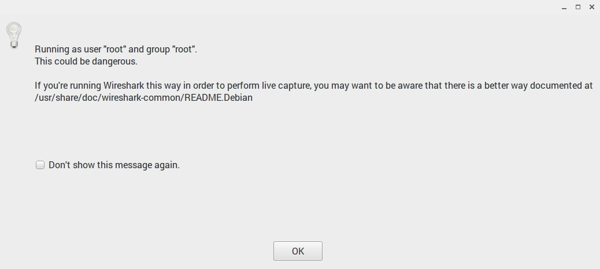

Process Security
================

*Written by Michael R, Edited by Michael B and Anthony.*

Introduction
------------
Process security is the method of securing processes on a computer to limit what
they can access. For example, if a piece of software such as Apache were
compromised, a hacker could potentially wreak havoc on any computer where it is
installed. With process security, multiple system functions such as directory
access, network ports, disk access, and CPU access can be limited to prevent
processes from going rogue or to prevent hackers from using them to exploit a
system.

Process Accounts
----------------
One way to secure processes is through the use of process accounts. If you have
ever used a Linux computer, you have likely seen some kind of warning about
running a program as root. This can be especially annoying if you are the only
user on a personal computer and you find yourself frequently switching between
your regular user account and the root account.

[wshark]_

So, how do you know when to make process accounts and how do you make them?

This depends on the operating system and software you're installing. Making a
process account is as simple as creating another login to your computer, but
setting the permissions for that account can get a little more complicated.

Let's use the example of installing Apache on a Linux machine. When installing
Apache the software automatically creates a user called "www-data" and a group
called "www-data" which includes that user. Apache stores all of its data in the
/var/www directory. After installing the software, you need to change the read,
write, and execute permissions of this directory to the "www-data" user. This
will prevent other user accounts from accessing this directory and people
accessing the server through this account from modifying files in other
locations on the server. [ugp]_

.. danger::

    Did you skim over the last section? The summary is that running a program as
    root potentially gives anyone who uses that program full and unlimited access
    to your computer.

Vulnerability Demonstration
---------------------------
Are you still having trouble seeing how this could be an issue for you? Let me
lay it out.

1. You install Apache web server to run as "root" on a Linux server.
2. A hacker accesses your server and uses a method like directory traversal to
   move up and out of the /var/www folder into the /etc folder.
3. The hacker takes whatever information they want and installs malware or
   corrupts the server operating system because they have access to execute any
   system command. [wss]_

Privilege Escalation
--------------------
Carefully creating process accounts does not remove the full threat of process
security risks. Privilege escalation is a method used to infiltrate systems
where hackers user a bug in a program or operating system's code to change the
rights of their account. There are two types:

* Vertical privilege escalation: This occurs when a user with lower rights, such
  as a standard user, accesses content that only elevated accounts should be
  able to see.
* Horizontal privilege escalation: This occurs when a user accesses content that
  other users with the same account type can see. [pea]_

Here are some example steps an intruder would take to execute a privilege
escalation attack:

1. Gather information about the computer you have limited access to. On Windows,
   this can be done by opening the command prompt and changing the directory to
   ``\Windows\system32``. Then execute the following:

   ``C:\Windows\system32> systeminfo | findstr /B /C:"OS Name" /C:"OS Version"``

2. If you don't already know it, find the computer's name:

   ``C:\Windows\system32> hostname``

3. Find the username you're logged on with:

   ``C:\Windows\system32> echo %username%``

3. Then, check what other accounts have been created on the system:

   ``C:\Windows\system32> net users``

4. You can find more information about any of the accounts by running this
   command:

   ``C:\Windows\system32> net user Michael``

5. The hacker would then probably run commands to find what network connections
   were open and if there were any unmounted disks. As with any well executed
   plan, the first part includes research. [wpef]_

It is interesting to see how much you can find out by running a few commands on
a computer. Here is the output from completing the above steps on my laptop:

  .. code-block:: bash

	c:\Windows\System32>systeminfo | findstr /B /C:"OS Name" /C:"OS Version"
	OS Name:                   Microsoft Windows 10 Pro
	OS Version:                10.0.14393 N/A Build 14393

	c:\Windows\System32>hostname
	mreuter-hp

	c:\Windows\System32>echo %username%
	Michael

	c:\Windows\System32>net users

	User accounts for \\MREUTER-HP

	----------------------------------------------------------------------------
	Administrator            DefaultAccount           Guest
	Michael
	The command completed successfully.

	c:\Windows\System32>net user Michael
	User name                    Michael
	Full Name                    Michael Reuter
	Comment
	Users comment
	Country/region code          000 (System Default)
	Account active               Yes
	Account expires              Never

	Password last set            10/14/2016 12:40:44 PM
	Password expires             Never
	Password changeable          10/14/2016 12:40:44 PM
	Password required            Yes
	User may change password     Yes

	Workstations allowed         All
	Logon script
	User profile
	Home directory
	Last logon                   Never

	Logon hours allowed          All

	Local Group Memberships      *Administrators       *Performance Log Users
	Global Group memberships     *None
	The command completed successfully.

Additional Example
------------------
On Linux computers you must be running as root or a superuser to listen on ports
0-1024. This was originally a security feature although at least one author
argues it is completely outdated and useless. Regardless, this feature requires
web servers to be run with superuser privileges if they are operating
traditionally on port 80 which could also be a vulnerability if a web server is
being run from a superuser account. [ports]_

Security Steps
--------------
Here are some things to do to limit process security vulnerabilities:

* If possible, install only the minimum necessary programs on your server and
  run one process per server.
* Save your web content and the operating system on different disks or file
  partitions. On Windows, it's typical to have a C: and D: drive. On Linux, the
  OS is typically installed in /etc and the data is typically saved in /var.
* Give process accounts minimum necessary permissions, don't guess. Figure out
  the absolute minimum permissions needed for a process account.
* Install security updates regularly.
* Turn on server logs and watch them for strange entries. [wss]_

Sources
-------
.. [ugp] "User and Group permissions, with chmod, and Apache." Fideloper, Web. 21 Feb. 2017.
.. [ports] "Why can only root listen to ports below 1024?" Michael Staldal, 31 Oct. 2007. Web. 21 Feb. 2017.
.. [wss] "Web Server Security and Database Server Security." Acuentix, Web. 21 Feb. 2017.
.. [wshark] "Wireshark Warning Image." Michael Reuter, Web. 21 Feb. 2017
.. [pea] "Privilege Escalation Attack." Margaret Rouse, Web. 26 Feb. 2017
.. [wpef] "Windows Privilege Escalation Fundamentals." FuxxySecurity, Web. 26 Feb. 2017
