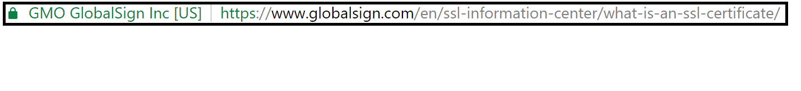
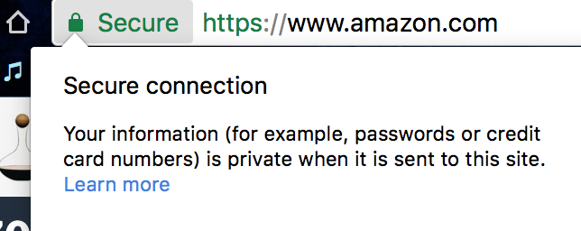
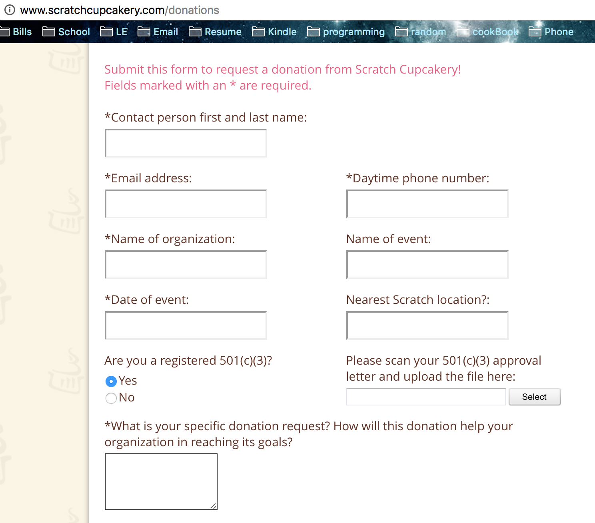

Server Certificates
===================

*Written by Lana, Edited by Paul and Taylor.*

Introduction
~~~~~~~~~~~~~
A server certificate is a digital certificate installed onto a web server. It is 
used for data encryption, and to authenticate an organizational identity 
[GlobalSign]_. Users will know if the website is secure due to the lock icon in 
the URL. For example, I took a screenshot of Global Sign URL which indicates is 
a secure website. 

Why Do Companies Need an SSL Certificate?
~~~~~~~~~~~~~~~~~~~~~~~~~~~~~~~~~~~~~~~~~~~
Companies need an SSL to encrypt the data the customer is entering such as 
username, password, credit card and more. This ensures clients that their 
sensitive information is not easily obtainable. [GlobalSign]_. If a server does 
not have a certificate, it cannot protect the clients from potentially being 
compromised. 

Who Needs an SSL Certificate?
~~~~~~~~~~~~~~~~~~~~~~~~~~~~~~~~
SSL certificates are not only used to encrypt transactions, but to also verify 
the identity of the company. Clients are more likely to visit a trusted website 
such as Amazon, GameStop, U.S. Bank, and more. Therefore, it is highly 
recommended to have an SSL certificate. [GoDaddy]_

What Could Happen if There is No SSL Certificate?
~~~~~~~~~~~~~~~~~~~~~~~~~~~~~~~~~~~~~~~~~~~~~~~~~~~~~~
Login forms have sensitive information such as username, and password. If this 
is not properly secure, someone can easily obtain that information. Also, for 
some users, they may use the same password for multiple sites, therefore, the 
attacker can potentially compromise the user. [SSL-Shopper]_

What Vulnerabilities are There? 
~~~~~~~~~~~~~~~~~~~~~~~~~~~~~~~~~~
There are websites that may appear legitimate, but is the imposter. If the 
“real” company doesn’t contain an SSL, an imposter can affirm the certificate, 
resulting in users entering their sensitive information into a website that 
appears genuine but is actually fake. [Digicert]_

Types of Certificates
~~~~~~~~~~~~~~~~~~~~~~
*Domain Validated Certificate*
This type of certificate is mainly used for owning the domain name and verifying 
ownership. This is the cheapest type of certificate where it can be obtained for 
free. This is not commonly used for commercial purposes because it is a high 
risk certificate use on a public website. The risk involves clients not able to 
verify the organization when they visit the website. [Symantec-Corp]_

*Organization Validated Certificate*
This type of certificate is a standard type of certificate that is at least used 
on commercial website. Organization Validated Certificate are trusted because 
they are "authenticated by real agents against business registry databases 
hosted by governments" [Symantec-Corp]_. Meaning, the website legitimatizes their 
business information. 

*Extended Validation Certificate*
This type of certificate is the most trusted type of certificate. This gives
users peace of mind that the domain is a secured website. It has more define 
guidelines for companies to follow. [Symantec-Corp]_

How to Obtain an SSL Certificate?
~~~~~~~~~~~~~~~~~~~~~~~~~~~~~~~~~~
A SSL Certificate can be purchased through a domain provider such as GoDaddy, 
DigiCert, GlobalSign and more. They will offer several different service 
packages including standard SSL certificate, Extended Validation Certificate, 
Multiple-Domains, and Wildcard.

How to Tell if a Website is Secure?
~~~~~~~~~~~~~~~~~~~~~~~~~~~~~~~~~~~~

There are several indications that can help identify if the website is secure. 

1. Check to see if the URL has a lock on it. Depending on which browser, it will 
display a lock icon either left (Firefox and Chrome) of the URL or right 
(internet Explorer) of it. Also, if the website is secure, it will have "https" 
at the beginning of the URL (except Internet Explorer, they only have the lock 
icon). Furthermore, you can select the lock icon, and it will say "this is a 
secure connection". 

		
		 
		

		
		An example of a secure website
		

		
		Be cautious on what information is being enter on an unsecure website. 

2. Always verify the domain. It is possible to visit a website that looks like 
the real company, however, it is the imposter. For example, there is a suspicious 
email from your bank stating you need to verify your account information. Do not 
click on the URL provided within the email. If you hover your mouse over it, it 
will display the true URL which will most likely direct you to a fake website.

3. Be a wise shopper. If the prices are too low, it is too good to be true. It 
is advised to only shop at reputable websites such as Amazon.   

Sources
+++++++++
.. [Digicert] "Protect Yourself Against Fraudulent SSL Certificates." What Are 
Fraudulent SSL Certificates & How Can Users Protect Themselves. Digicert, n.d. Web. 
21 Feb. 2017. 
<https://www.digicert.com/protecting-against-fraudulent-certificates.htm>.

.. [GlobalSign] "GlobalSign." SSL & Digital Certificates by GlobalSign., 
n.d. Web. 20 Feb. 2017. 
<https://www.globalsign.com/en/ssl-information-center/what-is-an-ssl-certificate/>.

.. [GoDaddy] "Do you need SSL encryption if you don't sell anything on your 
website?" GoDaddy., 16 Jan. 2017. Web. 21 Feb. 2017. 
<https://www.godaddy.com/garage/smallbusiness/secure/do-you-need-ssl-encryption-if-you-dont-sell-anything-on-your-website/>.

.. [SSL-Shopper] "Do I Need An SSL Certificate For My Website?" Do I Need An 
SSL Certificate For My Website? SSL-Shopper, n.d. Web. 21 Feb. 2017. 
<https://www.sslshopper.com/article-do-i-need-an-ssl-certificate-for-my-website.html>.

.. [Symantec-Corp] "Types of SSL certificates – choose the right one." Symantec 
- Global Leader In Next-Generation Cyber Security. Symantec, n.d. Web. 23 Feb. 
2017. 
<https://www.symantec.com/connect/blogs/types-ssl-certificates-choose-right-one>.