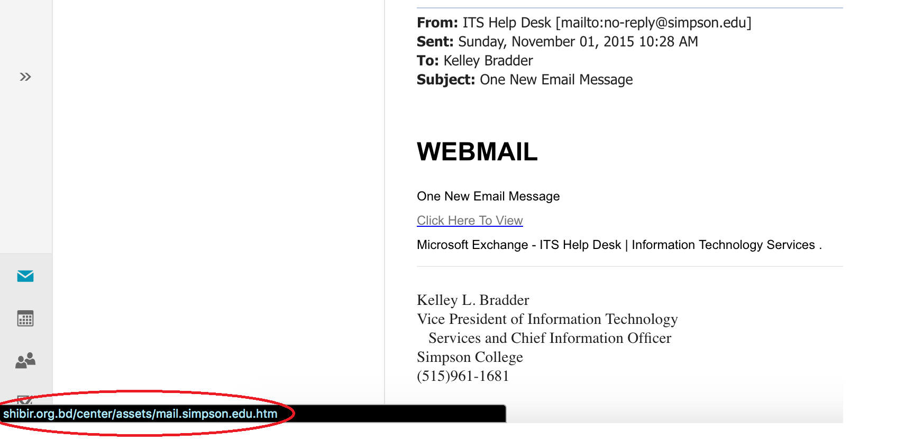

Server Certificates
===================

*Written by Lana, Edited by Paul and Taylor.*

Introduction
~~~~~~~~~~~~~
A server certificate is a digital certificate installed onto a web server. It is 
used for data encryption and to authenticate an organizational identity 
[GlobalSign]_. Users will know if the website is secure due to the lock icon in 
the URL. For example, the screenshot below of Global Sign URL indicates it is 
a secure website.

.. image:: ssl.png
		:align: left
		:alt: Lock Icon on URL

Why Do Companies Need an SSL Certificate?
~~~~~~~~~~~~~~~~~~~~~~~~~~~~~~~~~~~~~~~~~~~
Companies need an SSL to encrypt the data the customer is entering such as 
username, password, credit card and more. This ensures clients that their 
sensitive information is not easily obtainable [GlobalSign]_. If a server does 
not have a certificate, it cannot protect the clients from potentially being 
compromised. 

Who Needs an SSL Certificate?
~~~~~~~~~~~~~~~~~~~~~~~~~~~~~~~~
SSL certificates are not only used to encrypt transactions, but to also verify 
the identity of the company. Clients are more likely to visit a trusted website 
such as Amazon, GameStop, U.S. Bank, and more. Therefore, it is highly 
recommended to have an SSL certificate. [GoDaddy]_

What Could Happen if There is No SSL Certificate?
~~~~~~~~~~~~~~~~~~~~~~~~~~~~~~~~~~~~~~~~~~~~~~~~~~~~~~
Login forms have sensitive information such as username and password. 
Furthermore, to create a new account on some websites requires an email and 
password which is also highly recommended to verify if the site is secure or 
not. If this is not properly secure, someone can easily obtain that information 
and read the data including the client's login information. Additionally, some 
users may use the same password for multiple sites. Therefore, the attacker can 
potentially compromise the user. [SSL-Shopper]_

What Vulnerabilities are There? 
~~~~~~~~~~~~~~~~~~~~~~~~~~~~~~~~~~
There are websites that may appear legitimate, but are actually imposters. If 
the “real” company doesn’t contain an SSL, an imposter can affirm the 
certificate, resulting in users entering their sensitive information into a 
website that appears genuine but is actually fake. [Digicert]_

Types of Certificates
~~~~~~~~~~~~~~~~~~~~~~
*Domain Validated Certificate*

This type of certificate is mainly used for owning the domain name and verifying 
ownership. This is the cheapest type of certificate where it can be obtained for 
free. This is not commonly used for commercial purposes because it is a high 
risk certificate when used on a public website. The risk involves clients not 
able to verify the organization when they visit the website. [Symantec-Corp]_

*Organization Validated Certificate*

This type of certificate is a standard type of certificate that is used 
on commercial websites. Organization Validated Certificates are trusted because 
they are "authenticated by real agents against business registry databases 
hosted by governments" [Symantec-Corp]_. This means that the website 
legitimatizes their business information. 

*Extended Validation Certificate*

This type of certificate is the most trusted type of certificates. This gives
users peace of mind that the domain is a secured website. In addition, it has 
more defined guidelines for companies to follow. Basically, it encrypts all data 
between the user and web server. [Symantec-Corp]_

How to Obtain an SSL Certificate?
~~~~~~~~~~~~~~~~~~~~~~~~~~~~~~~~~~
A SSL Certificate can be purchased through a domain provider such as GoDaddy, 
DigiCert, GlobalSign and more. They will offer several different service 
packages including standard SSL certificate, Extended Validation Certificate, 
Multiple-Domains, and Wildcard(s).

How to Tell if a Website is Secure?
~~~~~~~~~~~~~~~~~~~~~~~~~~~~~~~~~~~~

There are several indications that can help identify if the website is secure. 

1. Check to see if the URL has a lock on it. Depending on which browser, it will 
display a lock icon either left of the URL (Firefox and Chrome) or right 
(Internet Explorer). In the event that the website is secure, it will have 
"https" at the beginning of the URL (except Internet Explorer, which only has 
the lock icon). Furthermore, select the lock icon and it will say "this is a secure connection".

.. figure:: cakeUnsecure.png
		:align: center
		:width: 400px
		:alt: Cupcake Form
		
		This screenshot is an example of an unsecure website. Even though the 
		information is not extremely sensitive in this example, it is good 
		practice to be cautious of what information is being entered.  

.. figure:: httpsHotTopic.png
		:align: center
		:width: 300px
		:alt: Hot Topic partially secure
		
		This screenshot is of the login page on Hot Topic's website. Even 
		though it says https, this is an indication that not all data on the 
		webpage is encrypted and some of the content is readable. However, the 
		information that is being inputted into the email and password is 
		secure. The screenshot below explains what is not encrypted on the 
		webpage.
		
.. figure:: httpImage.png
		:align: center
		:width: 350px
		:alt: Hot Topic http image
		
		This screenshot on Hot Topic's website is the reason why the login page 
		is considered "not fully secure". It is a image that is using HTTP and 
		not HTTPS. 

.. figure:: amazonSecure.png
		:align: center
		:width: 300px
		:alt: Secure Message
		
		For example, this screenshot of Amazon.com displays that it is a 
		secure website. Before the URL, it has a lock icon with the word 
		"Secure" to identify that all information will be encrypted. 

2. Always verify the domain. It is possible to visit a website that looks like 
the real company, however, it is the imposter. For example, a suspicious email 
from U.S. Bank states the account has not been verified and to click on the 
following link. This is where the first mistake occurs. Do not click on the URL 
provided within the email because it could be directed to a whole other website. 
To check this, hover the mouse cursor over the link and it will display the true
 URL. Phishing attempts occur often and they will imitate the real company to 
 their best ability to deceive the clients.

		
		In this example, Simpson students may have received an email saying 
		"One New Email Message" from Kelley Bradder. However, hover the mouse 
		over the link, and it will expose the true website that the students 
		would have been directed to.

3. Be a wise shopper. If the prices are too low, it is too good to be true. It 
is advised to only shop at reputable websites such as Amazon. In contrast 
sometimes companies could fail to update their certificate. So if a website that 
previously had a valid certificate, it will warn end users that the website 
security certificate presented is not valid. Under those circumstances there 
will be a chance hackers are to intercept the data. So either wait for the 
company to renew their certificate or visit another.

.. figure:: SSLexpired.png
		:align: center
		:width: 400px
		:alt: SSL Certificate Expired
		
		If a SSL certificate expires the end users will be greeted by this 
		warning. [Microsoft]_
		
Alternatively, a application that requires a SSL certificate functions the same 
way. Apple made a recent change in the last year requiring 
 all apps from the Mac App store to have a "valid provisioning profile" that 
 must be updated periodically [Mac]_. For those who did not renew it on time saw
 the consequences which the application would crash not allowing users to open 
 it. Developers were aware of the changes, but did not think it applied to them.
 As a matter of fact, the recent policy changes by Apple did impact several 
 applications, but developers were not aware until it occurred.

.. figure:: onePassword.png
		:align: center
		:width: 300px
		:alt: One Password App Crash Message
		
		One Password is a popular application on Apple where users have a vault 
		that stores all of their passwords. This was one of the many 
		applications that did not renew their certificate resulting in the app 
		crashing every time the end user attempted to open it. [Mac]_ 
		
Keep in mind, not all websites need an SSL certificate due to the type of 
content. For example, IMDB is a informative website about movies, T.V. shows, 
and actors/actresses. Therefore, IMDB made the decision to have the SSL 
Certificate to be applied only when the user is logging into their account and 
when viewing their profile. Otherwise, the remainder of the website is unsecure.
Basically, it is ok for some websites to not have all content to be secure. 
Regardless, it is crucial to verify if the webpage is secure when entering 
sensitive information and purchasing products online. 

Sources
+++++++++
.. [Digicert] "Protect Yourself Against Fraudulent SSL Certificates." What Are Fraudulent SSL Certificates & How Can Users Protect Themselves. Digicert, n.d. Web. 21 Feb. 2017. <https://www.digicert.com/protecting-against-fraudulent-certificates.htm>.

.. [GlobalSign] "GlobalSign." SSL & Digital Certificates by GlobalSign., n.d. Web. 20 Feb. 2017. <https://www.globalsign.com/en/ssl-information-center/what-is-an-ssl-certificate/>.

.. [GoDaddy] "Do you need SSL encryption if you don't sell anything on your website?" GoDaddy., 16 Jan. 2017. Web. 21 Feb. 2017. <https://www.godaddy.com/garage/smallbusiness/secure/do-you-need-ssl-encryption-if-you-dont-sell-anything-on-your-website/>.

.. [SSL-Shopper] "Do I Need An SSL Certificate For My Website?" Do I Need An SSL Certificate For My Website? SSL-Shopper, n.d. Web. 21 Feb. 2017. <https://www.sslshopper.com/article-do-i-need-an-ssl-certificate-for-my-website.html>.

.. [Symantec-Corp] "Types of SSL certificates – choose the right one." Symantec - Global Leader In Next-Generation Cyber Security. Symantec, n.d. Web. 23 Feb. 2017. <https://www.symantec.com/connect/blogs/types-ssl-certificates-choose-right-one>.

.. [Microsoft] Sanders, Jeff. "Troubleshooting ASP.NET – The remote certificate is invalid according to the validation procedure." Http Client Protocol Issues (and other fun stuff I support). Microsoft, n.d. Web. 27 Feb. 2017. <https://blogs.msdn.microsoft.com/jpsanders/2009/09/16/troubleshooting-asp-net-the-remote-certificate-is-invalid-according-to-the-validation-procedure/>.

.. [Mac] "Some popular Mac apps fail as developer certificates expire." Cult of Mac. Cult of Mac, 20 Feb. 2017. Web. 27 Feb. 2017. <http://www.cultofmac.com/468457/mac-apps-failing-developer-certificates-expire/>.