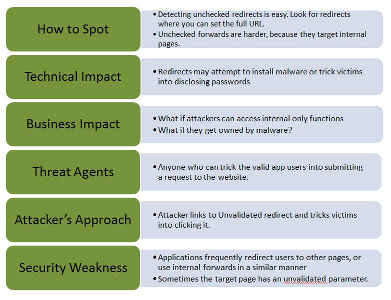

Unvalidated Redirects
=====================
*Written by Cody, Edited by Sara and Paul.*

Introduction
------------

Web applications often redirect and forward users to other pages and websites. 
Without proper validation of the data being used to determine the destination 
pages, attackers can redirect users to phishing or malware sites that may 
appear trustworthy. Unvalidated redirect and forward attacks can also be used 
to craft a URL to pass the application's access control check and forward the 
attacker to functions that they would normally not have access to. It is 
important that when working with redirects the programmer properly declare the 
URL so that it cannot be manipulated by an attacker. [owasp]_

How Do Redirects Work?
----------------------
The purpose of redirects is to send users to another page. The URL in a safe 
redirect must be explicitly declared so it is not manipulated by attackers. 
[owasp]_ A typical redirect might look like the following:

http://www.simpson.edu/redirect?url=http://simpsonstudentinfo.com

This redirect is just using a parameter, 'url' to decide the destination of the 
redirect. It may seem to be harmless as it is, but an attacker could easily use 
the redirect feature to send users to a different link. Such as:

http://www.simpson.edu/redirect?url=http://evilsimpsonstudentinfo.com

Which could then have the potential for the vulnerabilities and security risks 
mentioned later. But first, its important to understand where the risks are 
taking place and how they can be avoided. [cred]_

How To Fix a Dangerous Redirect
-------------------------------
In the previous section, I explained briefly how a redirect might look inside 
the URL, but what is going on behind the scenes that makes this vulnerability 
so risky? 

Below is the Java code that receives the URL from the 'url' GET parameter (same 
as the example above) and redirects to that URL.

.. code block:: Java
	response.sendRedirect(request.getParameter("url"));

This code is vulnerable because no validation or controls have been applied to 
verify the certainty of the URL. If no validation is applied, an attacker could 
create a hyperlink to redirect users to a malicious site.

Instead, the vulnerability could easily be avoided by using the following:

.. code block:: Java
	response.sendRedirect("http://simpsonstudentinfo.com")

In this case, the URL is being explicitly declared and cannot be manipulated by 
attackers. [owasp]_

Impacts of the Vulnerability
----------------------------
Redirects can a present a great security risk if they are not handled correctly 
Using a combination of malicious practice and social engineering, an attacker 
can trick the user into downloading malware, redirect them to a phishing site 
or even potentially gain access to unauthorized pages. One of the main reasons 
the user is so vulnerable is because the original website's name appears in the 
malicious URL convincing the user it is safe. Below are the different ways 
unvalidated redirects could potentially be vulnerable. 

	1. Technical Impact: As mentioned above, redirects may be used to install 
	malware and spread viruses. This could be dangerous for the user, as it 
	could do damage to their system. Redirects also may trick users into 
	disclosing sensitive information without knowing. This could have a very 
	large impact on some users because, although it is bad practice, most 
	people reuse passwords for multiple websites, and so, they could become 
	quite vulnerable with just one malicious redirect. 

	2. Business Impact: This impact is a little less technical, in the sense 
	that, physical damage is not being done, but rather, business trust and 
	relationships can be harmed. For example, if a user is taken advantage of 
	by an attacker using a unvalidated redirect, there is going to be a loss of 
	trust in that business's website. Therefore, leading to a loss in future 
	business. 

It is important to keep these vulnerabilities in mind if, and when, using 
redirects. The potential for an attacker to do harm to both users and the 
company's business is present. If redirects can be avoided, they should be. No 
business or website should have its user's trust in jeopardy with the 
possibility of malicious attacks. [cred]_

[tp]_

Avoiding the Vulnerability
--------------------------
With the potential security risks that come into play with unvalidated 
redirects, its important to know that there are other ways to go about sending 
users to different web pages to avoid the vulnerability. Listed below are a few 
simple ways to avoid unvalidated redirects. [mtsu]_
	1. Don't use redirects at all.
	2. Don't involve parameters in calculating the destination. In other words, 
	don't use user input to determine the destination.
	3. If the destination parameters can't be avoided, be sure the supplied 
	value is valid and authorized for the user. 

Summary
-------
In conclusion, it is apparent that unvalidated redirects bring about a 
potential for malicious attacks on websites and their users. With careful 
programming, these vulnerabilities can be avoided and prevent attackers from 
tricking users into giving away sensitive information or downloading malware. 
The cost of losing user trust and business is too great to risk this avoidable
vulnerability.

**Sources**

.. [owasp] Susanna Bezold, Johanna Curiel, Jim Manico. `"Unvalidated Redirects 
		and Forwards Cheat Sheet." <https://www.owasp.org/index.php/Unvalidated_Redirects_and_Forwards_Cheat_Sheet>`_ OWASP, 20 Sept. 2016. Web. 20 Feb. 2017.

.. [kemp] Maurice McMullin. `"OWASP Top Ten Series: Unvalidated Redirects and 
		Forwards." <https://kemptechnologies.com/blog/owasp-top-ten-series-unvalidated-redirects-forwards/>`_ Kemp Technologies, 18 Apr. 2016. Web. 20 Feb. 2017.

.. [tp] `"Security Testing - Unvalidated Redirects and Forwards" <https://www.tutorialspoint.com/security_testing/unvalidated_redirects_and_forwards.htm>`_ TutorialsPoint. 
		Web. 20 Feb. 2017.

.. [mtsu] `"Unvalidated Redirects and Forwards." <http://www.montana.edu/itcenter/security/web/unvalidated-redirects-and-forwards.html>`_ Montana State University. 
		Web. 20 Feb. 2017.

.. [cred] Chris Gaskill. `"Top 10 Web Security Risks: Unvalidated Redirects
		and Forwards (#10)." <https://www.credera.com/blog/technology-insights/java/top-10-web-security-risks-unvalidated-redirects-forwards-10/>`_ Credera, 16 Jan. 2014. Web. 27 Feb. 2017.