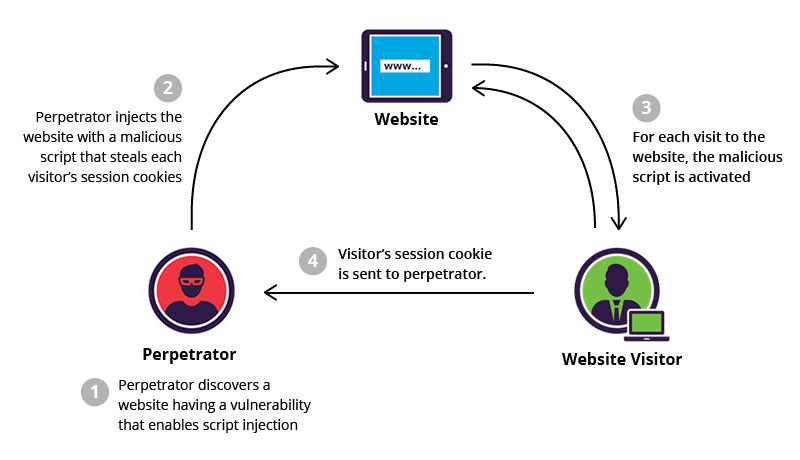

Cross-Site Scripting
====================

Introduction
------------

Cross-site scripting is when an attacker inserts code into a legitimate website, 
and is considered one of the more dangerous website vulnerabilities. Web sites are 
vulnerable  when they don't use validation or encoding on user generated 
data. This is dangerous for the site users, who are at risk for their data being 
stolen. There are several different ways for web applications to help prevent 
Cross-Site Scripting, such as escaping characters, Signature based filtering, 
and avoiding/validating HTML given by users. Users can also take precautions, such 
as using anti-viruses, checking that the sites they are using are safe, and being 
careful of clicking on unknown links.  

What is Cross-site scripting and Why is it Dangerous?
-----------------------------------------------------

XSS, or Cross-Site Scripting is inserting malicious code into an actual website 
to gather information from the users. Most of the danger lies on the users of the 
sites, as the code targets their information and use rather than the website itself. [xss]_ 

* Some examples of what dangerous XSS could do include: 

	1. Access session cookies, which can be used to impersonate the user
	2. Keylogging, which tracks the users keystrokes to catch usernames and passwords, 
	    
	3. Phishing, or sending out fake and/or malicious emails, usually to steal user 
	   data such as usernames and passwords. 
	4. Installing malicious software or viruses on the user's computer
	5. and Identity Theft [xss]_
	
These attacks can be damaging if the attacker manages to steal a user's username and/or 
password. They can be used to get into user accounts and either use their accounts as 
dummy accounts to send out other attacks, steal the users private, saved information, 
or could be used to purchase items in the users's name if their purchasing information is 
included in the account, such as an Amazon Prime or credit card account.
	
* There are two different types of XSS attacks, stored and reflective

	* Stored xss is "stored", or imbedded, on the website itself and steals data every time 
	  the website is visited. [xss-prevention]_ It is also known as "persistent XSS", 
	  and can be the more dangerous of the two types. [xss-attacks]_

	* Reflective xss is stored in a link embedded in the website that the user has to 
	  click on to activate. [xss-attacks]_ 
 
  
XSS attacks have been around since the start of the web, first becoming a problem when 
JavaScript language was introduced to the web application world. [Grossman]_

* One of the earliest XSS worms was known as "Samy", which was a small code that 
  a 19 put in his MySpace profile to add anyone who viewed his profile as a friend. 
  But it also added the code invisible to everyone who viewed his page, and it 
  quickly multiplied exponentially, adding over one million friend requests in just over  
  24 hours before MySpace took the website down. [Grossman]_ [Franceschi]_ 

What Can Be Done to Prevent XSS through Web Security
----------------------------------------------------
	
* Web Application Firewall (WAF) - the most common protection [xss-attacks]_ 
	
	* Many web browsers now come with built-in defenses against some XSS attacks. 
	  This mostly works on reflective XSS, as the browers can detect when common attacks 
	  senarios are run, and can nutralize them even if the user clicks on the link 
	  itself. [Shema]_
	
* Signature based Filtering - "identifies and blocks malicious requests" [xss-attacks]_ 
	
* Use escape characters -  escape any characters that could change the websites code [xss-prevention]_ 
	
	* PHP Applications can use **htmlentities()** , a built in function for 
	  escaping characters 
	
	* Also escape any HTML, attribute, JavaScript, JSON (with HTML), CSS, and URL 
	  before entering any untrusted or un-validated data [xss_cheat_sheet]_
	  
	* One way to do this is to use regulat expressions to validate data that is entered. 
	  Regular expressions often include escape characters that would be allowed, such as 
	  **\.** for "." Regular expressions can also be user to find special characters 
	  and escape them with a special sequense such as **&amp;** for &. [Watts]_  
	  
	* Many browers use a **blacklist** or a **whitelist** with regular expressions. 
	  The **blacklist** looks for matches to disallowed data, while the **whitelist** 
	  matches valid data. [Shema]_ 
	
* Escape data output, not input - when displaying to user [xss-prevention]_ 

	* "Security researcher Jouko Pynnönen of Klikki Oy realized MySQL column 
	  truncation can defeat before-insert XSS prevention strategies" [xss-prevention]_

* Avoid using straight HTML - use a markup language, such as Markdown or 
  ReStructuredText

* If HTML is needed, such as on blogging site where users may expect the ability 
  to use HTML on their personal blogs and/or comments, use a library such as HTML 
  Purifier to help validate the HTML [xss-prevention]_ 

What You Can Do To Spot/Prevent XSS
---------------------------

* Be careful of links that you click on in websites and through emails. Phishing 
  attacks are usually heard of coming through emails, and happen when the user clicks on a 
  link that leads them to a malicious website. 
  
  * For example, if you get an email saying that your password/username has expired 
    or needs to be changed, the safest option is to go to a new tab and go to the 
	website yourself to see if the password/username really needs changed, and if 
	it does, you can change it through the website itself. 
	
  * The same process should be used if you get an email saying that your shipping 
    or billing information needs to be updated for an online order. 

* Make sure that websites that you are visiting are safe, or take precautions before 
  or while you are on the website. 
  
  * Some anti-viruses, such as Norton and Kaspersky, come with web add-ons that will 
    check out websites when you google them. For Kaspersky, this can show up as a 
	green tag with a K inside next to websites that it has verified are safe to 
	visit, a grey version next to links that it cannot verify, and a red version for 
	links that are deemed dangerous. 
	

* Have a good Anti-Virus/ Web Security, such as McAfee AntiVirus Plus, Bitdefender 
  AnitVirus Plus, or Kaspersky Anti-Virus. As shown above, these can protect you from 
  malicious links while googling, but they can also protect the user from phishing 
  and keylogging attempts. 

Example of Cross-Site Scripting:
-------------------------------

	Stored XSS [xss-attacks]_ 

	
* Stored XSS Example: An attacker figures out that the comment section of a website can store 
  HTML tags. They leave a comment that says: 
  
  "Great price for a great item! Read my review here " [xss-attacks]_
  
  This is a stored in the website, and every time someone visits the page, they can 
  have their session cookies stolen. 

	* However, this is harder for hackers to attempt, because they must find a 
	  highly trafficked site that also has a security hole that they can infiltrate. [xss-prevention]_
	
	
* Reflective XSS: Similar to above, except that the user would have to click on the link 
  to activate the code. 

Sources
-------

.. [xss-attacks] "`Cross Site Scripting (XSS) Attacks <https://www.incapsula.com/web-application-security/cross-site-scripting-xss-attacks.html>`_." Incapsula.com. Imperva, n.d. Web. 18 Feb. 2017.

.. [xss-prevention] "`Everything You Need to Know About Preventing Cross-Site Scripting Vulnerabilities in PHP - Paragon Initiative Enterprises Blog <https://paragonie.com/blog/2015/06/preventing-xss-vulnerabilities-in-php-everything-you-need-know>`_." RSS. Paragon Initiative Enterprises , 16 June 2015. Web. 19 Feb. 2017. 

.. [Franceschi] Franceschi-Bicchierai, Lorenzo. "`The MySpace Worm that Changed the Internet Forever. <https://motherboard.vice.com/en_us/article/the-myspace-worm-that-changed-the-internet-forever>`_." Motherboard. Motherboard, 04 Oct. 2015. Web. 23 Feb. 2017. 

.. [Grossman] Grossman, Jeremiah. **XSS Attacks: Cross-site Scripting Exploits and Defense**. N.p.: Syngress, 2007. Print. 

.. [Shema] Shema, Mike. “HTML Injection & Cross-Site Scripting (XSS).” **Hacking Web Apps: Detecting and Preventing Web Application Security Problems** , Syngress, 2012, pp. 23–78.

.. [Watts] Watt, Andrew. **Beginning Regular Expressions**. Indianapolis , IN, Wiley, 2005. Print.  

.. [xss] "`What is Cross-Site Scripting and How Can You Fix it? <https://www.acunetix.com/websitesecurity/cross-site-scripting/>`_." Acunetix. Acunetix. n.d. Web. 16 Feb. 2017. 

.. [xss_cheat_sheet] "`XSS (Cross Site Scripting) Prevention Cheat Sheet <https://www.owasp.org/index.php/XSS_(Cross_Site_Scripting)_Prevention_Cheat_Sheet>`_." XSS (Cross Site Scripting) Prevention Cheat Sheet - OWASP. OWASP, n.d. Web. 19 Feb. 2017.

*Written by Kyann, Edited by Rasim and Cole.*

